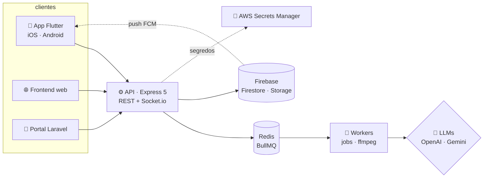

<!--
  Este README é 100% gerado por código: SVGs animados (CSS + SMIL, zero JS) feitos em scripts/.
  Rode `node scripts/build.mjs` pra regenerar. O Actions atualiza a atividade todo dia.
  Curtiu? Fork à vontade — troque os dados em scripts/sections/*.mjs.
-->

<div align="center">

<a href="https://github.com/anderecc"><picture><source media="(prefers-color-scheme: dark)" srcset="https://raw.githubusercontent.com/anderecc/anderecc/main/assets/hero-dark.svg"></picture></a>

<a href="https://www.linkedin.com/in/andersondb06/"><picture><source media="(prefers-color-scheme: dark)" srcset="https://raw.githubusercontent.com/anderecc/anderecc/main/assets/btn-linkedin-dark.svg"></picture></a>
<a href="mailto:andersondbl06@gmail.com"><picture><source media="(prefers-color-scheme: dark)" srcset="https://raw.githubusercontent.com/anderecc/anderecc/main/assets/btn-email-dark.svg"></picture></a>
<a href="https://instagram.com/anderecs"><picture><source media="(prefers-color-scheme: dark)" srcset="https://raw.githubusercontent.com/anderecc/anderecc/main/assets/btn-instagram-dark.svg"></picture></a>
<a href="https://github.com/anderecc?tab=followers"><picture><source media="(prefers-color-scheme: dark)" srcset="https://raw.githubusercontent.com/anderecc/anderecc/main/assets/btn-github-dark.svg"></picture></a>

</div>

<br/>

<picture><source media="(prefers-color-scheme: dark)" srcset="https://raw.githubusercontent.com/anderecc/anderecc/main/assets/whoami-dark.svg"></picture>

### `▸ stack`

<picture><source media="(prefers-color-scheme: dark)" srcset="https://raw.githubusercontent.com/anderecc/anderecc/main/assets/stack-dark.svg"></picture>

### `▸ como eu trabalho`

<picture><source media="(prefers-color-scheme: dark)" srcset="https://raw.githubusercontent.com/anderecc/anderecc/main/assets/flow-dark.svg"></picture>

Spec antes de código, agentes de IA como par de programação (com `AGENTS.md`/`CLAUDE.md` dando contexto do projeto), teste e lint no pipeline, deploy automatizado no **GitHub Actions** pra **VPS** que eu mesmo configuro (Docker + Nginx + TLS) ou Vercel. Segurança desde o começo: segredos fora do código, rate limit, menor privilégio.

### `▸ projetos reais`

<p align="center">
<a href="https://ldxcapital.vercel.app"><picture><source media="(prefers-color-scheme: dark)" srcset="https://raw.githubusercontent.com/anderecc/anderecc/main/assets/card-ldx-dark.svg"></picture></a>
<a href="https://gatuzii.vercel.app"><picture><source media="(prefers-color-scheme: dark)" srcset="https://raw.githubusercontent.com/anderecc/anderecc/main/assets/card-gatuzii-dark.svg"></picture></a>
<picture><source media="(prefers-color-scheme: dark)" srcset="https://raw.githubusercontent.com/anderecc/anderecc/main/assets/card-insta-dark.svg"></picture>
<picture><source media="(prefers-color-scheme: dark)" srcset="https://raw.githubusercontent.com/anderecc/anderecc/main/assets/card-bots-dark.svg"></picture>
</p>

<details>
<summary><b>🗺️ arquitetura do ecossistema LDX</b> <sub>(diagrama interativo: arraste e dê zoom)</sub></summary>
<br/>



<sub>visão simplificada · repositórios privados</sub>
</details>

### `▸ formação & certificados`

<picture><source media="(prefers-color-scheme: dark)" srcset="https://raw.githubusercontent.com/anderecc/anderecc/main/assets/edu-dark.svg"></picture>

<details>
<summary><b>📜 ver certificados</b></summary>
<br/>

<!-- certs:start -->
| curso | instrutor | horas | |
|:--|:--|--:|:-:|
| React e Redux | Leonardo Moura Leitão | 54,5h | [ver ↗](https://www.udemy.com/certificate/UC-0075e93e-db81-4423-8403-2ec34b56bcd6/) |
| HTML5, CSS3 e JS | Daniel Tapias Morales | 54,5h | [ver ↗](https://www.udemy.com/certificate/UC-a442931f-f2e9-4102-98c9-7edff9b5db8f/) |
| Node.js | Guia do Programador | 50h | [ver ↗](https://www.udemy.com/certificate/UC-06134f8b-38ce-435d-b387-f94540a1674f/) |
| JavaScript | Hcode Treinamentos | 38,5h | [ver ↗](https://www.udemy.com/certificate/UC-c201d74b-6ff0-4445-b433-ac9b4618883e/) |
| Next.js e React | Leonardo Moura Leitão | 28,5h | [ver ↗](https://www.udemy.com/certificate/UC-c6c563d8-d3af-469b-9191-24bba705e675/) |
| Algoritmo e Lógica | Leonardo Moura Leitão | 18h | [ver ↗](https://www.udemy.com/certificate/UC-b2f3524f-1d3e-4c0e-b81e-3983f30aea3f/) |
| JS Funcional e Reativo | Leonardo Moura Leitão | 17h | [ver ↗](https://www.udemy.com/certificate/UC-07b943da-4392-4fb1-8bbf-f7606a69a5c1/) |
| SASS e SCSS | Matheus Battisti | 12,5h | [ver ↗](https://www.udemy.com/certificate/UC-04a99e14-f7a5-4424-8e71-1116af7e36d1/) |
| Git e GitHub | Matheus Battisti | 8,5h | [ver ↗](https://www.udemy.com/certificate/UC-d28bae80-353d-4a2d-9dea-63460d5d87f4/) |
| MySQL 8 | Hcode Treinamentos | 8,5h | [ver ↗](https://www.udemy.com/certificate/UC-77b591d7-5314-4e52-a240-7373ed80c9ae/) |
| LGPD | Cláudio Dodt | 4h | [ver ↗](https://www.udemy.com/certificate/UC-3175fa50-b084-4a40-a38f-f8768e410412/) |
<!-- certs:end -->

</details>

### `▸ atividade`

<picture><source media="(prefers-color-scheme: dark)" srcset="https://raw.githubusercontent.com/anderecc/anderecc/main/assets/activity-dark.svg"></picture>

<details open>
<summary><b>🧊 a mesma cidade, agora em 3D de verdade</b> <sub>(clique e arraste pra girar · scroll pra zoom)</sub></summary>

<!-- skyline:start -->

```stl
solid skyline
facet normal 0 0 1
outer loop
vertex 0 5 2.5
vertex 1 5 2.5
vertex 1 6 2.5
endloop
endfacet
facet normal 0 0 1
outer loop
vertex 0 5 2.5
vertex 1 6 2.5
vertex 0 6 2.5
endloop
endfacet
facet normal 1 0 0
outer loop
vertex 1 5 2
vertex 1 6 2
vertex 1 6 2.5
endloop
endfacet
facet normal 1 0 0
outer loop
vertex 1 5 2
vertex 1 6 2.5
vertex 1 5 2.5
endloop
endfacet
facet normal -1 0 0
outer loop
vertex 0 6 0
vertex 0 5 0
vertex 0 5 2.5
endloop
endfacet
facet normal -1 0 0
outer loop
vertex 0 6 0
vertex 0 5 2.5
vertex 0 6 2.5
endloop
endfacet
facet normal 0 1 0
outer loop
vertex 1 6 0
vertex 0 6 0
vertex 0 6 2.5
endloop
endfacet
facet normal 0 1 0
outer loop
vertex 1 6 0
vertex 0 6 2.5
vertex 1 6 2.5
endloop
endfacet
facet normal 0 0 1
outer loop
vertex 0 4 2.5
vertex 1 4 2.5
vertex 1 5 2.5
endloop
endfacet
facet normal 0 0 1
outer loop
vertex 0 4 2.5
vertex 1 5 2.5
vertex 0 5 2.5
endloop
endfacet
facet normal 1 0 0
outer loop
vertex 1 4 2
vertex 1 5 2
vertex 1 5 2.5
endloop
endfacet
facet normal 1 0 0
outer loop
vertex 1 4 2
vertex 1 5 2.5
vertex 1 4 2.5
endloop
endfacet
facet normal -1 0 0
outer loop
vertex 0 5 0
vertex 0 4 0
vertex 0 4 2.5
endloop
endfacet
facet normal -1 0 0
outer loop
vertex 0 5 0
vertex 0 4 2.5
vertex 0 5 2.5
endloop
endfacet
facet normal 0 0 1
outer loop
vertex 0 3 2.5
vertex 1 3 2.5
vertex 1 4 2.5
endloop
endfacet
facet normal 0 0 1
outer loop
vertex 0 3 2.5
vertex 1 4 2.5
vertex 0 4 2.5
endloop
endfacet
facet normal -1 0 0
outer loop
vertex 0 4 0
vertex 0 3 0
vertex 0 3 2.5
endloop
endfacet
facet normal -1 0 0
outer loop
vertex 0 4 0
vertex 0 3 2.5
vertex 0 4 2.5
endloop
endfacet
facet normal 0 0 1
outer loop
vertex 0 2 3
vertex 1 2 3
vertex 1 3 3
endloop
endfacet
facet normal 0 0 1
outer loop
vertex 0 2 3
vertex 1 3 3
vertex 0 3 3
endloop
endfacet
facet normal -1 0 0
outer loop
vertex 0 3 0
vertex 0 2 0
vertex 0 2 3
endloop
endfacet
facet normal -1 0 0
outer loop
vertex 0 3 0
vertex 0 2 3
vertex 0 3 3
endloop
endfacet
facet normal 0 1 0
outer loop
vertex 1 3 2.5
vertex 0 3 2.5
vertex 0 3 3
endloop
endfacet
facet normal 0 1 0
outer loop
vertex 1 3 2.5
vertex 0 3 3
vertex 1 3 3
endloop
endfacet
facet normal 0 0 1
outer loop
vertex 0 1 3
vertex 1 1 3
vertex 1 2 3
endloop
endfacet
facet normal 0 0 1
outer loop
vertex 0 1 3
vertex 1 2 3
vertex 0 2 3
endloop
endfacet
facet normal -1 0 0
outer loop
vertex 0 2 0
vertex 0 1 0
vertex 0 1 3
endloop
endfacet
facet normal -1 0 0
outer loop
vertex 0 2 0
vertex 0 1 3
vertex 0 2 3
endloop
endfacet
facet normal 0 -1 0
outer loop
vertex 0 1 0
vertex 1 1 0
vertex 1 1 3
endloop
endfacet
facet normal 0 -1 0
outer loop
vertex 0 1 0
vertex 1 1 3
vertex 0 1 3
endloop
endfacet
facet normal 0 0 1
outer loop
vertex 1 5 2
vertex 2 5 2
vertex 2 6 2
endloop
endfacet
facet normal 0 0 1
outer loop
vertex 1 5 2
vertex 2 6 2
vertex 1 6 2
endloop
endfacet
facet normal 0 1 0
outer loop
vertex 2 6 0
vertex 1 6 0
vertex 1 6 2
endloop
endfacet
facet normal 0 1 0
outer loop
vertex 2 6 0
vertex 1 6 2
vertex 2 6 2
endloop
endfacet
facet normal 0 0 1
outer loop
vertex 1 4 2
vertex 2 4 2
vertex 2 5 2
endloop
endfacet
facet normal 0 0 1
outer loop
vertex 1 4 2
vertex 2 5 2
vertex 1 5 2
endloop
endfacet
facet normal 0 0 1
outer loop
vertex 1 3 3
vertex 2 3 3
vertex 2 4 3
endloop
endfacet
facet normal 0 0 1
outer loop
vertex 1 3 3
vertex 2 4 3
vertex 1 4 3
endloop
endfacet
facet normal -1 0 0
outer loop
vertex 1 4 2.5
vertex 1 3 2.5
vertex 1 3 3
endloop
endfacet
facet normal -1 0 0
outer loop
vertex 1 4 2.5
vertex 1 3 3
vertex 1 4 3
endloop
endfacet
facet normal 0 1 0
outer loop
vertex 2 4 2
vertex 1 4 2
vertex 1 4 3
endloop
endfacet
facet normal 0 1 0
outer loop
vertex 2 4 2
vertex 1 4 3
vertex 2 4 3
endloop
endfacet
facet normal 0 0 1
outer loop
vertex 1 2 3
vertex 2 2 3
vertex 2 3 3
endloop
endfacet
facet normal 0 0 1
outer loop
vertex 1 2 3
vertex 2 3 3
vertex 1 3 3
endloop
endfacet
facet normal 1 0 0
outer loop
vertex 2 2 2.5
vertex 2 3 2.5
vertex 2 3 3
endloop
endfacet
facet normal 1 0 0
outer loop
vertex 2 2 2.5
vertex 2 3 3
vertex 2 2 3
endloop
endfacet
facet normal 0 0 1
outer loop
vertex 1 1 3.5
vertex 2 1 3.5
vertex 2 2 3.5
endloop
endfacet
facet normal 0 0 1
outer loop
vertex 1 1 3.5
vertex 2 2 3.5
vertex 1 2 3.5
endloop
endfacet
facet normal 1 0 0
outer loop
vertex 2 1 2.5
vertex 2 2 2.5
vertex 2 2 3.5
endloop
endfacet
facet normal 1 0 0
outer loop
vertex 2 1 2.5
vertex 2 2 3.5
vertex 2 1 3.5
endloop
endfacet
facet normal -1 0 0
outer loop
vertex 1 2 3
vertex 1 1 3
vertex 1 1 3.5
endloop
endfacet
facet normal -1 0 0
outer loop
vertex 1 2 3
vertex 1 1 3.5
vertex 1 2 3.5
endloop
endfacet
facet normal 0 1 0
outer loop
vertex 2 2 3
vertex 1 2 3
vertex 1 2 3.5
endloop
endfacet
facet normal 0 1 0
outer loop
vertex 2 2 3
vertex 1 2 3.5
vertex 2 2 3.5
endloop
endfacet
facet normal 0 -1 0
outer loop
vertex 1 1 2
vertex 2 1 2
vertex 2 1 3.5
endloop
endfacet
facet normal 0 -1 0
outer loop
vertex 1 1 2
vertex 2 1 3.5
vertex 1 1 3.5
endloop
endfacet
facet normal 0 0 1
outer loop
vertex 1 0 2
vertex 2 0 2
vertex 2 1 2
endloop
endfacet
facet normal 0 0 1
outer loop
vertex 1 0 2
vertex 2 1 2
vertex 1 1 2
endloop
endfacet
facet normal 1 0 0
outer loop
vertex 2 0 0
vertex 2 1 0
vertex 2 1 2
endloop
endfacet
facet normal 1 0 0
outer loop
vertex 2 0 0
vertex 2 1 2
vertex 2 0 2
endloop
endfacet
facet normal -1 0 0
outer loop
vertex 1 1 0
vertex 1 0 0
vertex 1 0 2
endloop
endfacet
facet normal -1 0 0
outer loop
vertex 1 1 0
vertex 1 0 2
vertex 1 1 2
endloop
endfacet
facet normal 0 -1 0
outer loop
vertex 1 0 0
vertex 2 0 0
vertex 2 0 2
endloop
endfacet
facet normal 0 -1 0
outer loop
vertex 1 0 0
vertex 2 0 2
vertex 1 0 2
endloop
endfacet
facet normal 0 0 1
outer loop
vertex 2 5 2.5
vertex 3 5 2.5
vertex 3 6 2.5
endloop
endfacet
facet normal 0 0 1
outer loop
vertex 2 5 2.5
vertex 3 6 2.5
vertex 2 6 2.5
endloop
endfacet
facet normal 1 0 0
outer loop
vertex 3 5 0
vertex 3 6 0
vertex 3 6 2.5
endloop
endfacet
facet normal 1 0 0
outer loop
vertex 3 5 0
vertex 3 6 2.5
vertex 3 5 2.5
endloop
endfacet
facet normal -1 0 0
outer loop
vertex 2 6 2
vertex 2 5 2
vertex 2 5 2.5
endloop
endfacet
facet normal -1 0 0
outer loop
vertex 2 6 2
vertex 2 5 2.5
vertex 2 6 2.5
endloop
endfacet
facet normal 0 1 0
outer loop
vertex 3 6 0
vertex 2 6 0
vertex 2 6 2.5
endloop
endfacet
facet normal 0 1 0
outer loop
vertex 3 6 0
vertex 2 6 2.5
vertex 3 6 2.5
endloop
endfacet
facet normal 0 0 1
outer loop
vertex 2 4 3
vertex 3 4 3
vertex 3 5 3
endloop
endfacet
facet normal 0 0 1
outer loop
vertex 2 4 3
vertex 3 5 3
vertex 2 5 3
endloop
endfacet
facet normal 1 0 0
outer loop
vertex 3 4 2.5
vertex 3 5 2.5
vertex 3 5 3
endloop
endfacet
facet normal 1 0 0
outer loop
vertex 3 4 2.5
vertex 3 5 3
vertex 3 4 3
endloop
endfacet
facet normal -1 0 0
outer loop
vertex 2 5 2
vertex 2 4 2
vertex 2 4 3
endloop
endfacet
facet normal -1 0 0
outer loop
vertex 2 5 2
vertex 2 4 3
vertex 2 5 3
endloop
endfacet
facet normal 0 1 0
outer loop
vertex 3 5 2.5
vertex 2 5 2.5
vertex 2 5 3
endloop
endfacet
facet normal 0 1 0
outer loop
vertex 3 5 2.5
vertex 2 5 3
vertex 3 5 3
endloop
endfacet
facet normal 0 0 1
outer loop
vertex 2 3 3
vertex 3 3 3
vertex 3 4 3
endloop
endfacet
facet normal 0 0 1
outer loop
vertex 2 3 3
vertex 3 4 3
vertex 2 4 3
endloop
endfacet
facet normal 1 0 0
outer loop
vertex 3 3 2
vertex 3 4 2
vertex 3 4 3
endloop
endfacet
facet normal 1 0 0
outer loop
vertex 3 3 2
vertex 3 4 3
vertex 3 3 3
endloop
endfacet
facet normal 0 -1 0
outer loop
vertex 2 3 2.5
vertex 3 3 2.5
vertex 3 3 3
endloop
endfacet
facet normal 0 -1 0
outer loop
vertex 2 3 2.5
vertex 3 3 3
vertex 2 3 3
endloop
endfacet
facet normal 0 0 1
outer loop
vertex 2 2 2.5
vertex 3 2 2.5
vertex 3 3 2.5
endloop
endfacet
facet normal 0 0 1
outer loop
vertex 2 2 2.5
vertex 3 3 2.5
vertex 2 3 2.5
endloop
endfacet
facet normal 0 0 1
outer loop
vertex 2 1 2.5
vertex 3 1 2.5
vertex 3 2 2.5
endloop
endfacet
facet normal 0 0 1
outer loop
vertex 2 1 2.5
vertex 3 2 2.5
vertex 2 2 2.5
endloop
endfacet
facet normal 1 0 0
outer loop
vertex 3 1 1.5
vertex 3 2 1.5
vertex 3 2 2.5
endloop
endfacet
facet normal 1 0 0
outer loop
vertex 3 1 1.5
vertex 3 2 2.5
vertex 3 1 2.5
endloop
endfacet
facet normal 0 -1 0
outer loop
vertex 2 1 0
vertex 3 1 0
vertex 3 1 2.5
endloop
endfacet
facet normal 0 -1 0
outer loop
vertex 2 1 0
vertex 3 1 2.5
vertex 2 1 2.5
endloop
endfacet
facet normal 0 0 1
outer loop
vertex 3 4 2.5
vertex 4 4 2.5
vertex 4 5 2.5
endloop
endfacet
facet normal 0 0 1
outer loop
vertex 3 4 2.5
vertex 4 5 2.5
vertex 3 5 2.5
endloop
endfacet
facet normal 0 1 0
outer loop
vertex 4 5 0
vertex 3 5 0
vertex 3 5 2.5
endloop
endfacet
facet normal 0 1 0
outer loop
vertex 4 5 0
vertex 3 5 2.5
vertex 4 5 2.5
endloop
endfacet
facet normal 0 -1 0
outer loop
vertex 3 4 2
vertex 4 4 2
vertex 4 4 2.5
endloop
endfacet
facet normal 0 -1 0
outer loop
vertex 3 4 2
vertex 4 4 2.5
vertex 3 4 2.5
endloop
endfacet
facet normal 0 0 1
outer loop
vertex 3 3 2
vertex 4 3 2
vertex 4 4 2
endloop
endfacet
facet normal 0 0 1
outer loop
vertex 3 3 2
vertex 4 4 2
vertex 3 4 2
endloop
endfacet
facet normal 1 0 0
outer loop
vertex 4 3 1.5
vertex 4 4 1.5
vertex 4 4 2
endloop
endfacet
facet normal 1 0 0
outer loop
vertex 4 3 1.5
vertex 4 4 2
vertex 4 3 2
endloop
endfacet
facet normal 0 0 1
outer loop
vertex 3 2 3.5
vertex 4 2 3.5
vertex 4 3 3.5
endloop
endfacet
facet normal 0 0 1
outer loop
vertex 3 2 3.5
vertex 4 3 3.5
vertex 3 3 3.5
endloop
endfacet
facet normal 1 0 0
outer loop
vertex 4 2 2.5
vertex 4 3 2.5
vertex 4 3 3.5
endloop
endfacet
facet normal 1 0 0
outer loop
vertex 4 2 2.5
vertex 4 3 3.5
vertex 4 2 3.5
endloop
endfacet
facet normal -1 0 0
outer loop
vertex 3 3 2.5
vertex 3 2 2.5
vertex 3 2 3.5
endloop
endfacet
facet normal -1 0 0
outer loop
vertex 3 3 2.5
vertex 3 2 3.5
vertex 3 3 3.5
endloop
endfacet
facet normal 0 1 0
outer loop
vertex 4 3 2
vertex 3 3 2
vertex 3 3 3.5
endloop
endfacet
facet normal 0 1 0
outer loop
vertex 4 3 2
vertex 3 3 3.5
vertex 4 3 3.5
endloop
endfacet
facet normal 0 -1 0
outer loop
vertex 3 2 1.5
vertex 4 2 1.5
vertex 4 2 3.5
endloop
endfacet
facet normal 0 -1 0
outer loop
vertex 3 2 1.5
vertex 4 2 3.5
vertex 3 2 3.5
endloop
endfacet
facet normal 0 0 1
outer loop
vertex 3 1 1.5
vertex 4 1 1.5
vertex 4 2 1.5
endloop
endfacet
facet normal 0 0 1
outer loop
vertex 3 1 1.5
vertex 4 2 1.5
vertex 3 2 1.5
endloop
endfacet
facet normal 0 0 1
outer loop
vertex 3 0 1.5
vertex 4 0 1.5
vertex 4 1 1.5
endloop
endfacet
facet normal 0 0 1
outer loop
vertex 3 0 1.5
vertex 4 1 1.5
vertex 3 1 1.5
endloop
endfacet
facet normal 1 0 0
outer loop
vertex 4 0 0
vertex 4 1 0
vertex 4 1 1.5
endloop
endfacet
facet normal 1 0 0
outer loop
vertex 4 0 0
vertex 4 1 1.5
vertex 4 0 1.5
endloop
endfacet
facet normal -1 0 0
outer loop
vertex 3 1 0
vertex 3 0 0
vertex 3 0 1.5
endloop
endfacet
facet normal -1 0 0
outer loop
vertex 3 1 0
vertex 3 0 1.5
vertex 3 1 1.5
endloop
endfacet
facet normal 0 -1 0
outer loop
vertex 3 0 0
vertex 4 0 0
vertex 4 0 1.5
endloop
endfacet
facet normal 0 -1 0
outer loop
vertex 3 0 0
vertex 4 0 1.5
vertex 3 0 1.5
endloop
endfacet
facet normal 0 0 1
outer loop
vertex 4 5 2
vertex 5 5 2
vertex 5 6 2
endloop
endfacet
facet normal 0 0 1
outer loop
vertex 4 5 2
vertex 5 6 2
vertex 4 6 2
endloop
endfacet
facet normal -1 0 0
outer loop
vertex 4 6 0
vertex 4 5 0
vertex 4 5 2
endloop
endfacet
facet normal -1 0 0
outer loop
vertex 4 6 0
vertex 4 5 2
vertex 4 6 2
endloop
endfacet
facet normal 0 1 0
outer loop
vertex 5 6 0
vertex 4 6 0
vertex 4 6 2
endloop
endfacet
facet normal 0 1 0
outer loop
vertex 5 6 0
vertex 4 6 2
vertex 5 6 2
endloop
endfacet
facet normal 0 0 1
outer loop
vertex 4 4 2.5
vertex 5 4 2.5
vertex 5 5 2.5
endloop
endfacet
facet normal 0 0 1
outer loop
vertex 4 4 2.5
vertex 5 5 2.5
vertex 4 5 2.5
endloop
endfacet
facet normal 0 1 0
outer loop
vertex 5 5 2
vertex 4 5 2
vertex 4 5 2.5
endloop
endfacet
facet normal 0 1 0
outer loop
vertex 5 5 2
vertex 4 5 2.5
vertex 5 5 2.5
endloop
endfacet
facet normal 0 -1 0
outer loop
vertex 4 4 1.5
vertex 5 4 1.5
vertex 5 4 2.5
endloop
endfacet
facet normal 0 -1 0
outer loop
vertex 4 4 1.5
vertex 5 4 2.5
vertex 4 4 2.5
endloop
endfacet
facet normal 0 0 1
outer loop
vertex 4 3 1.5
vertex 5 3 1.5
vertex 5 4 1.5
endloop
endfacet
facet normal 0 0 1
outer loop
vertex 4 3 1.5
vertex 5 4 1.5
vertex 4 4 1.5
endloop
endfacet
facet normal 0 0 1
outer loop
vertex 4 2 2.5
vertex 5 2 2.5
vertex 5 3 2.5
endloop
endfacet
facet normal 0 0 1
outer loop
vertex 4 2 2.5
vertex 5 3 2.5
vertex 4 3 2.5
endloop
endfacet
facet normal 0 1 0
outer loop
vertex 5 3 1.5
vertex 4 3 1.5
vertex 4 3 2.5
endloop
endfacet
facet normal 0 1 0
outer loop
vertex 5 3 1.5
vertex 4 3 2.5
vertex 5 3 2.5
endloop
endfacet
facet normal 0 0 1
outer loop
vertex 4 1 2.5
vertex 5 1 2.5
vertex 5 2 2.5
endloop
endfacet
facet normal 0 0 1
outer loop
vertex 4 1 2.5
vertex 5 2 2.5
vertex 4 2 2.5
endloop
endfacet
facet normal 1 0 0
outer loop
vertex 5 1 2
vertex 5 2 2
vertex 5 2 2.5
endloop
endfacet
facet normal 1 0 0
outer loop
vertex 5 1 2
vertex 5 2 2.5
vertex 5 1 2.5
endloop
endfacet
facet normal -1 0 0
outer loop
vertex 4 2 1.5
vertex 4 1 1.5
vertex 4 1 2.5
endloop
endfacet
facet normal -1 0 0
outer loop
vertex 4 2 1.5
vertex 4 1 2.5
vertex 4 2 2.5
endloop
endfacet
facet normal 0 -1 0
outer loop
vertex 4 1 0
vertex 5 1 0
vertex 5 1 2.5
endloop
endfacet
facet normal 0 -1 0
outer loop
vertex 4 1 0
vertex 5 1 2.5
vertex 4 1 2.5
endloop
endfacet
facet normal 0 0 1
outer loop
vertex 5 5 3
vertex 6 5 3
vertex 6 6 3
endloop
endfacet
facet normal 0 0 1
outer loop
vertex 5 5 3
vertex 6 6 3
vertex 5 6 3
endloop
endfacet
facet normal 1 0 0
outer loop
vertex 6 5 1.5
vertex 6 6 1.5
vertex 6 6 3
endloop
endfacet
facet normal 1 0 0
outer loop
vertex 6 5 1.5
vertex 6 6 3
vertex 6 5 3
endloop
endfacet
facet normal -1 0 0
outer loop
vertex 5 6 2
vertex 5 5 2
vertex 5 5 3
endloop
endfacet
facet normal -1 0 0
outer loop
vertex 5 6 2
vertex 5 5 3
vertex 5 6 3
endloop
endfacet
facet normal 0 1 0
outer loop
vertex 6 6 0
vertex 5 6 0
vertex 5 6 3
endloop
endfacet
facet normal 0 1 0
outer loop
vertex 6 6 0
vertex 5 6 3
vertex 6 6 3
endloop
endfacet
facet normal 0 0 1
outer loop
vertex 5 4 3
vertex 6 4 3
vertex 6 5 3
endloop
endfacet
facet normal 0 0 1
outer loop
vertex 5 4 3
vertex 6 5 3
vertex 5 5 3
endloop
endfacet
facet normal 1 0 0
outer loop
vertex 6 4 2.5
vertex 6 5 2.5
vertex 6 5 3
endloop
endfacet
facet normal 1 0 0
outer loop
vertex 6 4 2.5
vertex 6 5 3
vertex 6 4 3
endloop
endfacet
facet normal -1 0 0
outer loop
vertex 5 5 2.5
vertex 5 4 2.5
vertex 5 4 3
endloop
endfacet
facet normal -1 0 0
outer loop
vertex 5 5 2.5
vertex 5 4 3
vertex 5 5 3
endloop
endfacet
facet normal 0 0 1
outer loop
vertex 5 3 3.5
vertex 6 3 3.5
vertex 6 4 3.5
endloop
endfacet
facet normal 0 0 1
outer loop
vertex 5 3 3.5
vertex 6 4 3.5
vertex 5 4 3.5
endloop
endfacet
facet normal 1 0 0
outer loop
vertex 6 3 3
vertex 6 4 3
vertex 6 4 3.5
endloop
endfacet
facet normal 1 0 0
outer loop
vertex 6 3 3
vertex 6 4 3.5
vertex 6 3 3.5
endloop
endfacet
facet normal -1 0 0
outer loop
vertex 5 4 1.5
vertex 5 3 1.5
vertex 5 3 3.5
endloop
endfacet
facet normal -1 0 0
outer loop
vertex 5 4 1.5
vertex 5 3 3.5
vertex 5 4 3.5
endloop
endfacet
facet normal 0 1 0
outer loop
vertex 6 4 3
vertex 5 4 3
vertex 5 4 3.5
endloop
endfacet
facet normal 0 1 0
outer loop
vertex 6 4 3
vertex 5 4 3.5
vertex 6 4 3.5
endloop
endfacet
facet normal 0 0 1
outer loop
vertex 5 2 3.5
vertex 6 2 3.5
vertex 6 3 3.5
endloop
endfacet
facet normal 0 0 1
outer loop
vertex 5 2 3.5
vertex 6 3 3.5
vertex 5 3 3.5
endloop
endfacet
facet normal 1 0 0
outer loop
vertex 6 2 1.5
vertex 6 3 1.5
vertex 6 3 3.5
endloop
endfacet
facet normal 1 0 0
outer loop
vertex 6 2 1.5
vertex 6 3 3.5
vertex 6 2 3.5
endloop
endfacet
facet normal -1 0 0
outer loop
vertex 5 3 2.5
vertex 5 2 2.5
vertex 5 2 3.5
endloop
endfacet
facet normal -1 0 0
outer loop
vertex 5 3 2.5
vertex 5 2 3.5
vertex 5 3 3.5
endloop
endfacet
facet normal 0 -1 0
outer loop
vertex 5 2 2
vertex 6 2 2
vertex 6 2 3.5
endloop
endfacet
facet normal 0 -1 0
outer loop
vertex 5 2 2
vertex 6 2 3.5
vertex 5 2 3.5
endloop
endfacet
facet normal 0 0 1
outer loop
vertex 5 1 2
vertex 6 1 2
vertex 6 2 2
endloop
endfacet
facet normal 0 0 1
outer loop
vertex 5 1 2
vertex 6 2 2
vertex 5 2 2
endloop
endfacet
facet normal 1 0 0
outer loop
vertex 6 1 1.5
vertex 6 2 1.5
vertex 6 2 2
endloop
endfacet
facet normal 1 0 0
outer loop
vertex 6 1 1.5
vertex 6 2 2
vertex 6 1 2
endloop
endfacet
facet normal 0 -1 0
outer loop
vertex 5 1 0
vertex 6 1 0
vertex 6 1 2
endloop
endfacet
facet normal 0 -1 0
outer loop
vertex 5 1 0
vertex 6 1 2
vertex 5 1 2
endloop
endfacet
facet normal 0 0 1
outer loop
vertex 6 5 1.5
vertex 7 5 1.5
vertex 7 6 1.5
endloop
endfacet
facet normal 0 0 1
outer loop
vertex 6 5 1.5
vertex 7 6 1.5
vertex 6 6 1.5
endloop
endfacet
facet normal 0 1 0
outer loop
vertex 7 6 0
vertex 6 6 0
vertex 6 6 1.5
endloop
endfacet
facet normal 0 1 0
outer loop
vertex 7 6 0
vertex 6 6 1.5
vertex 7 6 1.5
endloop
endfacet
facet normal 0 0 1
outer loop
vertex 6 4 2.5
vertex 7 4 2.5
vertex 7 5 2.5
endloop
endfacet
facet normal 0 0 1
outer loop
vertex 6 4 2.5
vertex 7 5 2.5
vertex 6 5 2.5
endloop
endfacet
facet normal 1 0 0
outer loop
vertex 7 4 2
vertex 7 5 2
vertex 7 5 2.5
endloop
endfacet
facet normal 1 0 0
outer loop
vertex 7 4 2
vertex 7 5 2.5
vertex 7 4 2.5
endloop
endfacet
facet normal 0 1 0
outer loop
vertex 7 5 1.5
vertex 6 5 1.5
vertex 6 5 2.5
endloop
endfacet
facet normal 0 1 0
outer loop
vertex 7 5 1.5
vertex 6 5 2.5
vertex 7 5 2.5
endloop
endfacet
facet normal 0 0 1
outer loop
vertex 6 3 3
vertex 7 3 3
vertex 7 4 3
endloop
endfacet
facet normal 0 0 1
outer loop
vertex 6 3 3
vertex 7 4 3
vertex 6 4 3
endloop
endfacet
facet normal 1 0 0
outer loop
vertex 7 3 0
vertex 7 4 0
vertex 7 4 3
endloop
endfacet
facet normal 1 0 0
outer loop
vertex 7 3 0
vertex 7 4 3
vertex 7 3 3
endloop
endfacet
facet normal 0 1 0
outer loop
vertex 7 4 2.5
vertex 6 4 2.5
vertex 6 4 3
endloop
endfacet
facet normal 0 1 0
outer loop
vertex 7 4 2.5
vertex 6 4 3
vertex 7 4 3
endloop
endfacet
facet normal 0 -1 0
outer loop
vertex 6 3 1.5
vertex 7 3 1.5
vertex 7 3 3
endloop
endfacet
facet normal 0 -1 0
outer loop
vertex 6 3 1.5
vertex 7 3 3
vertex 6 3 3
endloop
endfacet
facet normal 0 0 1
outer loop
vertex 6 2 1.5
vertex 7 2 1.5
vertex 7 3 1.5
endloop
endfacet
facet normal 0 0 1
outer loop
vertex 6 2 1.5
vertex 7 3 1.5
vertex 6 3 1.5
endloop
endfacet
facet normal 0 0 1
outer loop
vertex 6 1 1.5
vertex 7 1 1.5
vertex 7 2 1.5
endloop
endfacet
facet normal 0 0 1
outer loop
vertex 6 1 1.5
vertex 7 2 1.5
vertex 6 2 1.5
endloop
endfacet
facet normal 1 0 0
outer loop
vertex 7 1 0
vertex 7 2 0
vertex 7 2 1.5
endloop
endfacet
facet normal 1 0 0
outer loop
vertex 7 1 0
vertex 7 2 1.5
vertex 7 1 1.5
endloop
endfacet
facet normal 0 -1 0
outer loop
vertex 6 1 0
vertex 7 1 0
vertex 7 1 1.5
endloop
endfacet
facet normal 0 -1 0
outer loop
vertex 6 1 0
vertex 7 1 1.5
vertex 6 1 1.5
endloop
endfacet
facet normal 0 0 1
outer loop
vertex 7 5 2.5
vertex 8 5 2.5
vertex 8 6 2.5
endloop
endfacet
facet normal 0 0 1
outer loop
vertex 7 5 2.5
vertex 8 6 2.5
vertex 7 6 2.5
endloop
endfacet
facet normal 1 0 0
outer loop
vertex 8 5 2
vertex 8 6 2
vertex 8 6 2.5
endloop
endfacet
facet normal 1 0 0
outer loop
vertex 8 5 2
vertex 8 6 2.5
vertex 8 5 2.5
endloop
endfacet
facet normal -1 0 0
outer loop
vertex 7 6 1.5
vertex 7 5 1.5
vertex 7 5 2.5
endloop
endfacet
facet normal -1 0 0
outer loop
vertex 7 6 1.5
vertex 7 5 2.5
vertex 7 6 2.5
endloop
endfacet
facet normal 0 1 0
outer loop
vertex 8 6 0
vertex 7 6 0
vertex 7 6 2.5
endloop
endfacet
facet normal 0 1 0
outer loop
vertex 8 6 0
vertex 7 6 2.5
vertex 8 6 2.5
endloop
endfacet
facet normal 0 -1 0
outer loop
vertex 7 5 2
vertex 8 5 2
vertex 8 5 2.5
endloop
endfacet
facet normal 0 -1 0
outer loop
vertex 7 5 2
vertex 8 5 2.5
vertex 7 5 2.5
endloop
endfacet
facet normal 0 0 1
outer loop
vertex 7 4 2
vertex 8 4 2
vertex 8 5 2
endloop
endfacet
facet normal 0 0 1
outer loop
vertex 7 4 2
vertex 8 5 2
vertex 7 5 2
endloop
endfacet
facet normal 1 0 0
outer loop
vertex 8 4 1.5
vertex 8 5 1.5
vertex 8 5 2
endloop
endfacet
facet normal 1 0 0
outer loop
vertex 8 4 1.5
vertex 8 5 2
vertex 8 4 2
endloop
endfacet
facet normal 0 -1 0
outer loop
vertex 7 4 0
vertex 8 4 0
vertex 8 4 2
endloop
endfacet
facet normal 0 -1 0
outer loop
vertex 7 4 0
vertex 8 4 2
vertex 7 4 2
endloop
endfacet
facet normal 0 0 1
outer loop
vertex 7 2 2
vertex 8 2 2
vertex 8 3 2
endloop
endfacet
facet normal 0 0 1
outer loop
vertex 7 2 2
vertex 8 3 2
vertex 7 3 2
endloop
endfacet
facet normal -1 0 0
outer loop
vertex 7 3 1.5
vertex 7 2 1.5
vertex 7 2 2
endloop
endfacet
facet normal -1 0 0
outer loop
vertex 7 3 1.5
vertex 7 2 2
vertex 7 3 2
endloop
endfacet
facet normal 0 1 0
outer loop
vertex 8 3 0
vertex 7 3 0
vertex 7 3 2
endloop
endfacet
facet normal 0 1 0
outer loop
vertex 8 3 0
vertex 7 3 2
vertex 8 3 2
endloop
endfacet
facet normal 0 -1 0
outer loop
vertex 7 2 0
vertex 8 2 0
vertex 8 2 2
endloop
endfacet
facet normal 0 -1 0
outer loop
vertex 7 2 0
vertex 8 2 2
vertex 7 2 2
endloop
endfacet
facet normal 0 0 1
outer loop
vertex 8 5 2
vertex 9 5 2
vertex 9 6 2
endloop
endfacet
facet normal 0 0 1
outer loop
vertex 8 5 2
vertex 9 6 2
vertex 8 6 2
endloop
endfacet
facet normal 1 0 0
outer loop
vertex 9 5 1.5
vertex 9 6 1.5
vertex 9 6 2
endloop
endfacet
facet normal 1 0 0
outer loop
vertex 9 5 1.5
vertex 9 6 2
vertex 9 5 2
endloop
endfacet
facet normal 0 1 0
outer loop
vertex 9 6 0
vertex 8 6 0
vertex 8 6 2
endloop
endfacet
facet normal 0 1 0
outer loop
vertex 9 6 0
vertex 8 6 2
vertex 9 6 2
endloop
endfacet
facet normal 0 -1 0
outer loop
vertex 8 5 1.5
vertex 9 5 1.5
vertex 9 5 2
endloop
endfacet
facet normal 0 -1 0
outer loop
vertex 8 5 1.5
vertex 9 5 2
vertex 8 5 2
endloop
endfacet
facet normal 0 0 1
outer loop
vertex 8 4 1.5
vertex 9 4 1.5
vertex 9 5 1.5
endloop
endfacet
facet normal 0 0 1
outer loop
vertex 8 4 1.5
vertex 9 5 1.5
vertex 8 5 1.5
endloop
endfacet
facet normal 0 0 1
outer loop
vertex 8 3 2.5
vertex 9 3 2.5
vertex 9 4 2.5
endloop
endfacet
facet normal 0 0 1
outer loop
vertex 8 3 2.5
vertex 9 4 2.5
vertex 8 4 2.5
endloop
endfacet
facet normal 1 0 0
outer loop
vertex 9 3 2
vertex 9 4 2
vertex 9 4 2.5
endloop
endfacet
facet normal 1 0 0
outer loop
vertex 9 3 2
vertex 9 4 2.5
vertex 9 3 2.5
endloop
endfacet
facet normal -1 0 0
outer loop
vertex 8 4 0
vertex 8 3 0
vertex 8 3 2.5
endloop
endfacet
facet normal -1 0 0
outer loop
vertex 8 4 0
vertex 8 3 2.5
vertex 8 4 2.5
endloop
endfacet
facet normal 0 1 0
outer loop
vertex 9 4 1.5
vertex 8 4 1.5
vertex 8 4 2.5
endloop
endfacet
facet normal 0 1 0
outer loop
vertex 9 4 1.5
vertex 8 4 2.5
vertex 9 4 2.5
endloop
endfacet
facet normal 0 -1 0
outer loop
vertex 8 3 2
vertex 9 3 2
vertex 9 3 2.5
endloop
endfacet
facet normal 0 -1 0
outer loop
vertex 8 3 2
vertex 9 3 2.5
vertex 8 3 2.5
endloop
endfacet
facet normal 0 0 1
outer loop
vertex 8 2 2
vertex 9 2 2
vertex 9 3 2
endloop
endfacet
facet normal 0 0 1
outer loop
vertex 8 2 2
vertex 9 3 2
vertex 8 3 2
endloop
endfacet
facet normal 0 0 1
outer loop
vertex 8 1 2.5
vertex 9 1 2.5
vertex 9 2 2.5
endloop
endfacet
facet normal 0 0 1
outer loop
vertex 8 1 2.5
vertex 9 2 2.5
vertex 8 2 2.5
endloop
endfacet
facet normal 1 0 0
outer loop
vertex 9 1 2
vertex 9 2 2
vertex 9 2 2.5
endloop
endfacet
facet normal 1 0 0
outer loop
vertex 9 1 2
vertex 9 2 2.5
vertex 9 1 2.5
endloop
endfacet
facet normal -1 0 0
outer loop
vertex 8 2 0
vertex 8 1 0
vertex 8 1 2.5
endloop
endfacet
facet normal -1 0 0
outer loop
vertex 8 2 0
vertex 8 1 2.5
vertex 8 2 2.5
endloop
endfacet
facet normal 0 1 0
outer loop
vertex 9 2 2
vertex 8 2 2
vertex 8 2 2.5
endloop
endfacet
facet normal 0 1 0
outer loop
vertex 9 2 2
vertex 8 2 2.5
vertex 9 2 2.5
endloop
endfacet
facet normal 0 -1 0
outer loop
vertex 8 1 0
vertex 9 1 0
vertex 9 1 2.5
endloop
endfacet
facet normal 0 -1 0
outer loop
vertex 8 1 0
vertex 9 1 2.5
vertex 8 1 2.5
endloop
endfacet
facet normal 0 0 1
outer loop
vertex 9 5 1.5
vertex 10 5 1.5
vertex 10 6 1.5
endloop
endfacet
facet normal 0 0 1
outer loop
vertex 9 5 1.5
vertex 10 6 1.5
vertex 9 6 1.5
endloop
endfacet
facet normal 1 0 0
outer loop
vertex 10 5 0
vertex 10 6 0
vertex 10 6 1.5
endloop
endfacet
facet normal 1 0 0
outer loop
vertex 10 5 0
vertex 10 6 1.5
vertex 10 5 1.5
endloop
endfacet
facet normal 0 1 0
outer loop
vertex 10 6 0
vertex 9 6 0
vertex 9 6 1.5
endloop
endfacet
facet normal 0 1 0
outer loop
vertex 10 6 0
vertex 9 6 1.5
vertex 10 6 1.5
endloop
endfacet
facet normal 0 0 1
outer loop
vertex 9 4 1.5
vertex 10 4 1.5
vertex 10 5 1.5
endloop
endfacet
facet normal 0 0 1
outer loop
vertex 9 4 1.5
vertex 10 5 1.5
vertex 9 5 1.5
endloop
endfacet
facet normal 0 0 1
outer loop
vertex 9 3 2
vertex 10 3 2
vertex 10 4 2
endloop
endfacet
facet normal 0 0 1
outer loop
vertex 9 3 2
vertex 10 4 2
vertex 9 4 2
endloop
endfacet
facet normal 1 0 0
outer loop
vertex 10 3 1.5
vertex 10 4 1.5
vertex 10 4 2
endloop
endfacet
facet normal 1 0 0
outer loop
vertex 10 3 1.5
vertex 10 4 2
vertex 10 3 2
endloop
endfacet
facet normal 0 1 0
outer loop
vertex 10 4 1.5
vertex 9 4 1.5
vertex 9 4 2
endloop
endfacet
facet normal 0 1 0
outer loop
vertex 10 4 1.5
vertex 9 4 2
vertex 10 4 2
endloop
endfacet
facet normal 0 0 1
outer loop
vertex 9 2 2.5
vertex 10 2 2.5
vertex 10 3 2.5
endloop
endfacet
facet normal 0 0 1
outer loop
vertex 9 2 2.5
vertex 10 3 2.5
vertex 9 3 2.5
endloop
endfacet
facet normal 1 0 0
outer loop
vertex 10 2 1.5
vertex 10 3 1.5
vertex 10 3 2.5
endloop
endfacet
facet normal 1 0 0
outer loop
vertex 10 2 1.5
vertex 10 3 2.5
vertex 10 2 2.5
endloop
endfacet
facet normal -1 0 0
outer loop
vertex 9 3 2
vertex 9 2 2
vertex 9 2 2.5
endloop
endfacet
facet normal -1 0 0
outer loop
vertex 9 3 2
vertex 9 2 2.5
vertex 9 3 2.5
endloop
endfacet
facet normal 0 1 0
outer loop
vertex 10 3 2
vertex 9 3 2
vertex 9 3 2.5
endloop
endfacet
facet normal 0 1 0
outer loop
vertex 10 3 2
vertex 9 3 2.5
vertex 10 3 2.5
endloop
endfacet
facet normal 0 -1 0
outer loop
vertex 9 2 2
vertex 10 2 2
vertex 10 2 2.5
endloop
endfacet
facet normal 0 -1 0
outer loop
vertex 9 2 2
vertex 10 2 2.5
vertex 9 2 2.5
endloop
endfacet
facet normal 0 0 1
outer loop
vertex 9 1 2
vertex 10 1 2
vertex 10 2 2
endloop
endfacet
facet normal 0 0 1
outer loop
vertex 9 1 2
vertex 10 2 2
vertex 9 2 2
endloop
endfacet
facet normal 1 0 0
outer loop
vertex 10 1 1.5
vertex 10 2 1.5
vertex 10 2 2
endloop
endfacet
facet normal 1 0 0
outer loop
vertex 10 1 1.5
vertex 10 2 2
vertex 10 1 2
endloop
endfacet
facet normal 0 -1 0
outer loop
vertex 9 1 0
vertex 10 1 0
vertex 10 1 2
endloop
endfacet
facet normal 0 -1 0
outer loop
vertex 9 1 0
vertex 10 1 2
vertex 9 1 2
endloop
endfacet
facet normal 0 0 1
outer loop
vertex 10 4 1.5
vertex 11 4 1.5
vertex 11 5 1.5
endloop
endfacet
facet normal 0 0 1
outer loop
vertex 10 4 1.5
vertex 11 5 1.5
vertex 10 5 1.5
endloop
endfacet
facet normal 1 0 0
outer loop
vertex 11 4 0
vertex 11 5 0
vertex 11 5 1.5
endloop
endfacet
facet normal 1 0 0
outer loop
vertex 11 4 0
vertex 11 5 1.5
vertex 11 4 1.5
endloop
endfacet
facet normal 0 1 0
outer loop
vertex 11 5 0
vertex 10 5 0
vertex 10 5 1.5
endloop
endfacet
facet normal 0 1 0
outer loop
vertex 11 5 0
vertex 10 5 1.5
vertex 11 5 1.5
endloop
endfacet
facet normal 0 0 1
outer loop
vertex 10 3 1.5
vertex 11 3 1.5
vertex 11 4 1.5
endloop
endfacet
facet normal 0 0 1
outer loop
vertex 10 3 1.5
vertex 11 4 1.5
vertex 10 4 1.5
endloop
endfacet
facet normal 1 0 0
outer loop
vertex 11 3 0
vertex 11 4 0
vertex 11 4 1.5
endloop
endfacet
facet normal 1 0 0
outer loop
vertex 11 3 0
vertex 11 4 1.5
vertex 11 3 1.5
endloop
endfacet
facet normal 0 0 1
outer loop
vertex 10 2 1.5
vertex 11 2 1.5
vertex 11 3 1.5
endloop
endfacet
facet normal 0 0 1
outer loop
vertex 10 2 1.5
vertex 11 3 1.5
vertex 10 3 1.5
endloop
endfacet
facet normal 1 0 0
outer loop
vertex 11 2 0
vertex 11 3 0
vertex 11 3 1.5
endloop
endfacet
facet normal 1 0 0
outer loop
vertex 11 2 0
vertex 11 3 1.5
vertex 11 2 1.5
endloop
endfacet
facet normal 0 0 1
outer loop
vertex 10 1 1.5
vertex 11 1 1.5
vertex 11 2 1.5
endloop
endfacet
facet normal 0 0 1
outer loop
vertex 10 1 1.5
vertex 11 2 1.5
vertex 10 2 1.5
endloop
endfacet
facet normal 1 0 0
outer loop
vertex 11 1 0
vertex 11 2 0
vertex 11 2 1.5
endloop
endfacet
facet normal 1 0 0
outer loop
vertex 11 1 0
vertex 11 2 1.5
vertex 11 1 1.5
endloop
endfacet
facet normal 0 -1 0
outer loop
vertex 10 1 0
vertex 11 1 0
vertex 11 1 1.5
endloop
endfacet
facet normal 0 -1 0
outer loop
vertex 10 1 0
vertex 11 1 1.5
vertex 10 1 1.5
endloop
endfacet
facet normal 0 0 1
outer loop
vertex 12 5 1.5
vertex 13 5 1.5
vertex 13 6 1.5
endloop
endfacet
facet normal 0 0 1
outer loop
vertex 12 5 1.5
vertex 13 6 1.5
vertex 12 6 1.5
endloop
endfacet
facet normal -1 0 0
outer loop
vertex 12 6 0
vertex 12 5 0
vertex 12 5 1.5
endloop
endfacet
facet normal -1 0 0
outer loop
vertex 12 6 0
vertex 12 5 1.5
vertex 12 6 1.5
endloop
endfacet
facet normal 0 1 0
outer loop
vertex 13 6 0
vertex 12 6 0
vertex 12 6 1.5
endloop
endfacet
facet normal 0 1 0
outer loop
vertex 13 6 0
vertex 12 6 1.5
vertex 13 6 1.5
endloop
endfacet
facet normal 0 -1 0
outer loop
vertex 12 5 0
vertex 13 5 0
vertex 13 5 1.5
endloop
endfacet
facet normal 0 -1 0
outer loop
vertex 12 5 0
vertex 13 5 1.5
vertex 12 5 1.5
endloop
endfacet
facet normal 0 0 1
outer loop
vertex 13 5 1.5
vertex 14 5 1.5
vertex 14 6 1.5
endloop
endfacet
facet normal 0 0 1
outer loop
vertex 13 5 1.5
vertex 14 6 1.5
vertex 13 6 1.5
endloop
endfacet
facet normal 0 1 0
outer loop
vertex 14 6 0
vertex 13 6 0
vertex 13 6 1.5
endloop
endfacet
facet normal 0 1 0
outer loop
vertex 14 6 0
vertex 13 6 1.5
vertex 14 6 1.5
endloop
endfacet
facet normal 0 0 1
outer loop
vertex 13 4 2
vertex 14 4 2
vertex 14 5 2
endloop
endfacet
facet normal 0 0 1
outer loop
vertex 13 4 2
vertex 14 5 2
vertex 13 5 2
endloop
endfacet
facet normal -1 0 0
outer loop
vertex 13 5 0
vertex 13 4 0
vertex 13 4 2
endloop
endfacet
facet normal -1 0 0
outer loop
vertex 13 5 0
vertex 13 4 2
vertex 13 5 2
endloop
endfacet
facet normal 0 1 0
outer loop
vertex 14 5 1.5
vertex 13 5 1.5
vertex 13 5 2
endloop
endfacet
facet normal 0 1 0
outer loop
vertex 14 5 1.5
vertex 13 5 2
vertex 14 5 2
endloop
endfacet
facet normal 0 -1 0
outer loop
vertex 13 4 0
vertex 14 4 0
vertex 14 4 2
endloop
endfacet
facet normal 0 -1 0
outer loop
vertex 13 4 0
vertex 14 4 2
vertex 13 4 2
endloop
endfacet
facet normal 0 0 1
outer loop
vertex 13 2 1.5
vertex 14 2 1.5
vertex 14 3 1.5
endloop
endfacet
facet normal 0 0 1
outer loop
vertex 13 2 1.5
vertex 14 3 1.5
vertex 13 3 1.5
endloop
endfacet
facet normal -1 0 0
outer loop
vertex 13 3 0
vertex 13 2 0
vertex 13 2 1.5
endloop
endfacet
facet normal -1 0 0
outer loop
vertex 13 3 0
vertex 13 2 1.5
vertex 13 3 1.5
endloop
endfacet
facet normal 0 1 0
outer loop
vertex 14 3 0
vertex 13 3 0
vertex 13 3 1.5
endloop
endfacet
facet normal 0 1 0
outer loop
vertex 14 3 0
vertex 13 3 1.5
vertex 14 3 1.5
endloop
endfacet
facet normal 0 -1 0
outer loop
vertex 13 2 0
vertex 14 2 0
vertex 14 2 1.5
endloop
endfacet
facet normal 0 -1 0
outer loop
vertex 13 2 0
vertex 14 2 1.5
vertex 13 2 1.5
endloop
endfacet
facet normal 0 0 1
outer loop
vertex 14 5 1.5
vertex 15 5 1.5
vertex 15 6 1.5
endloop
endfacet
facet normal 0 0 1
outer loop
vertex 14 5 1.5
vertex 15 6 1.5
vertex 14 6 1.5
endloop
endfacet
facet normal 1 0 0
outer loop
vertex 15 5 0
vertex 15 6 0
vertex 15 6 1.5
endloop
endfacet
facet normal 1 0 0
outer loop
vertex 15 5 0
vertex 15 6 1.5
vertex 15 5 1.5
endloop
endfacet
facet normal 0 1 0
outer loop
vertex 15 6 0
vertex 14 6 0
vertex 14 6 1.5
endloop
endfacet
facet normal 0 1 0
outer loop
vertex 15 6 0
vertex 14 6 1.5
vertex 15 6 1.5
endloop
endfacet
facet normal 0 0 1
outer loop
vertex 14 4 2.5
vertex 15 4 2.5
vertex 15 5 2.5
endloop
endfacet
facet normal 0 0 1
outer loop
vertex 14 4 2.5
vertex 15 5 2.5
vertex 14 5 2.5
endloop
endfacet
facet normal 1 0 0
outer loop
vertex 15 4 2
vertex 15 5 2
vertex 15 5 2.5
endloop
endfacet
facet normal 1 0 0
outer loop
vertex 15 4 2
vertex 15 5 2.5
vertex 15 4 2.5
endloop
endfacet
facet normal -1 0 0
outer loop
vertex 14 5 2
vertex 14 4 2
vertex 14 4 2.5
endloop
endfacet
facet normal -1 0 0
outer loop
vertex 14 5 2
vertex 14 4 2.5
vertex 14 5 2.5
endloop
endfacet
facet normal 0 1 0
outer loop
vertex 15 5 1.5
vertex 14 5 1.5
vertex 14 5 2.5
endloop
endfacet
facet normal 0 1 0
outer loop
vertex 15 5 1.5
vertex 14 5 2.5
vertex 15 5 2.5
endloop
endfacet
facet normal 0 -1 0
outer loop
vertex 14 4 2
vertex 15 4 2
vertex 15 4 2.5
endloop
endfacet
facet normal 0 -1 0
outer loop
vertex 14 4 2
vertex 15 4 2.5
vertex 14 4 2.5
endloop
endfacet
facet normal 0 0 1
outer loop
vertex 14 3 2
vertex 15 3 2
vertex 15 4 2
endloop
endfacet
facet normal 0 0 1
outer loop
vertex 14 3 2
vertex 15 4 2
vertex 14 4 2
endloop
endfacet
facet normal 1 0 0
outer loop
vertex 15 3 1.5
vertex 15 4 1.5
vertex 15 4 2
endloop
endfacet
facet normal 1 0 0
outer loop
vertex 15 3 1.5
vertex 15 4 2
vertex 15 3 2
endloop
endfacet
facet normal -1 0 0
outer loop
vertex 14 4 0
vertex 14 3 0
vertex 14 3 2
endloop
endfacet
facet normal -1 0 0
outer loop
vertex 14 4 0
vertex 14 3 2
vertex 14 4 2
endloop
endfacet
facet normal 0 -1 0
outer loop
vertex 14 3 1.5
vertex 15 3 1.5
vertex 15 3 2
endloop
endfacet
facet normal 0 -1 0
outer loop
vertex 14 3 1.5
vertex 15 3 2
vertex 14 3 2
endloop
endfacet
facet normal 0 0 1
outer loop
vertex 14 2 1.5
vertex 15 2 1.5
vertex 15 3 1.5
endloop
endfacet
facet normal 0 0 1
outer loop
vertex 14 2 1.5
vertex 15 3 1.5
vertex 14 3 1.5
endloop
endfacet
facet normal 0 0 1
outer loop
vertex 14 1 2
vertex 15 1 2
vertex 15 2 2
endloop
endfacet
facet normal 0 0 1
outer loop
vertex 14 1 2
vertex 15 2 2
vertex 14 2 2
endloop
endfacet
facet normal 1 0 0
outer loop
vertex 15 1 1.5
vertex 15 2 1.5
vertex 15 2 2
endloop
endfacet
facet normal 1 0 0
outer loop
vertex 15 1 1.5
vertex 15 2 2
vertex 15 1 2
endloop
endfacet
facet normal -1 0 0
outer loop
vertex 14 2 0
vertex 14 1 0
vertex 14 1 2
endloop
endfacet
facet normal -1 0 0
outer loop
vertex 14 2 0
vertex 14 1 2
vertex 14 2 2
endloop
endfacet
facet normal 0 1 0
outer loop
vertex 15 2 1.5
vertex 14 2 1.5
vertex 14 2 2
endloop
endfacet
facet normal 0 1 0
outer loop
vertex 15 2 1.5
vertex 14 2 2
vertex 15 2 2
endloop
endfacet
facet normal 0 -1 0
outer loop
vertex 14 1 0
vertex 15 1 0
vertex 15 1 2
endloop
endfacet
facet normal 0 -1 0
outer loop
vertex 14 1 0
vertex 15 1 2
vertex 14 1 2
endloop
endfacet
facet normal 0 0 1
outer loop
vertex 15 4 2
vertex 16 4 2
vertex 16 5 2
endloop
endfacet
facet normal 0 0 1
outer loop
vertex 15 4 2
vertex 16 5 2
vertex 15 5 2
endloop
endfacet
facet normal 0 1 0
outer loop
vertex 16 5 0
vertex 15 5 0
vertex 15 5 2
endloop
endfacet
facet normal 0 1 0
outer loop
vertex 16 5 0
vertex 15 5 2
vertex 16 5 2
endloop
endfacet
facet normal 0 -1 0
outer loop
vertex 15 4 1.5
vertex 16 4 1.5
vertex 16 4 2
endloop
endfacet
facet normal 0 -1 0
outer loop
vertex 15 4 1.5
vertex 16 4 2
vertex 15 4 2
endloop
endfacet
facet normal 0 0 1
outer loop
vertex 15 3 1.5
vertex 16 3 1.5
vertex 16 4 1.5
endloop
endfacet
facet normal 0 0 1
outer loop
vertex 15 3 1.5
vertex 16 4 1.5
vertex 15 4 1.5
endloop
endfacet
facet normal 0 0 1
outer loop
vertex 15 2 3
vertex 16 2 3
vertex 16 3 3
endloop
endfacet
facet normal 0 0 1
outer loop
vertex 15 2 3
vertex 16 3 3
vertex 15 3 3
endloop
endfacet
facet normal 1 0 0
outer loop
vertex 16 2 2
vertex 16 3 2
vertex 16 3 3
endloop
endfacet
facet normal 1 0 0
outer loop
vertex 16 2 2
vertex 16 3 3
vertex 16 2 3
endloop
endfacet
facet normal -1 0 0
outer loop
vertex 15 3 1.5
vertex 15 2 1.5
vertex 15 2 3
endloop
endfacet
facet normal -1 0 0
outer loop
vertex 15 3 1.5
vertex 15 2 3
vertex 15 3 3
endloop
endfacet
facet normal 0 1 0
outer loop
vertex 16 3 1.5
vertex 15 3 1.5
vertex 15 3 3
endloop
endfacet
facet normal 0 1 0
outer loop
vertex 16 3 1.5
vertex 15 3 3
vertex 16 3 3
endloop
endfacet
facet normal 0 -1 0
outer loop
vertex 15 2 1.5
vertex 16 2 1.5
vertex 16 2 3
endloop
endfacet
facet normal 0 -1 0
outer loop
vertex 15 2 1.5
vertex 16 2 3
vertex 15 2 3
endloop
endfacet
facet normal 0 0 1
outer loop
vertex 15 1 1.5
vertex 16 1 1.5
vertex 16 2 1.5
endloop
endfacet
facet normal 0 0 1
outer loop
vertex 15 1 1.5
vertex 16 2 1.5
vertex 15 2 1.5
endloop
endfacet
facet normal 0 -1 0
outer loop
vertex 15 1 0
vertex 16 1 0
vertex 16 1 1.5
endloop
endfacet
facet normal 0 -1 0
outer loop
vertex 15 1 0
vertex 16 1 1.5
vertex 15 1 1.5
endloop
endfacet
facet normal 0 0 1
outer loop
vertex 16 5 2
vertex 17 5 2
vertex 17 6 2
endloop
endfacet
facet normal 0 0 1
outer loop
vertex 16 5 2
vertex 17 6 2
vertex 16 6 2
endloop
endfacet
facet normal 1 0 0
outer loop
vertex 17 5 1.5
vertex 17 6 1.5
vertex 17 6 2
endloop
endfacet
facet normal 1 0 0
outer loop
vertex 17 5 1.5
vertex 17 6 2
vertex 17 5 2
endloop
endfacet
facet normal -1 0 0
outer loop
vertex 16 6 0
vertex 16 5 0
vertex 16 5 2
endloop
endfacet
facet normal -1 0 0
outer loop
vertex 16 6 0
vertex 16 5 2
vertex 16 6 2
endloop
endfacet
facet normal 0 1 0
outer loop
vertex 17 6 0
vertex 16 6 0
vertex 16 6 2
endloop
endfacet
facet normal 0 1 0
outer loop
vertex 17 6 0
vertex 16 6 2
vertex 17 6 2
endloop
endfacet
facet normal 0 0 1
outer loop
vertex 16 4 3
vertex 17 4 3
vertex 17 5 3
endloop
endfacet
facet normal 0 0 1
outer loop
vertex 16 4 3
vertex 17 5 3
vertex 16 5 3
endloop
endfacet
facet normal 1 0 0
outer loop
vertex 17 4 1.5
vertex 17 5 1.5
vertex 17 5 3
endloop
endfacet
facet normal 1 0 0
outer loop
vertex 17 4 1.5
vertex 17 5 3
vertex 17 4 3
endloop
endfacet
facet normal -1 0 0
outer loop
vertex 16 5 2
vertex 16 4 2
vertex 16 4 3
endloop
endfacet
facet normal -1 0 0
outer loop
vertex 16 5 2
vertex 16 4 3
vertex 16 5 3
endloop
endfacet
facet normal 0 1 0
outer loop
vertex 17 5 2
vertex 16 5 2
vertex 16 5 3
endloop
endfacet
facet normal 0 1 0
outer loop
vertex 17 5 2
vertex 16 5 3
vertex 17 5 3
endloop
endfacet
facet normal 0 -1 0
outer loop
vertex 16 4 1.5
vertex 17 4 1.5
vertex 17 4 3
endloop
endfacet
facet normal 0 -1 0
outer loop
vertex 16 4 1.5
vertex 17 4 3
vertex 16 4 3
endloop
endfacet
facet normal 0 0 1
outer loop
vertex 16 3 1.5
vertex 17 3 1.5
vertex 17 4 1.5
endloop
endfacet
facet normal 0 0 1
outer loop
vertex 16 3 1.5
vertex 17 4 1.5
vertex 16 4 1.5
endloop
endfacet
facet normal 0 0 1
outer loop
vertex 16 2 2
vertex 17 2 2
vertex 17 3 2
endloop
endfacet
facet normal 0 0 1
outer loop
vertex 16 2 2
vertex 17 3 2
vertex 16 3 2
endloop
endfacet
facet normal 1 0 0
outer loop
vertex 17 2 1.5
vertex 17 3 1.5
vertex 17 3 2
endloop
endfacet
facet normal 1 0 0
outer loop
vertex 17 2 1.5
vertex 17 3 2
vertex 17 2 2
endloop
endfacet
facet normal 0 1 0
outer loop
vertex 17 3 1.5
vertex 16 3 1.5
vertex 16 3 2
endloop
endfacet
facet normal 0 1 0
outer loop
vertex 17 3 1.5
vertex 16 3 2
vertex 17 3 2
endloop
endfacet
facet normal 0 0 1
outer loop
vertex 16 1 2.5
vertex 17 1 2.5
vertex 17 2 2.5
endloop
endfacet
facet normal 0 0 1
outer loop
vertex 16 1 2.5
vertex 17 2 2.5
vertex 16 2 2.5
endloop
endfacet
facet normal 1 0 0
outer loop
vertex 17 1 1.5
vertex 17 2 1.5
vertex 17 2 2.5
endloop
endfacet
facet normal 1 0 0
outer loop
vertex 17 1 1.5
vertex 17 2 2.5
vertex 17 1 2.5
endloop
endfacet
facet normal -1 0 0
outer loop
vertex 16 2 1.5
vertex 16 1 1.5
vertex 16 1 2.5
endloop
endfacet
facet normal -1 0 0
outer loop
vertex 16 2 1.5
vertex 16 1 2.5
vertex 16 2 2.5
endloop
endfacet
facet normal 0 1 0
outer loop
vertex 17 2 2
vertex 16 2 2
vertex 16 2 2.5
endloop
endfacet
facet normal 0 1 0
outer loop
vertex 17 2 2
vertex 16 2 2.5
vertex 17 2 2.5
endloop
endfacet
facet normal 0 -1 0
outer loop
vertex 16 1 0
vertex 17 1 0
vertex 17 1 2.5
endloop
endfacet
facet normal 0 -1 0
outer loop
vertex 16 1 0
vertex 17 1 2.5
vertex 16 1 2.5
endloop
endfacet
facet normal 0 0 1
outer loop
vertex 17 5 1.5
vertex 18 5 1.5
vertex 18 6 1.5
endloop
endfacet
facet normal 0 0 1
outer loop
vertex 17 5 1.5
vertex 18 6 1.5
vertex 17 6 1.5
endloop
endfacet
facet normal 1 0 0
outer loop
vertex 18 5 0
vertex 18 6 0
vertex 18 6 1.5
endloop
endfacet
facet normal 1 0 0
outer loop
vertex 18 5 0
vertex 18 6 1.5
vertex 18 5 1.5
endloop
endfacet
facet normal 0 1 0
outer loop
vertex 18 6 0
vertex 17 6 0
vertex 17 6 1.5
endloop
endfacet
facet normal 0 1 0
outer loop
vertex 18 6 0
vertex 17 6 1.5
vertex 18 6 1.5
endloop
endfacet
facet normal 0 0 1
outer loop
vertex 17 4 1.5
vertex 18 4 1.5
vertex 18 5 1.5
endloop
endfacet
facet normal 0 0 1
outer loop
vertex 17 4 1.5
vertex 18 5 1.5
vertex 17 5 1.5
endloop
endfacet
facet normal 0 0 1
outer loop
vertex 17 3 3
vertex 18 3 3
vertex 18 4 3
endloop
endfacet
facet normal 0 0 1
outer loop
vertex 17 3 3
vertex 18 4 3
vertex 17 4 3
endloop
endfacet
facet normal 1 0 0
outer loop
vertex 18 3 2
vertex 18 4 2
vertex 18 4 3
endloop
endfacet
facet normal 1 0 0
outer loop
vertex 18 3 2
vertex 18 4 3
vertex 18 3 3
endloop
endfacet
facet normal -1 0 0
outer loop
vertex 17 4 1.5
vertex 17 3 1.5
vertex 17 3 3
endloop
endfacet
facet normal -1 0 0
outer loop
vertex 17 4 1.5
vertex 17 3 3
vertex 17 4 3
endloop
endfacet
facet normal 0 1 0
outer loop
vertex 18 4 1.5
vertex 17 4 1.5
vertex 17 4 3
endloop
endfacet
facet normal 0 1 0
outer loop
vertex 18 4 1.5
vertex 17 4 3
vertex 18 4 3
endloop
endfacet
facet normal 0 -1 0
outer loop
vertex 17 3 1.5
vertex 18 3 1.5
vertex 18 3 3
endloop
endfacet
facet normal 0 -1 0
outer loop
vertex 17 3 1.5
vertex 18 3 3
vertex 17 3 3
endloop
endfacet
facet normal 0 0 1
outer loop
vertex 17 2 1.5
vertex 18 2 1.5
vertex 18 3 1.5
endloop
endfacet
facet normal 0 0 1
outer loop
vertex 17 2 1.5
vertex 18 3 1.5
vertex 17 3 1.5
endloop
endfacet
facet normal 0 0 1
outer loop
vertex 17 1 1.5
vertex 18 1 1.5
vertex 18 2 1.5
endloop
endfacet
facet normal 0 0 1
outer loop
vertex 17 1 1.5
vertex 18 2 1.5
vertex 17 2 1.5
endloop
endfacet
facet normal 1 0 0
outer loop
vertex 18 1 0
vertex 18 2 0
vertex 18 2 1.5
endloop
endfacet
facet normal 1 0 0
outer loop
vertex 18 1 0
vertex 18 2 1.5
vertex 18 1 1.5
endloop
endfacet
facet normal 0 -1 0
outer loop
vertex 17 1 0
vertex 18 1 0
vertex 18 1 1.5
endloop
endfacet
facet normal 0 -1 0
outer loop
vertex 17 1 0
vertex 18 1 1.5
vertex 17 1 1.5
endloop
endfacet
facet normal 0 0 1
outer loop
vertex 18 4 2.5
vertex 19 4 2.5
vertex 19 5 2.5
endloop
endfacet
facet normal 0 0 1
outer loop
vertex 18 4 2.5
vertex 19 5 2.5
vertex 18 5 2.5
endloop
endfacet
facet normal 1 0 0
outer loop
vertex 19 4 0
vertex 19 5 0
vertex 19 5 2.5
endloop
endfacet
facet normal 1 0 0
outer loop
vertex 19 4 0
vertex 19 5 2.5
vertex 19 4 2.5
endloop
endfacet
facet normal -1 0 0
outer loop
vertex 18 5 1.5
vertex 18 4 1.5
vertex 18 4 2.5
endloop
endfacet
facet normal -1 0 0
outer loop
vertex 18 5 1.5
vertex 18 4 2.5
vertex 18 5 2.5
endloop
endfacet
facet normal 0 1 0
outer loop
vertex 19 5 0
vertex 18 5 0
vertex 18 5 2.5
endloop
endfacet
facet normal 0 1 0
outer loop
vertex 19 5 0
vertex 18 5 2.5
vertex 19 5 2.5
endloop
endfacet
facet normal 0 -1 0
outer loop
vertex 18 4 2
vertex 19 4 2
vertex 19 4 2.5
endloop
endfacet
facet normal 0 -1 0
outer loop
vertex 18 4 2
vertex 19 4 2.5
vertex 18 4 2.5
endloop
endfacet
facet normal 0 0 1
outer loop
vertex 18 3 2
vertex 19 3 2
vertex 19 4 2
endloop
endfacet
facet normal 0 0 1
outer loop
vertex 18 3 2
vertex 19 4 2
vertex 18 4 2
endloop
endfacet
facet normal 1 0 0
outer loop
vertex 19 3 1.5
vertex 19 4 1.5
vertex 19 4 2
endloop
endfacet
facet normal 1 0 0
outer loop
vertex 19 3 1.5
vertex 19 4 2
vertex 19 3 2
endloop
endfacet
facet normal 0 0 1
outer loop
vertex 18 2 2
vertex 19 2 2
vertex 19 3 2
endloop
endfacet
facet normal 0 0 1
outer loop
vertex 18 2 2
vertex 19 3 2
vertex 18 3 2
endloop
endfacet
facet normal -1 0 0
outer loop
vertex 18 3 1.5
vertex 18 2 1.5
vertex 18 2 2
endloop
endfacet
facet normal -1 0 0
outer loop
vertex 18 3 1.5
vertex 18 2 2
vertex 18 3 2
endloop
endfacet
facet normal 0 -1 0
outer loop
vertex 18 2 0
vertex 19 2 0
vertex 19 2 2
endloop
endfacet
facet normal 0 -1 0
outer loop
vertex 18 2 0
vertex 19 2 2
vertex 18 2 2
endloop
endfacet
facet normal 0 0 1
outer loop
vertex 19 5 2.5
vertex 20 5 2.5
vertex 20 6 2.5
endloop
endfacet
facet normal 0 0 1
outer loop
vertex 19 5 2.5
vertex 20 6 2.5
vertex 19 6 2.5
endloop
endfacet
facet normal 1 0 0
outer loop
vertex 20 5 1.5
vertex 20 6 1.5
vertex 20 6 2.5
endloop
endfacet
facet normal 1 0 0
outer loop
vertex 20 5 1.5
vertex 20 6 2.5
vertex 20 5 2.5
endloop
endfacet
facet normal -1 0 0
outer loop
vertex 19 6 0
vertex 19 5 0
vertex 19 5 2.5
endloop
endfacet
facet normal -1 0 0
outer loop
vertex 19 6 0
vertex 19 5 2.5
vertex 19 6 2.5
endloop
endfacet
facet normal 0 1 0
outer loop
vertex 20 6 0
vertex 19 6 0
vertex 19 6 2.5
endloop
endfacet
facet normal 0 1 0
outer loop
vertex 20 6 0
vertex 19 6 2.5
vertex 20 6 2.5
endloop
endfacet
facet normal 0 -1 0
outer loop
vertex 19 5 0
vertex 20 5 0
vertex 20 5 2.5
endloop
endfacet
facet normal 0 -1 0
outer loop
vertex 19 5 0
vertex 20 5 2.5
vertex 19 5 2.5
endloop
endfacet
facet normal 0 0 1
outer loop
vertex 19 3 1.5
vertex 20 3 1.5
vertex 20 4 1.5
endloop
endfacet
facet normal 0 0 1
outer loop
vertex 19 3 1.5
vertex 20 4 1.5
vertex 19 4 1.5
endloop
endfacet
facet normal 1 0 0
outer loop
vertex 20 3 0
vertex 20 4 0
vertex 20 4 1.5
endloop
endfacet
facet normal 1 0 0
outer loop
vertex 20 3 0
vertex 20 4 1.5
vertex 20 3 1.5
endloop
endfacet
facet normal 0 1 0
outer loop
vertex 20 4 0
vertex 19 4 0
vertex 19 4 1.5
endloop
endfacet
facet normal 0 1 0
outer loop
vertex 20 4 0
vertex 19 4 1.5
vertex 20 4 1.5
endloop
endfacet
facet normal 0 0 1
outer loop
vertex 19 2 2
vertex 20 2 2
vertex 20 3 2
endloop
endfacet
facet normal 0 0 1
outer loop
vertex 19 2 2
vertex 20 3 2
vertex 19 3 2
endloop
endfacet
facet normal 0 1 0
outer loop
vertex 20 3 1.5
vertex 19 3 1.5
vertex 19 3 2
endloop
endfacet
facet normal 0 1 0
outer loop
vertex 20 3 1.5
vertex 19 3 2
vertex 20 3 2
endloop
endfacet
facet normal 0 0 1
outer loop
vertex 19 1 2
vertex 20 1 2
vertex 20 2 2
endloop
endfacet
facet normal 0 0 1
outer loop
vertex 19 1 2
vertex 20 2 2
vertex 19 2 2
endloop
endfacet
facet normal -1 0 0
outer loop
vertex 19 2 0
vertex 19 1 0
vertex 19 1 2
endloop
endfacet
facet normal -1 0 0
outer loop
vertex 19 2 0
vertex 19 1 2
vertex 19 2 2
endloop
endfacet
facet normal 0 -1 0
outer loop
vertex 19 1 0
vertex 20 1 0
vertex 20 1 2
endloop
endfacet
facet normal 0 -1 0
outer loop
vertex 19 1 0
vertex 20 1 2
vertex 19 1 2
endloop
endfacet
facet normal 0 0 1
outer loop
vertex 20 5 1.5
vertex 21 5 1.5
vertex 21 6 1.5
endloop
endfacet
facet normal 0 0 1
outer loop
vertex 20 5 1.5
vertex 21 6 1.5
vertex 20 6 1.5
endloop
endfacet
facet normal 0 1 0
outer loop
vertex 21 6 0
vertex 20 6 0
vertex 20 6 1.5
endloop
endfacet
facet normal 0 1 0
outer loop
vertex 21 6 0
vertex 20 6 1.5
vertex 21 6 1.5
endloop
endfacet
facet normal 0 0 1
outer loop
vertex 20 4 3
vertex 21 4 3
vertex 21 5 3
endloop
endfacet
facet normal 0 0 1
outer loop
vertex 20 4 3
vertex 21 5 3
vertex 20 5 3
endloop
endfacet
facet normal 1 0 0
outer loop
vertex 21 4 2.5
vertex 21 5 2.5
vertex 21 5 3
endloop
endfacet
facet normal 1 0 0
outer loop
vertex 21 4 2.5
vertex 21 5 3
vertex 21 4 3
endloop
endfacet
facet normal -1 0 0
outer loop
vertex 20 5 0
vertex 20 4 0
vertex 20 4 3
endloop
endfacet
facet normal -1 0 0
outer loop
vertex 20 5 0
vertex 20 4 3
vertex 20 5 3
endloop
endfacet
facet normal 0 1 0
outer loop
vertex 21 5 1.5
vertex 20 5 1.5
vertex 20 5 3
endloop
endfacet
facet normal 0 1 0
outer loop
vertex 21 5 1.5
vertex 20 5 3
vertex 21 5 3
endloop
endfacet
facet normal 0 -1 0
outer loop
vertex 20 4 0
vertex 21 4 0
vertex 21 4 3
endloop
endfacet
facet normal 0 -1 0
outer loop
vertex 20 4 0
vertex 21 4 3
vertex 20 4 3
endloop
endfacet
facet normal 0 0 1
outer loop
vertex 20 2 2
vertex 21 2 2
vertex 21 3 2
endloop
endfacet
facet normal 0 0 1
outer loop
vertex 20 2 2
vertex 21 3 2
vertex 20 3 2
endloop
endfacet
facet normal 0 1 0
outer loop
vertex 21 3 0
vertex 20 3 0
vertex 20 3 2
endloop
endfacet
facet normal 0 1 0
outer loop
vertex 21 3 0
vertex 20 3 2
vertex 21 3 2
endloop
endfacet
facet normal 0 0 1
outer loop
vertex 20 1 2
vertex 21 1 2
vertex 21 2 2
endloop
endfacet
facet normal 0 0 1
outer loop
vertex 20 1 2
vertex 21 2 2
vertex 20 2 2
endloop
endfacet
facet normal 1 0 0
outer loop
vertex 21 1 0
vertex 21 2 0
vertex 21 2 2
endloop
endfacet
facet normal 1 0 0
outer loop
vertex 21 1 0
vertex 21 2 2
vertex 21 1 2
endloop
endfacet
facet normal 0 -1 0
outer loop
vertex 20 1 1.5
vertex 21 1 1.5
vertex 21 1 2
endloop
endfacet
facet normal 0 -1 0
outer loop
vertex 20 1 1.5
vertex 21 1 2
vertex 20 1 2
endloop
endfacet
facet normal 0 0 1
outer loop
vertex 20 0 1.5
vertex 21 0 1.5
vertex 21 1 1.5
endloop
endfacet
facet normal 0 0 1
outer loop
vertex 20 0 1.5
vertex 21 1 1.5
vertex 20 1 1.5
endloop
endfacet
facet normal 1 0 0
outer loop
vertex 21 0 0
vertex 21 1 0
vertex 21 1 1.5
endloop
endfacet
facet normal 1 0 0
outer loop
vertex 21 0 0
vertex 21 1 1.5
vertex 21 0 1.5
endloop
endfacet
facet normal -1 0 0
outer loop
vertex 20 1 0
vertex 20 0 0
vertex 20 0 1.5
endloop
endfacet
facet normal -1 0 0
outer loop
vertex 20 1 0
vertex 20 0 1.5
vertex 20 1 1.5
endloop
endfacet
facet normal 0 -1 0
outer loop
vertex 20 0 0
vertex 21 0 0
vertex 21 0 1.5
endloop
endfacet
facet normal 0 -1 0
outer loop
vertex 20 0 0
vertex 21 0 1.5
vertex 20 0 1.5
endloop
endfacet
facet normal 0 0 1
outer loop
vertex 21 5 2
vertex 22 5 2
vertex 22 6 2
endloop
endfacet
facet normal 0 0 1
outer loop
vertex 21 5 2
vertex 22 6 2
vertex 21 6 2
endloop
endfacet
facet normal 1 0 0
outer loop
vertex 22 5 0
vertex 22 6 0
vertex 22 6 2
endloop
endfacet
facet normal 1 0 0
outer loop
vertex 22 5 0
vertex 22 6 2
vertex 22 5 2
endloop
endfacet
facet normal -1 0 0
outer loop
vertex 21 6 1.5
vertex 21 5 1.5
vertex 21 5 2
endloop
endfacet
facet normal -1 0 0
outer loop
vertex 21 6 1.5
vertex 21 5 2
vertex 21 6 2
endloop
endfacet
facet normal 0 1 0
outer loop
vertex 22 6 0
vertex 21 6 0
vertex 21 6 2
endloop
endfacet
facet normal 0 1 0
outer loop
vertex 22 6 0
vertex 21 6 2
vertex 22 6 2
endloop
endfacet
facet normal 0 0 1
outer loop
vertex 21 4 2.5
vertex 22 4 2.5
vertex 22 5 2.5
endloop
endfacet
facet normal 0 0 1
outer loop
vertex 21 4 2.5
vertex 22 5 2.5
vertex 21 5 2.5
endloop
endfacet
facet normal 0 1 0
outer loop
vertex 22 5 2
vertex 21 5 2
vertex 21 5 2.5
endloop
endfacet
facet normal 0 1 0
outer loop
vertex 22 5 2
vertex 21 5 2.5
vertex 22 5 2.5
endloop
endfacet
facet normal 0 -1 0
outer loop
vertex 21 4 0
vertex 22 4 0
vertex 22 4 2.5
endloop
endfacet
facet normal 0 -1 0
outer loop
vertex 21 4 0
vertex 22 4 2.5
vertex 21 4 2.5
endloop
endfacet
facet normal 0 0 1
outer loop
vertex 21 2 3
vertex 22 2 3
vertex 22 3 3
endloop
endfacet
facet normal 0 0 1
outer loop
vertex 21 2 3
vertex 22 3 3
vertex 21 3 3
endloop
endfacet
facet normal -1 0 0
outer loop
vertex 21 3 2
vertex 21 2 2
vertex 21 2 3
endloop
endfacet
facet normal -1 0 0
outer loop
vertex 21 3 2
vertex 21 2 3
vertex 21 3 3
endloop
endfacet
facet normal 0 1 0
outer loop
vertex 22 3 0
vertex 21 3 0
vertex 21 3 3
endloop
endfacet
facet normal 0 1 0
outer loop
vertex 22 3 0
vertex 21 3 3
vertex 22 3 3
endloop
endfacet
facet normal 0 -1 0
outer loop
vertex 21 2 0
vertex 22 2 0
vertex 22 2 3
endloop
endfacet
facet normal 0 -1 0
outer loop
vertex 21 2 0
vertex 22 2 3
vertex 21 2 3
endloop
endfacet
facet normal 0 0 1
outer loop
vertex 22 4 3
vertex 23 4 3
vertex 23 5 3
endloop
endfacet
facet normal 0 0 1
outer loop
vertex 22 4 3
vertex 23 5 3
vertex 22 5 3
endloop
endfacet
facet normal 1 0 0
outer loop
vertex 23 4 1.5
vertex 23 5 1.5
vertex 23 5 3
endloop
endfacet
facet normal 1 0 0
outer loop
vertex 23 4 1.5
vertex 23 5 3
vertex 23 4 3
endloop
endfacet
facet normal -1 0 0
outer loop
vertex 22 5 2.5
vertex 22 4 2.5
vertex 22 4 3
endloop
endfacet
facet normal -1 0 0
outer loop
vertex 22 5 2.5
vertex 22 4 3
vertex 22 5 3
endloop
endfacet
facet normal 0 1 0
outer loop
vertex 23 5 0
vertex 22 5 0
vertex 22 5 3
endloop
endfacet
facet normal 0 1 0
outer loop
vertex 23 5 0
vertex 22 5 3
vertex 23 5 3
endloop
endfacet
facet normal 0 0 1
outer loop
vertex 22 3 3
vertex 23 3 3
vertex 23 4 3
endloop
endfacet
facet normal 0 0 1
outer loop
vertex 22 3 3
vertex 23 4 3
vertex 22 4 3
endloop
endfacet
facet normal 1 0 0
outer loop
vertex 23 3 1.5
vertex 23 4 1.5
vertex 23 4 3
endloop
endfacet
facet normal 1 0 0
outer loop
vertex 23 3 1.5
vertex 23 4 3
vertex 23 3 3
endloop
endfacet
facet normal -1 0 0
outer loop
vertex 22 4 0
vertex 22 3 0
vertex 22 3 3
endloop
endfacet
facet normal -1 0 0
outer loop
vertex 22 4 0
vertex 22 3 3
vertex 22 4 3
endloop
endfacet
facet normal 0 0 1
outer loop
vertex 22 2 3
vertex 23 2 3
vertex 23 3 3
endloop
endfacet
facet normal 0 0 1
outer loop
vertex 22 2 3
vertex 23 3 3
vertex 22 3 3
endloop
endfacet
facet normal 1 0 0
outer loop
vertex 23 2 1.5
vertex 23 3 1.5
vertex 23 3 3
endloop
endfacet
facet normal 1 0 0
outer loop
vertex 23 2 1.5
vertex 23 3 3
vertex 23 2 3
endloop
endfacet
facet normal 0 -1 0
outer loop
vertex 22 2 0
vertex 23 2 0
vertex 23 2 3
endloop
endfacet
facet normal 0 -1 0
outer loop
vertex 22 2 0
vertex 23 2 3
vertex 22 2 3
endloop
endfacet
facet normal 0 0 1
outer loop
vertex 23 5 2
vertex 24 5 2
vertex 24 6 2
endloop
endfacet
facet normal 0 0 1
outer loop
vertex 23 5 2
vertex 24 6 2
vertex 23 6 2
endloop
endfacet
facet normal -1 0 0
outer loop
vertex 23 6 0
vertex 23 5 0
vertex 23 5 2
endloop
endfacet
facet normal -1 0 0
outer loop
vertex 23 6 0
vertex 23 5 2
vertex 23 6 2
endloop
endfacet
facet normal 0 1 0
outer loop
vertex 24 6 0
vertex 23 6 0
vertex 23 6 2
endloop
endfacet
facet normal 0 1 0
outer loop
vertex 24 6 0
vertex 23 6 2
vertex 24 6 2
endloop
endfacet
facet normal 0 -1 0
outer loop
vertex 23 5 1.5
vertex 24 5 1.5
vertex 24 5 2
endloop
endfacet
facet normal 0 -1 0
outer loop
vertex 23 5 1.5
vertex 24 5 2
vertex 23 5 2
endloop
endfacet
facet normal 0 0 1
outer loop
vertex 23 4 1.5
vertex 24 4 1.5
vertex 24 5 1.5
endloop
endfacet
facet normal 0 0 1
outer loop
vertex 23 4 1.5
vertex 24 5 1.5
vertex 23 5 1.5
endloop
endfacet
facet normal 0 0 1
outer loop
vertex 23 3 1.5
vertex 24 3 1.5
vertex 24 4 1.5
endloop
endfacet
facet normal 0 0 1
outer loop
vertex 23 3 1.5
vertex 24 4 1.5
vertex 23 4 1.5
endloop
endfacet
facet normal 1 0 0
outer loop
vertex 24 3 0
vertex 24 4 0
vertex 24 4 1.5
endloop
endfacet
facet normal 1 0 0
outer loop
vertex 24 3 0
vertex 24 4 1.5
vertex 24 3 1.5
endloop
endfacet
facet normal 0 0 1
outer loop
vertex 23 2 1.5
vertex 24 2 1.5
vertex 24 3 1.5
endloop
endfacet
facet normal 0 0 1
outer loop
vertex 23 2 1.5
vertex 24 3 1.5
vertex 23 3 1.5
endloop
endfacet
facet normal 0 0 1
outer loop
vertex 23 1 1.5
vertex 24 1 1.5
vertex 24 2 1.5
endloop
endfacet
facet normal 0 0 1
outer loop
vertex 23 1 1.5
vertex 24 2 1.5
vertex 23 2 1.5
endloop
endfacet
facet normal -1 0 0
outer loop
vertex 23 2 0
vertex 23 1 0
vertex 23 1 1.5
endloop
endfacet
facet normal -1 0 0
outer loop
vertex 23 2 0
vertex 23 1 1.5
vertex 23 2 1.5
endloop
endfacet
facet normal 0 -1 0
outer loop
vertex 23 1 0
vertex 24 1 0
vertex 24 1 1.5
endloop
endfacet
facet normal 0 -1 0
outer loop
vertex 23 1 0
vertex 24 1 1.5
vertex 23 1 1.5
endloop
endfacet
facet normal 0 0 1
outer loop
vertex 24 5 2
vertex 25 5 2
vertex 25 6 2
endloop
endfacet
facet normal 0 0 1
outer loop
vertex 24 5 2
vertex 25 6 2
vertex 24 6 2
endloop
endfacet
facet normal 1 0 0
outer loop
vertex 25 5 0
vertex 25 6 0
vertex 25 6 2
endloop
endfacet
facet normal 1 0 0
outer loop
vertex 25 5 0
vertex 25 6 2
vertex 25 5 2
endloop
endfacet
facet normal 0 1 0
outer loop
vertex 25 6 0
vertex 24 6 0
vertex 24 6 2
endloop
endfacet
facet normal 0 1 0
outer loop
vertex 25 6 0
vertex 24 6 2
vertex 25 6 2
endloop
endfacet
facet normal 0 -1 0
outer loop
vertex 24 5 1.5
vertex 25 5 1.5
vertex 25 5 2
endloop
endfacet
facet normal 0 -1 0
outer loop
vertex 24 5 1.5
vertex 25 5 2
vertex 24 5 2
endloop
endfacet
facet normal 0 0 1
outer loop
vertex 24 4 1.5
vertex 25 4 1.5
vertex 25 5 1.5
endloop
endfacet
facet normal 0 0 1
outer loop
vertex 24 4 1.5
vertex 25 5 1.5
vertex 24 5 1.5
endloop
endfacet
facet normal 0 -1 0
outer loop
vertex 24 4 0
vertex 25 4 0
vertex 25 4 1.5
endloop
endfacet
facet normal 0 -1 0
outer loop
vertex 24 4 0
vertex 25 4 1.5
vertex 24 4 1.5
endloop
endfacet
facet normal 0 0 1
outer loop
vertex 24 2 2.5
vertex 25 2 2.5
vertex 25 3 2.5
endloop
endfacet
facet normal 0 0 1
outer loop
vertex 24 2 2.5
vertex 25 3 2.5
vertex 24 3 2.5
endloop
endfacet
facet normal -1 0 0
outer loop
vertex 24 3 1.5
vertex 24 2 1.5
vertex 24 2 2.5
endloop
endfacet
facet normal -1 0 0
outer loop
vertex 24 3 1.5
vertex 24 2 2.5
vertex 24 3 2.5
endloop
endfacet
facet normal 0 1 0
outer loop
vertex 25 3 0
vertex 24 3 0
vertex 24 3 2.5
endloop
endfacet
facet normal 0 1 0
outer loop
vertex 25 3 0
vertex 24 3 2.5
vertex 25 3 2.5
endloop
endfacet
facet normal 0 -1 0
outer loop
vertex 24 2 1.5
vertex 25 2 1.5
vertex 25 2 2.5
endloop
endfacet
facet normal 0 -1 0
outer loop
vertex 24 2 1.5
vertex 25 2 2.5
vertex 24 2 2.5
endloop
endfacet
facet normal 0 0 1
outer loop
vertex 24 1 1.5
vertex 25 1 1.5
vertex 25 2 1.5
endloop
endfacet
facet normal 0 0 1
outer loop
vertex 24 1 1.5
vertex 25 2 1.5
vertex 24 2 1.5
endloop
endfacet
facet normal 1 0 0
outer loop
vertex 25 1 0
vertex 25 2 0
vertex 25 2 1.5
endloop
endfacet
facet normal 1 0 0
outer loop
vertex 25 1 0
vertex 25 2 1.5
vertex 25 1 1.5
endloop
endfacet
facet normal 0 -1 0
outer loop
vertex 24 1 0
vertex 25 1 0
vertex 25 1 1.5
endloop
endfacet
facet normal 0 -1 0
outer loop
vertex 24 1 0
vertex 25 1 1.5
vertex 24 1 1.5
endloop
endfacet
facet normal 0 0 1
outer loop
vertex 25 4 1.5
vertex 26 4 1.5
vertex 26 5 1.5
endloop
endfacet
facet normal 0 0 1
outer loop
vertex 25 4 1.5
vertex 26 5 1.5
vertex 25 5 1.5
endloop
endfacet
facet normal 0 1 0
outer loop
vertex 26 5 0
vertex 25 5 0
vertex 25 5 1.5
endloop
endfacet
facet normal 0 1 0
outer loop
vertex 26 5 0
vertex 25 5 1.5
vertex 26 5 1.5
endloop
endfacet
facet normal 0 0 1
outer loop
vertex 25 3 1.5
vertex 26 3 1.5
vertex 26 4 1.5
endloop
endfacet
facet normal 0 0 1
outer loop
vertex 25 3 1.5
vertex 26 4 1.5
vertex 25 4 1.5
endloop
endfacet
facet normal -1 0 0
outer loop
vertex 25 4 0
vertex 25 3 0
vertex 25 3 1.5
endloop
endfacet
facet normal -1 0 0
outer loop
vertex 25 4 0
vertex 25 3 1.5
vertex 25 4 1.5
endloop
endfacet
facet normal 0 0 1
outer loop
vertex 25 2 2.5
vertex 26 2 2.5
vertex 26 3 2.5
endloop
endfacet
facet normal 0 0 1
outer loop
vertex 25 2 2.5
vertex 26 3 2.5
vertex 25 3 2.5
endloop
endfacet
facet normal 1 0 0
outer loop
vertex 26 2 1.5
vertex 26 3 1.5
vertex 26 3 2.5
endloop
endfacet
facet normal 1 0 0
outer loop
vertex 26 2 1.5
vertex 26 3 2.5
vertex 26 2 2.5
endloop
endfacet
facet normal 0 1 0
outer loop
vertex 26 3 1.5
vertex 25 3 1.5
vertex 25 3 2.5
endloop
endfacet
facet normal 0 1 0
outer loop
vertex 26 3 1.5
vertex 25 3 2.5
vertex 26 3 2.5
endloop
endfacet
facet normal 0 -1 0
outer loop
vertex 25 2 0
vertex 26 2 0
vertex 26 2 2.5
endloop
endfacet
facet normal 0 -1 0
outer loop
vertex 25 2 0
vertex 26 2 2.5
vertex 25 2 2.5
endloop
endfacet
facet normal 0 0 1
outer loop
vertex 26 5 2
vertex 27 5 2
vertex 27 6 2
endloop
endfacet
facet normal 0 0 1
outer loop
vertex 26 5 2
vertex 27 6 2
vertex 26 6 2
endloop
endfacet
facet normal 1 0 0
outer loop
vertex 27 5 1.5
vertex 27 6 1.5
vertex 27 6 2
endloop
endfacet
facet normal 1 0 0
outer loop
vertex 27 5 1.5
vertex 27 6 2
vertex 27 5 2
endloop
endfacet
facet normal -1 0 0
outer loop
vertex 26 6 0
vertex 26 5 0
vertex 26 5 2
endloop
endfacet
facet normal -1 0 0
outer loop
vertex 26 6 0
vertex 26 5 2
vertex 26 6 2
endloop
endfacet
facet normal 0 1 0
outer loop
vertex 27 6 0
vertex 26 6 0
vertex 26 6 2
endloop
endfacet
facet normal 0 1 0
outer loop
vertex 27 6 0
vertex 26 6 2
vertex 27 6 2
endloop
endfacet
facet normal 0 -1 0
outer loop
vertex 26 5 1.5
vertex 27 5 1.5
vertex 27 5 2
endloop
endfacet
facet normal 0 -1 0
outer loop
vertex 26 5 1.5
vertex 27 5 2
vertex 26 5 2
endloop
endfacet
facet normal 0 0 1
outer loop
vertex 26 4 1.5
vertex 27 4 1.5
vertex 27 5 1.5
endloop
endfacet
facet normal 0 0 1
outer loop
vertex 26 4 1.5
vertex 27 5 1.5
vertex 26 5 1.5
endloop
endfacet
facet normal 0 0 1
outer loop
vertex 26 3 3
vertex 27 3 3
vertex 27 4 3
endloop
endfacet
facet normal 0 0 1
outer loop
vertex 26 3 3
vertex 27 4 3
vertex 26 4 3
endloop
endfacet
facet normal 1 0 0
outer loop
vertex 27 3 2
vertex 27 4 2
vertex 27 4 3
endloop
endfacet
facet normal 1 0 0
outer loop
vertex 27 3 2
vertex 27 4 3
vertex 27 3 3
endloop
endfacet
facet normal -1 0 0
outer loop
vertex 26 4 1.5
vertex 26 3 1.5
vertex 26 3 3
endloop
endfacet
facet normal -1 0 0
outer loop
vertex 26 4 1.5
vertex 26 3 3
vertex 26 4 3
endloop
endfacet
facet normal 0 1 0
outer loop
vertex 27 4 1.5
vertex 26 4 1.5
vertex 26 4 3
endloop
endfacet
facet normal 0 1 0
outer loop
vertex 27 4 1.5
vertex 26 4 3
vertex 27 4 3
endloop
endfacet
facet normal 0 -1 0
outer loop
vertex 26 3 1.5
vertex 27 3 1.5
vertex 27 3 3
endloop
endfacet
facet normal 0 -1 0
outer loop
vertex 26 3 1.5
vertex 27 3 3
vertex 26 3 3
endloop
endfacet
facet normal 0 0 1
outer loop
vertex 26 2 1.5
vertex 27 2 1.5
vertex 27 3 1.5
endloop
endfacet
facet normal 0 0 1
outer loop
vertex 26 2 1.5
vertex 27 3 1.5
vertex 26 3 1.5
endloop
endfacet
facet normal 0 0 1
outer loop
vertex 26 1 1.5
vertex 27 1 1.5
vertex 27 2 1.5
endloop
endfacet
facet normal 0 0 1
outer loop
vertex 26 1 1.5
vertex 27 2 1.5
vertex 26 2 1.5
endloop
endfacet
facet normal 1 0 0
outer loop
vertex 27 1 0
vertex 27 2 0
vertex 27 2 1.5
endloop
endfacet
facet normal 1 0 0
outer loop
vertex 27 1 0
vertex 27 2 1.5
vertex 27 1 1.5
endloop
endfacet
facet normal -1 0 0
outer loop
vertex 26 2 0
vertex 26 1 0
vertex 26 1 1.5
endloop
endfacet
facet normal -1 0 0
outer loop
vertex 26 2 0
vertex 26 1 1.5
vertex 26 2 1.5
endloop
endfacet
facet normal 0 -1 0
outer loop
vertex 26 1 0
vertex 27 1 0
vertex 27 1 1.5
endloop
endfacet
facet normal 0 -1 0
outer loop
vertex 26 1 0
vertex 27 1 1.5
vertex 26 1 1.5
endloop
endfacet
facet normal 0 0 1
outer loop
vertex 27 5 1.5
vertex 28 5 1.5
vertex 28 6 1.5
endloop
endfacet
facet normal 0 0 1
outer loop
vertex 27 5 1.5
vertex 28 6 1.5
vertex 27 6 1.5
endloop
endfacet
facet normal 1 0 0
outer loop
vertex 28 5 0
vertex 28 6 0
vertex 28 6 1.5
endloop
endfacet
facet normal 1 0 0
outer loop
vertex 28 5 0
vertex 28 6 1.5
vertex 28 5 1.5
endloop
endfacet
facet normal 0 1 0
outer loop
vertex 28 6 0
vertex 27 6 0
vertex 27 6 1.5
endloop
endfacet
facet normal 0 1 0
outer loop
vertex 28 6 0
vertex 27 6 1.5
vertex 28 6 1.5
endloop
endfacet
facet normal 0 0 1
outer loop
vertex 27 4 1.5
vertex 28 4 1.5
vertex 28 5 1.5
endloop
endfacet
facet normal 0 0 1
outer loop
vertex 27 4 1.5
vertex 28 5 1.5
vertex 27 5 1.5
endloop
endfacet
facet normal 0 0 1
outer loop
vertex 27 3 2
vertex 28 3 2
vertex 28 4 2
endloop
endfacet
facet normal 0 0 1
outer loop
vertex 27 3 2
vertex 28 4 2
vertex 27 4 2
endloop
endfacet
facet normal 0 1 0
outer loop
vertex 28 4 1.5
vertex 27 4 1.5
vertex 27 4 2
endloop
endfacet
facet normal 0 1 0
outer loop
vertex 28 4 1.5
vertex 27 4 2
vertex 28 4 2
endloop
endfacet
facet normal 0 -1 0
outer loop
vertex 27 3 1.5
vertex 28 3 1.5
vertex 28 3 2
endloop
endfacet
facet normal 0 -1 0
outer loop
vertex 27 3 1.5
vertex 28 3 2
vertex 27 3 2
endloop
endfacet
facet normal 0 0 1
outer loop
vertex 27 2 1.5
vertex 28 2 1.5
vertex 28 3 1.5
endloop
endfacet
facet normal 0 0 1
outer loop
vertex 27 2 1.5
vertex 28 3 1.5
vertex 27 3 1.5
endloop
endfacet
facet normal 0 -1 0
outer loop
vertex 27 2 0
vertex 28 2 0
vertex 28 2 1.5
endloop
endfacet
facet normal 0 -1 0
outer loop
vertex 27 2 0
vertex 28 2 1.5
vertex 27 2 1.5
endloop
endfacet
facet normal 0 0 1
outer loop
vertex 28 4 1.5
vertex 29 4 1.5
vertex 29 5 1.5
endloop
endfacet
facet normal 0 0 1
outer loop
vertex 28 4 1.5
vertex 29 5 1.5
vertex 28 5 1.5
endloop
endfacet
facet normal 0 1 0
outer loop
vertex 29 5 0
vertex 28 5 0
vertex 28 5 1.5
endloop
endfacet
facet normal 0 1 0
outer loop
vertex 29 5 0
vertex 28 5 1.5
vertex 29 5 1.5
endloop
endfacet
facet normal 0 0 1
outer loop
vertex 28 3 2
vertex 29 3 2
vertex 29 4 2
endloop
endfacet
facet normal 0 0 1
outer loop
vertex 28 3 2
vertex 29 4 2
vertex 28 4 2
endloop
endfacet
facet normal 1 0 0
outer loop
vertex 29 3 1.5
vertex 29 4 1.5
vertex 29 4 2
endloop
endfacet
facet normal 1 0 0
outer loop
vertex 29 3 1.5
vertex 29 4 2
vertex 29 3 2
endloop
endfacet
facet normal 0 1 0
outer loop
vertex 29 4 1.5
vertex 28 4 1.5
vertex 28 4 2
endloop
endfacet
facet normal 0 1 0
outer loop
vertex 29 4 1.5
vertex 28 4 2
vertex 29 4 2
endloop
endfacet
facet normal 0 0 1
outer loop
vertex 28 2 3
vertex 29 2 3
vertex 29 3 3
endloop
endfacet
facet normal 0 0 1
outer loop
vertex 28 2 3
vertex 29 3 3
vertex 28 3 3
endloop
endfacet
facet normal 1 0 0
outer loop
vertex 29 2 0
vertex 29 3 0
vertex 29 3 3
endloop
endfacet
facet normal 1 0 0
outer loop
vertex 29 2 0
vertex 29 3 3
vertex 29 2 3
endloop
endfacet
facet normal -1 0 0
outer loop
vertex 28 3 1.5
vertex 28 2 1.5
vertex 28 2 3
endloop
endfacet
facet normal -1 0 0
outer loop
vertex 28 3 1.5
vertex 28 2 3
vertex 28 3 3
endloop
endfacet
facet normal 0 1 0
outer loop
vertex 29 3 2
vertex 28 3 2
vertex 28 3 3
endloop
endfacet
facet normal 0 1 0
outer loop
vertex 29 3 2
vertex 28 3 3
vertex 29 3 3
endloop
endfacet
facet normal 0 -1 0
outer loop
vertex 28 2 2
vertex 29 2 2
vertex 29 2 3
endloop
endfacet
facet normal 0 -1 0
outer loop
vertex 28 2 2
vertex 29 2 3
vertex 28 2 3
endloop
endfacet
facet normal 0 0 1
outer loop
vertex 28 1 2
vertex 29 1 2
vertex 29 2 2
endloop
endfacet
facet normal 0 0 1
outer loop
vertex 28 1 2
vertex 29 2 2
vertex 28 2 2
endloop
endfacet
facet normal 1 0 0
outer loop
vertex 29 1 0
vertex 29 2 0
vertex 29 2 2
endloop
endfacet
facet normal 1 0 0
outer loop
vertex 29 1 0
vertex 29 2 2
vertex 29 1 2
endloop
endfacet
facet normal -1 0 0
outer loop
vertex 28 2 0
vertex 28 1 0
vertex 28 1 2
endloop
endfacet
facet normal -1 0 0
outer loop
vertex 28 2 0
vertex 28 1 2
vertex 28 2 2
endloop
endfacet
facet normal 0 -1 0
outer loop
vertex 28 1 0
vertex 29 1 0
vertex 29 1 2
endloop
endfacet
facet normal 0 -1 0
outer loop
vertex 28 1 0
vertex 29 1 2
vertex 28 1 2
endloop
endfacet
facet normal 0 0 1
outer loop
vertex 29 5 2.5
vertex 30 5 2.5
vertex 30 6 2.5
endloop
endfacet
facet normal 0 0 1
outer loop
vertex 29 5 2.5
vertex 30 6 2.5
vertex 29 6 2.5
endloop
endfacet
facet normal -1 0 0
outer loop
vertex 29 6 0
vertex 29 5 0
vertex 29 5 2.5
endloop
endfacet
facet normal -1 0 0
outer loop
vertex 29 6 0
vertex 29 5 2.5
vertex 29 6 2.5
endloop
endfacet
facet normal 0 1 0
outer loop
vertex 30 6 0
vertex 29 6 0
vertex 29 6 2.5
endloop
endfacet
facet normal 0 1 0
outer loop
vertex 30 6 0
vertex 29 6 2.5
vertex 30 6 2.5
endloop
endfacet
facet normal 0 -1 0
outer loop
vertex 29 5 2
vertex 30 5 2
vertex 30 5 2.5
endloop
endfacet
facet normal 0 -1 0
outer loop
vertex 29 5 2
vertex 30 5 2.5
vertex 29 5 2.5
endloop
endfacet
facet normal 0 0 1
outer loop
vertex 29 4 2
vertex 30 4 2
vertex 30 5 2
endloop
endfacet
facet normal 0 0 1
outer loop
vertex 29 4 2
vertex 30 5 2
vertex 29 5 2
endloop
endfacet
facet normal 1 0 0
outer loop
vertex 30 4 1.5
vertex 30 5 1.5
vertex 30 5 2
endloop
endfacet
facet normal 1 0 0
outer loop
vertex 30 4 1.5
vertex 30 5 2
vertex 30 4 2
endloop
endfacet
facet normal -1 0 0
outer loop
vertex 29 5 1.5
vertex 29 4 1.5
vertex 29 4 2
endloop
endfacet
facet normal -1 0 0
outer loop
vertex 29 5 1.5
vertex 29 4 2
vertex 29 5 2
endloop
endfacet
facet normal 0 -1 0
outer loop
vertex 29 4 1.5
vertex 30 4 1.5
vertex 30 4 2
endloop
endfacet
facet normal 0 -1 0
outer loop
vertex 29 4 1.5
vertex 30 4 2
vertex 29 4 2
endloop
endfacet
facet normal 0 0 1
outer loop
vertex 29 3 1.5
vertex 30 3 1.5
vertex 30 4 1.5
endloop
endfacet
facet normal 0 0 1
outer loop
vertex 29 3 1.5
vertex 30 4 1.5
vertex 29 4 1.5
endloop
endfacet
facet normal 0 -1 0
outer loop
vertex 29 3 0
vertex 30 3 0
vertex 30 3 1.5
endloop
endfacet
facet normal 0 -1 0
outer loop
vertex 29 3 0
vertex 30 3 1.5
vertex 29 3 1.5
endloop
endfacet
facet normal 0 0 1
outer loop
vertex 29 0 1.5
vertex 30 0 1.5
vertex 30 1 1.5
endloop
endfacet
facet normal 0 0 1
outer loop
vertex 29 0 1.5
vertex 30 1 1.5
vertex 29 1 1.5
endloop
endfacet
facet normal 1 0 0
outer loop
vertex 30 0 0
vertex 30 1 0
vertex 30 1 1.5
endloop
endfacet
facet normal 1 0 0
outer loop
vertex 30 0 0
vertex 30 1 1.5
vertex 30 0 1.5
endloop
endfacet
facet normal -1 0 0
outer loop
vertex 29 1 0
vertex 29 0 0
vertex 29 0 1.5
endloop
endfacet
facet normal -1 0 0
outer loop
vertex 29 1 0
vertex 29 0 1.5
vertex 29 1 1.5
endloop
endfacet
facet normal 0 1 0
outer loop
vertex 30 1 0
vertex 29 1 0
vertex 29 1 1.5
endloop
endfacet
facet normal 0 1 0
outer loop
vertex 30 1 0
vertex 29 1 1.5
vertex 30 1 1.5
endloop
endfacet
facet normal 0 -1 0
outer loop
vertex 29 0 0
vertex 30 0 0
vertex 30 0 1.5
endloop
endfacet
facet normal 0 -1 0
outer loop
vertex 29 0 0
vertex 30 0 1.5
vertex 29 0 1.5
endloop
endfacet
facet normal 0 0 1
outer loop
vertex 30 5 4.5
vertex 31 5 4.5
vertex 31 6 4.5
endloop
endfacet
facet normal 0 0 1
outer loop
vertex 30 5 4.5
vertex 31 6 4.5
vertex 30 6 4.5
endloop
endfacet
facet normal 1 0 0
outer loop
vertex 31 5 3
vertex 31 6 3
vertex 31 6 4.5
endloop
endfacet
facet normal 1 0 0
outer loop
vertex 31 5 3
vertex 31 6 4.5
vertex 31 5 4.5
endloop
endfacet
facet normal -1 0 0
outer loop
vertex 30 6 2.5
vertex 30 5 2.5
vertex 30 5 4.5
endloop
endfacet
facet normal -1 0 0
outer loop
vertex 30 6 2.5
vertex 30 5 4.5
vertex 30 6 4.5
endloop
endfacet
facet normal 0 1 0
outer loop
vertex 31 6 0
vertex 30 6 0
vertex 30 6 4.5
endloop
endfacet
facet normal 0 1 0
outer loop
vertex 31 6 0
vertex 30 6 4.5
vertex 31 6 4.5
endloop
endfacet
facet normal 0 -1 0
outer loop
vertex 30 5 1.5
vertex 31 5 1.5
vertex 31 5 4.5
endloop
endfacet
facet normal 0 -1 0
outer loop
vertex 30 5 1.5
vertex 31 5 4.5
vertex 30 5 4.5
endloop
endfacet
facet normal 0 0 1
outer loop
vertex 30 4 1.5
vertex 31 4 1.5
vertex 31 5 1.5
endloop
endfacet
facet normal 0 0 1
outer loop
vertex 30 4 1.5
vertex 31 5 1.5
vertex 30 5 1.5
endloop
endfacet
facet normal 1 0 0
outer loop
vertex 31 4 0
vertex 31 5 0
vertex 31 5 1.5
endloop
endfacet
facet normal 1 0 0
outer loop
vertex 31 4 0
vertex 31 5 1.5
vertex 31 4 1.5
endloop
endfacet
facet normal 0 0 1
outer loop
vertex 30 3 2
vertex 31 3 2
vertex 31 4 2
endloop
endfacet
facet normal 0 0 1
outer loop
vertex 30 3 2
vertex 31 4 2
vertex 30 4 2
endloop
endfacet
facet normal -1 0 0
outer loop
vertex 30 4 1.5
vertex 30 3 1.5
vertex 30 3 2
endloop
endfacet
facet normal -1 0 0
outer loop
vertex 30 4 1.5
vertex 30 3 2
vertex 30 4 2
endloop
endfacet
facet normal 0 1 0
outer loop
vertex 31 4 1.5
vertex 30 4 1.5
vertex 30 4 2
endloop
endfacet
facet normal 0 1 0
outer loop
vertex 31 4 1.5
vertex 30 4 2
vertex 31 4 2
endloop
endfacet
facet normal 0 0 1
outer loop
vertex 30 2 2
vertex 31 2 2
vertex 31 3 2
endloop
endfacet
facet normal 0 0 1
outer loop
vertex 30 2 2
vertex 31 3 2
vertex 30 3 2
endloop
endfacet
facet normal -1 0 0
outer loop
vertex 30 3 0
vertex 30 2 0
vertex 30 2 2
endloop
endfacet
facet normal -1 0 0
outer loop
vertex 30 3 0
vertex 30 2 2
vertex 30 3 2
endloop
endfacet
facet normal 0 0 1
outer loop
vertex 30 1 2.5
vertex 31 1 2.5
vertex 31 2 2.5
endloop
endfacet
facet normal 0 0 1
outer loop
vertex 30 1 2.5
vertex 31 2 2.5
vertex 30 2 2.5
endloop
endfacet
facet normal 1 0 0
outer loop
vertex 31 1 1.5
vertex 31 2 1.5
vertex 31 2 2.5
endloop
endfacet
facet normal 1 0 0
outer loop
vertex 31 1 1.5
vertex 31 2 2.5
vertex 31 1 2.5
endloop
endfacet
facet normal -1 0 0
outer loop
vertex 30 2 0
vertex 30 1 0
vertex 30 1 2.5
endloop
endfacet
facet normal -1 0 0
outer loop
vertex 30 2 0
vertex 30 1 2.5
vertex 30 2 2.5
endloop
endfacet
facet normal 0 1 0
outer loop
vertex 31 2 2
vertex 30 2 2
vertex 30 2 2.5
endloop
endfacet
facet normal 0 1 0
outer loop
vertex 31 2 2
vertex 30 2 2.5
vertex 31 2 2.5
endloop
endfacet
facet normal 0 -1 0
outer loop
vertex 30 1 0
vertex 31 1 0
vertex 31 1 2.5
endloop
endfacet
facet normal 0 -1 0
outer loop
vertex 30 1 0
vertex 31 1 2.5
vertex 30 1 2.5
endloop
endfacet
facet normal 0 0 1
outer loop
vertex 31 6 2
vertex 32 6 2
vertex 32 7 2
endloop
endfacet
facet normal 0 0 1
outer loop
vertex 31 6 2
vertex 32 7 2
vertex 31 7 2
endloop
endfacet
facet normal 1 0 0
outer loop
vertex 32 6 0
vertex 32 7 0
vertex 32 7 2
endloop
endfacet
facet normal 1 0 0
outer loop
vertex 32 6 0
vertex 32 7 2
vertex 32 6 2
endloop
endfacet
facet normal -1 0 0
outer loop
vertex 31 7 0
vertex 31 6 0
vertex 31 6 2
endloop
endfacet
facet normal -1 0 0
outer loop
vertex 31 7 0
vertex 31 6 2
vertex 31 7 2
endloop
endfacet
facet normal 0 1 0
outer loop
vertex 32 7 0
vertex 31 7 0
vertex 31 7 2
endloop
endfacet
facet normal 0 1 0
outer loop
vertex 32 7 0
vertex 31 7 2
vertex 32 7 2
endloop
endfacet
facet normal 0 0 1
outer loop
vertex 31 5 3
vertex 32 5 3
vertex 32 6 3
endloop
endfacet
facet normal 0 0 1
outer loop
vertex 31 5 3
vertex 32 6 3
vertex 31 6 3
endloop
endfacet
facet normal 0 1 0
outer loop
vertex 32 6 2
vertex 31 6 2
vertex 31 6 3
endloop
endfacet
facet normal 0 1 0
outer loop
vertex 32 6 2
vertex 31 6 3
vertex 32 6 3
endloop
endfacet
facet normal 0 -1 0
outer loop
vertex 31 5 0
vertex 32 5 0
vertex 32 5 3
endloop
endfacet
facet normal 0 -1 0
outer loop
vertex 31 5 0
vertex 32 5 3
vertex 31 5 3
endloop
endfacet
facet normal 0 0 1
outer loop
vertex 31 3 2
vertex 32 3 2
vertex 32 4 2
endloop
endfacet
facet normal 0 0 1
outer loop
vertex 31 3 2
vertex 32 4 2
vertex 31 4 2
endloop
endfacet
facet normal 0 1 0
outer loop
vertex 32 4 0
vertex 31 4 0
vertex 31 4 2
endloop
endfacet
facet normal 0 1 0
outer loop
vertex 32 4 0
vertex 31 4 2
vertex 32 4 2
endloop
endfacet
facet normal 0 0 1
outer loop
vertex 31 2 2.5
vertex 32 2 2.5
vertex 32 3 2.5
endloop
endfacet
facet normal 0 0 1
outer loop
vertex 31 2 2.5
vertex 32 3 2.5
vertex 31 3 2.5
endloop
endfacet
facet normal -1 0 0
outer loop
vertex 31 3 2
vertex 31 2 2
vertex 31 2 2.5
endloop
endfacet
facet normal -1 0 0
outer loop
vertex 31 3 2
vertex 31 2 2.5
vertex 31 3 2.5
endloop
endfacet
facet normal 0 1 0
outer loop
vertex 32 3 2
vertex 31 3 2
vertex 31 3 2.5
endloop
endfacet
facet normal 0 1 0
outer loop
vertex 32 3 2
vertex 31 3 2.5
vertex 32 3 2.5
endloop
endfacet
facet normal 0 -1 0
outer loop
vertex 31 2 1.5
vertex 32 2 1.5
vertex 32 2 2.5
endloop
endfacet
facet normal 0 -1 0
outer loop
vertex 31 2 1.5
vertex 32 2 2.5
vertex 31 2 2.5
endloop
endfacet
facet normal 0 0 1
outer loop
vertex 31 1 1.5
vertex 32 1 1.5
vertex 32 2 1.5
endloop
endfacet
facet normal 0 0 1
outer loop
vertex 31 1 1.5
vertex 32 2 1.5
vertex 31 2 1.5
endloop
endfacet
facet normal 0 -1 0
outer loop
vertex 31 1 0
vertex 32 1 0
vertex 32 1 1.5
endloop
endfacet
facet normal 0 -1 0
outer loop
vertex 31 1 0
vertex 32 1 1.5
vertex 31 1 1.5
endloop
endfacet
facet normal 0 0 1
outer loop
vertex 32 5 3
vertex 33 5 3
vertex 33 6 3
endloop
endfacet
facet normal 0 0 1
outer loop
vertex 32 5 3
vertex 33 6 3
vertex 32 6 3
endloop
endfacet
facet normal 1 0 0
outer loop
vertex 33 5 2
vertex 33 6 2
vertex 33 6 3
endloop
endfacet
facet normal 1 0 0
outer loop
vertex 33 5 2
vertex 33 6 3
vertex 33 5 3
endloop
endfacet
facet normal 0 1 0
outer loop
vertex 33 6 0
vertex 32 6 0
vertex 32 6 3
endloop
endfacet
facet normal 0 1 0
outer loop
vertex 33 6 0
vertex 32 6 3
vertex 33 6 3
endloop
endfacet
facet normal 0 -1 0
outer loop
vertex 32 5 2.5
vertex 33 5 2.5
vertex 33 5 3
endloop
endfacet
facet normal 0 -1 0
outer loop
vertex 32 5 2.5
vertex 33 5 3
vertex 32 5 3
endloop
endfacet
facet normal 0 0 1
outer loop
vertex 32 4 2.5
vertex 33 4 2.5
vertex 33 5 2.5
endloop
endfacet
facet normal 0 0 1
outer loop
vertex 32 4 2.5
vertex 33 5 2.5
vertex 32 5 2.5
endloop
endfacet
facet normal 1 0 0
outer loop
vertex 33 4 2
vertex 33 5 2
vertex 33 5 2.5
endloop
endfacet
facet normal 1 0 0
outer loop
vertex 33 4 2
vertex 33 5 2.5
vertex 33 4 2.5
endloop
endfacet
facet normal -1 0 0
outer loop
vertex 32 5 0
vertex 32 4 0
vertex 32 4 2.5
endloop
endfacet
facet normal -1 0 0
outer loop
vertex 32 5 0
vertex 32 4 2.5
vertex 32 5 2.5
endloop
endfacet
facet normal 0 0 1
outer loop
vertex 32 3 3
vertex 33 3 3
vertex 33 4 3
endloop
endfacet
facet normal 0 0 1
outer loop
vertex 32 3 3
vertex 33 4 3
vertex 32 4 3
endloop
endfacet
facet normal -1 0 0
outer loop
vertex 32 4 2
vertex 32 3 2
vertex 32 3 3
endloop
endfacet
facet normal -1 0 0
outer loop
vertex 32 4 2
vertex 32 3 3
vertex 32 4 3
endloop
endfacet
facet normal 0 1 0
outer loop
vertex 33 4 2.5
vertex 32 4 2.5
vertex 32 4 3
endloop
endfacet
facet normal 0 1 0
outer loop
vertex 33 4 2.5
vertex 32 4 3
vertex 33 4 3
endloop
endfacet
facet normal 0 -1 0
outer loop
vertex 32 3 2.5
vertex 33 3 2.5
vertex 33 3 3
endloop
endfacet
facet normal 0 -1 0
outer loop
vertex 32 3 2.5
vertex 33 3 3
vertex 32 3 3
endloop
endfacet
facet normal 0 0 1
outer loop
vertex 32 2 2.5
vertex 33 2 2.5
vertex 33 3 2.5
endloop
endfacet
facet normal 0 0 1
outer loop
vertex 32 2 2.5
vertex 33 3 2.5
vertex 32 3 2.5
endloop
endfacet
facet normal 0 0 1
outer loop
vertex 32 1 2.5
vertex 33 1 2.5
vertex 33 2 2.5
endloop
endfacet
facet normal 0 0 1
outer loop
vertex 32 1 2.5
vertex 33 2 2.5
vertex 32 2 2.5
endloop
endfacet
facet normal -1 0 0
outer loop
vertex 32 2 1.5
vertex 32 1 1.5
vertex 32 1 2.5
endloop
endfacet
facet normal -1 0 0
outer loop
vertex 32 2 1.5
vertex 32 1 2.5
vertex 32 2 2.5
endloop
endfacet
facet normal 0 -1 0
outer loop
vertex 32 1 0
vertex 33 1 0
vertex 33 1 2.5
endloop
endfacet
facet normal 0 -1 0
outer loop
vertex 32 1 0
vertex 33 1 2.5
vertex 32 1 2.5
endloop
endfacet
facet normal 0 0 1
outer loop
vertex 33 5 2
vertex 34 5 2
vertex 34 6 2
endloop
endfacet
facet normal 0 0 1
outer loop
vertex 33 5 2
vertex 34 6 2
vertex 33 6 2
endloop
endfacet
facet normal 0 1 0
outer loop
vertex 34 6 0
vertex 33 6 0
vertex 33 6 2
endloop
endfacet
facet normal 0 1 0
outer loop
vertex 34 6 0
vertex 33 6 2
vertex 34 6 2
endloop
endfacet
facet normal 0 0 1
outer loop
vertex 33 4 2
vertex 34 4 2
vertex 34 5 2
endloop
endfacet
facet normal 0 0 1
outer loop
vertex 33 4 2
vertex 34 5 2
vertex 33 5 2
endloop
endfacet
facet normal 0 0 1
outer loop
vertex 33 3 3
vertex 34 3 3
vertex 34 4 3
endloop
endfacet
facet normal 0 0 1
outer loop
vertex 33 3 3
vertex 34 4 3
vertex 33 4 3
endloop
endfacet
facet normal 0 1 0
outer loop
vertex 34 4 2
vertex 33 4 2
vertex 33 4 3
endloop
endfacet
facet normal 0 1 0
outer loop
vertex 34 4 2
vertex 33 4 3
vertex 34 4 3
endloop
endfacet
facet normal 0 0 1
outer loop
vertex 33 2 3.5
vertex 34 2 3.5
vertex 34 3 3.5
endloop
endfacet
facet normal 0 0 1
outer loop
vertex 33 2 3.5
vertex 34 3 3.5
vertex 33 3 3.5
endloop
endfacet
facet normal 1 0 0
outer loop
vertex 34 2 0
vertex 34 3 0
vertex 34 3 3.5
endloop
endfacet
facet normal 1 0 0
outer loop
vertex 34 2 0
vertex 34 3 3.5
vertex 34 2 3.5
endloop
endfacet
facet normal -1 0 0
outer loop
vertex 33 3 2.5
vertex 33 2 2.5
vertex 33 2 3.5
endloop
endfacet
facet normal -1 0 0
outer loop
vertex 33 3 2.5
vertex 33 2 3.5
vertex 33 3 3.5
endloop
endfacet
facet normal 0 1 0
outer loop
vertex 34 3 3
vertex 33 3 3
vertex 33 3 3.5
endloop
endfacet
facet normal 0 1 0
outer loop
vertex 34 3 3
vertex 33 3 3.5
vertex 34 3 3.5
endloop
endfacet
facet normal 0 0 1
outer loop
vertex 33 1 3.5
vertex 34 1 3.5
vertex 34 2 3.5
endloop
endfacet
facet normal 0 0 1
outer loop
vertex 33 1 3.5
vertex 34 2 3.5
vertex 33 2 3.5
endloop
endfacet
facet normal 1 0 0
outer loop
vertex 34 1 2
vertex 34 2 2
vertex 34 2 3.5
endloop
endfacet
facet normal 1 0 0
outer loop
vertex 34 1 2
vertex 34 2 3.5
vertex 34 1 3.5
endloop
endfacet
facet normal -1 0 0
outer loop
vertex 33 2 2.5
vertex 33 1 2.5
vertex 33 1 3.5
endloop
endfacet
facet normal -1 0 0
outer loop
vertex 33 2 2.5
vertex 33 1 3.5
vertex 33 2 3.5
endloop
endfacet
facet normal 0 -1 0
outer loop
vertex 33 1 0
vertex 34 1 0
vertex 34 1 3.5
endloop
endfacet
facet normal 0 -1 0
outer loop
vertex 33 1 0
vertex 34 1 3.5
vertex 33 1 3.5
endloop
endfacet
facet normal 0 0 1
outer loop
vertex 34 6 2
vertex 35 6 2
vertex 35 7 2
endloop
endfacet
facet normal 0 0 1
outer loop
vertex 34 6 2
vertex 35 7 2
vertex 34 7 2
endloop
endfacet
facet normal 1 0 0
outer loop
vertex 35 6 0
vertex 35 7 0
vertex 35 7 2
endloop
endfacet
facet normal 1 0 0
outer loop
vertex 35 6 0
vertex 35 7 2
vertex 35 6 2
endloop
endfacet
facet normal -1 0 0
outer loop
vertex 34 7 0
vertex 34 6 0
vertex 34 6 2
endloop
endfacet
facet normal -1 0 0
outer loop
vertex 34 7 0
vertex 34 6 2
vertex 34 7 2
endloop
endfacet
facet normal 0 1 0
outer loop
vertex 35 7 0
vertex 34 7 0
vertex 34 7 2
endloop
endfacet
facet normal 0 1 0
outer loop
vertex 35 7 0
vertex 34 7 2
vertex 35 7 2
endloop
endfacet
facet normal 0 0 1
outer loop
vertex 34 5 3.5
vertex 35 5 3.5
vertex 35 6 3.5
endloop
endfacet
facet normal 0 0 1
outer loop
vertex 34 5 3.5
vertex 35 6 3.5
vertex 34 6 3.5
endloop
endfacet
facet normal -1 0 0
outer loop
vertex 34 6 2
vertex 34 5 2
vertex 34 5 3.5
endloop
endfacet
facet normal -1 0 0
outer loop
vertex 34 6 2
vertex 34 5 3.5
vertex 34 6 3.5
endloop
endfacet
facet normal 0 1 0
outer loop
vertex 35 6 2
vertex 34 6 2
vertex 34 6 3.5
endloop
endfacet
facet normal 0 1 0
outer loop
vertex 35 6 2
vertex 34 6 3.5
vertex 35 6 3.5
endloop
endfacet
facet normal 0 0 1
outer loop
vertex 34 4 4
vertex 35 4 4
vertex 35 5 4
endloop
endfacet
facet normal 0 0 1
outer loop
vertex 34 4 4
vertex 35 5 4
vertex 34 5 4
endloop
endfacet
facet normal 1 0 0
outer loop
vertex 35 4 2.5
vertex 35 5 2.5
vertex 35 5 4
endloop
endfacet
facet normal 1 0 0
outer loop
vertex 35 4 2.5
vertex 35 5 4
vertex 35 4 4
endloop
endfacet
facet normal -1 0 0
outer loop
vertex 34 5 2
vertex 34 4 2
vertex 34 4 4
endloop
endfacet
facet normal -1 0 0
outer loop
vertex 34 5 2
vertex 34 4 4
vertex 34 5 4
endloop
endfacet
facet normal 0 1 0
outer loop
vertex 35 5 3.5
vertex 34 5 3.5
vertex 34 5 4
endloop
endfacet
facet normal 0 1 0
outer loop
vertex 35 5 3.5
vertex 34 5 4
vertex 35 5 4
endloop
endfacet
facet normal 0 -1 0
outer loop
vertex 34 4 3
vertex 35 4 3
vertex 35 4 4
endloop
endfacet
facet normal 0 -1 0
outer loop
vertex 34 4 3
vertex 35 4 4
vertex 34 4 4
endloop
endfacet
facet normal 0 0 1
outer loop
vertex 34 3 3
vertex 35 3 3
vertex 35 4 3
endloop
endfacet
facet normal 0 0 1
outer loop
vertex 34 3 3
vertex 35 4 3
vertex 34 4 3
endloop
endfacet
facet normal 0 -1 0
outer loop
vertex 34 3 0
vertex 35 3 0
vertex 35 3 3
endloop
endfacet
facet normal 0 -1 0
outer loop
vertex 34 3 0
vertex 35 3 3
vertex 34 3 3
endloop
endfacet
facet normal 0 0 1
outer loop
vertex 34 1 2
vertex 35 1 2
vertex 35 2 2
endloop
endfacet
facet normal 0 0 1
outer loop
vertex 34 1 2
vertex 35 2 2
vertex 34 2 2
endloop
endfacet
facet normal 0 1 0
outer loop
vertex 35 2 0
vertex 34 2 0
vertex 34 2 2
endloop
endfacet
facet normal 0 1 0
outer loop
vertex 35 2 0
vertex 34 2 2
vertex 35 2 2
endloop
endfacet
facet normal 0 -1 0
outer loop
vertex 34 1 0
vertex 35 1 0
vertex 35 1 2
endloop
endfacet
facet normal 0 -1 0
outer loop
vertex 34 1 0
vertex 35 1 2
vertex 34 1 2
endloop
endfacet
facet normal 0 0 1
outer loop
vertex 35 5 3.5
vertex 36 5 3.5
vertex 36 6 3.5
endloop
endfacet
facet normal 0 0 1
outer loop
vertex 35 5 3.5
vertex 36 6 3.5
vertex 35 6 3.5
endloop
endfacet
facet normal 0 1 0
outer loop
vertex 36 6 0
vertex 35 6 0
vertex 35 6 3.5
endloop
endfacet
facet normal 0 1 0
outer loop
vertex 36 6 0
vertex 35 6 3.5
vertex 36 6 3.5
endloop
endfacet
facet normal 0 -1 0
outer loop
vertex 35 5 2.5
vertex 36 5 2.5
vertex 36 5 3.5
endloop
endfacet
facet normal 0 -1 0
outer loop
vertex 35 5 2.5
vertex 36 5 3.5
vertex 35 5 3.5
endloop
endfacet
facet normal 0 0 1
outer loop
vertex 35 4 2.5
vertex 36 4 2.5
vertex 36 5 2.5
endloop
endfacet
facet normal 0 0 1
outer loop
vertex 35 4 2.5
vertex 36 5 2.5
vertex 35 5 2.5
endloop
endfacet
facet normal 0 0 1
outer loop
vertex 35 3 3
vertex 36 3 3
vertex 36 4 3
endloop
endfacet
facet normal 0 0 1
outer loop
vertex 35 3 3
vertex 36 4 3
vertex 35 4 3
endloop
endfacet
facet normal 0 1 0
outer loop
vertex 36 4 2.5
vertex 35 4 2.5
vertex 35 4 3
endloop
endfacet
facet normal 0 1 0
outer loop
vertex 36 4 2.5
vertex 35 4 3
vertex 36 4 3
endloop
endfacet
facet normal 0 0 1
outer loop
vertex 35 2 6.5
vertex 36 2 6.5
vertex 36 3 6.5
endloop
endfacet
facet normal 0 0 1
outer loop
vertex 35 2 6.5
vertex 36 3 6.5
vertex 35 3 6.5
endloop
endfacet
facet normal 1 0 0
outer loop
vertex 36 2 5.5
vertex 36 3 5.5
vertex 36 3 6.5
endloop
endfacet
facet normal 1 0 0
outer loop
vertex 36 2 5.5
vertex 36 3 6.5
vertex 36 2 6.5
endloop
endfacet
facet normal -1 0 0
outer loop
vertex 35 3 0
vertex 35 2 0
vertex 35 2 6.5
endloop
endfacet
facet normal -1 0 0
outer loop
vertex 35 3 0
vertex 35 2 6.5
vertex 35 3 6.5
endloop
endfacet
facet normal 0 1 0
outer loop
vertex 36 3 3
vertex 35 3 3
vertex 35 3 6.5
endloop
endfacet
facet normal 0 1 0
outer loop
vertex 36 3 3
vertex 35 3 6.5
vertex 36 3 6.5
endloop
endfacet
facet normal 0 -1 0
outer loop
vertex 35 2 6
vertex 36 2 6
vertex 36 2 6.5
endloop
endfacet
facet normal 0 -1 0
outer loop
vertex 35 2 6
vertex 36 2 6.5
vertex 35 2 6.5
endloop
endfacet
facet normal 0 0 1
outer loop
vertex 35 1 6
vertex 36 1 6
vertex 36 2 6
endloop
endfacet
facet normal 0 0 1
outer loop
vertex 35 1 6
vertex 36 2 6
vertex 35 2 6
endloop
endfacet
facet normal 1 0 0
outer loop
vertex 36 1 3.5
vertex 36 2 3.5
vertex 36 2 6
endloop
endfacet
facet normal 1 0 0
outer loop
vertex 36 1 3.5
vertex 36 2 6
vertex 36 1 6
endloop
endfacet
facet normal -1 0 0
outer loop
vertex 35 2 2
vertex 35 1 2
vertex 35 1 6
endloop
endfacet
facet normal -1 0 0
outer loop
vertex 35 2 2
vertex 35 1 6
vertex 35 2 6
endloop
endfacet
facet normal 0 -1 0
outer loop
vertex 35 1 0
vertex 36 1 0
vertex 36 1 6
endloop
endfacet
facet normal 0 -1 0
outer loop
vertex 35 1 0
vertex 36 1 6
vertex 35 1 6
endloop
endfacet
facet normal 0 0 1
outer loop
vertex 36 5 5.5
vertex 37 5 5.5
vertex 37 6 5.5
endloop
endfacet
facet normal 0 0 1
outer loop
vertex 36 5 5.5
vertex 37 6 5.5
vertex 36 6 5.5
endloop
endfacet
facet normal 1 0 0
outer loop
vertex 37 5 4.5
vertex 37 6 4.5
vertex 37 6 5.5
endloop
endfacet
facet normal 1 0 0
outer loop
vertex 37 5 4.5
vertex 37 6 5.5
vertex 37 5 5.5
endloop
endfacet
facet normal -1 0 0
outer loop
vertex 36 6 3.5
vertex 36 5 3.5
vertex 36 5 5.5
endloop
endfacet
facet normal -1 0 0
outer loop
vertex 36 6 3.5
vertex 36 5 5.5
vertex 36 6 5.5
endloop
endfacet
facet normal 0 1 0
outer loop
vertex 37 6 0
vertex 36 6 0
vertex 36 6 5.5
endloop
endfacet
facet normal 0 1 0
outer loop
vertex 37 6 0
vertex 36 6 5.5
vertex 37 6 5.5
endloop
endfacet
facet normal 0 -1 0
outer loop
vertex 36 5 4
vertex 37 5 4
vertex 37 5 5.5
endloop
endfacet
facet normal 0 -1 0
outer loop
vertex 36 5 4
vertex 37 5 5.5
vertex 36 5 5.5
endloop
endfacet
facet normal 0 0 1
outer loop
vertex 36 4 4
vertex 37 4 4
vertex 37 5 4
endloop
endfacet
facet normal 0 0 1
outer loop
vertex 36 4 4
vertex 37 5 4
vertex 36 5 4
endloop
endfacet
facet normal -1 0 0
outer loop
vertex 36 5 2.5
vertex 36 4 2.5
vertex 36 4 4
endloop
endfacet
facet normal -1 0 0
outer loop
vertex 36 5 2.5
vertex 36 4 4
vertex 36 5 4
endloop
endfacet
facet normal 0 0 1
outer loop
vertex 36 3 5.5
vertex 37 3 5.5
vertex 37 4 5.5
endloop
endfacet
facet normal 0 0 1
outer loop
vertex 36 3 5.5
vertex 37 4 5.5
vertex 36 4 5.5
endloop
endfacet
facet normal 1 0 0
outer loop
vertex 37 3 3.5
vertex 37 4 3.5
vertex 37 4 5.5
endloop
endfacet
facet normal 1 0 0
outer loop
vertex 37 3 3.5
vertex 37 4 5.5
vertex 37 3 5.5
endloop
endfacet
facet normal -1 0 0
outer loop
vertex 36 4 3
vertex 36 3 3
vertex 36 3 5.5
endloop
endfacet
facet normal -1 0 0
outer loop
vertex 36 4 3
vertex 36 3 5.5
vertex 36 4 5.5
endloop
endfacet
facet normal 0 1 0
outer loop
vertex 37 4 4
vertex 36 4 4
vertex 36 4 5.5
endloop
endfacet
facet normal 0 1 0
outer loop
vertex 37 4 4
vertex 36 4 5.5
vertex 37 4 5.5
endloop
endfacet
facet normal 0 0 1
outer loop
vertex 36 2 5.5
vertex 37 2 5.5
vertex 37 3 5.5
endloop
endfacet
facet normal 0 0 1
outer loop
vertex 36 2 5.5
vertex 37 3 5.5
vertex 36 3 5.5
endloop
endfacet
facet normal 1 0 0
outer loop
vertex 37 2 3.5
vertex 37 3 3.5
vertex 37 3 5.5
endloop
endfacet
facet normal 1 0 0
outer loop
vertex 37 2 3.5
vertex 37 3 5.5
vertex 37 2 5.5
endloop
endfacet
facet normal 0 -1 0
outer loop
vertex 36 2 3.5
vertex 37 2 3.5
vertex 37 2 5.5
endloop
endfacet
facet normal 0 -1 0
outer loop
vertex 36 2 3.5
vertex 37 2 5.5
vertex 36 2 5.5
endloop
endfacet
facet normal 0 0 1
outer loop
vertex 36 1 3.5
vertex 37 1 3.5
vertex 37 2 3.5
endloop
endfacet
facet normal 0 0 1
outer loop
vertex 36 1 3.5
vertex 37 2 3.5
vertex 36 2 3.5
endloop
endfacet
facet normal 0 -1 0
outer loop
vertex 36 1 1.5
vertex 37 1 1.5
vertex 37 1 3.5
endloop
endfacet
facet normal 0 -1 0
outer loop
vertex 36 1 1.5
vertex 37 1 3.5
vertex 36 1 3.5
endloop
endfacet
facet normal 0 0 1
outer loop
vertex 36 0 1.5
vertex 37 0 1.5
vertex 37 1 1.5
endloop
endfacet
facet normal 0 0 1
outer loop
vertex 36 0 1.5
vertex 37 1 1.5
vertex 36 1 1.5
endloop
endfacet
facet normal 1 0 0
outer loop
vertex 37 0 0
vertex 37 1 0
vertex 37 1 1.5
endloop
endfacet
facet normal 1 0 0
outer loop
vertex 37 0 0
vertex 37 1 1.5
vertex 37 0 1.5
endloop
endfacet
facet normal -1 0 0
outer loop
vertex 36 1 0
vertex 36 0 0
vertex 36 0 1.5
endloop
endfacet
facet normal -1 0 0
outer loop
vertex 36 1 0
vertex 36 0 1.5
vertex 36 1 1.5
endloop
endfacet
facet normal 0 -1 0
outer loop
vertex 36 0 0
vertex 37 0 0
vertex 37 0 1.5
endloop
endfacet
facet normal 0 -1 0
outer loop
vertex 36 0 0
vertex 37 0 1.5
vertex 36 0 1.5
endloop
endfacet
facet normal 0 0 1
outer loop
vertex 37 5 4.5
vertex 38 5 4.5
vertex 38 6 4.5
endloop
endfacet
facet normal 0 0 1
outer loop
vertex 37 5 4.5
vertex 38 6 4.5
vertex 37 6 4.5
endloop
endfacet
facet normal 1 0 0
outer loop
vertex 38 5 2.5
vertex 38 6 2.5
vertex 38 6 4.5
endloop
endfacet
facet normal 1 0 0
outer loop
vertex 38 5 2.5
vertex 38 6 4.5
vertex 38 5 4.5
endloop
endfacet
facet normal 0 1 0
outer loop
vertex 38 6 0
vertex 37 6 0
vertex 37 6 4.5
endloop
endfacet
facet normal 0 1 0
outer loop
vertex 38 6 0
vertex 37 6 4.5
vertex 38 6 4.5
endloop
endfacet
facet normal 0 0 1
outer loop
vertex 37 4 6
vertex 38 4 6
vertex 38 5 6
endloop
endfacet
facet normal 0 0 1
outer loop
vertex 37 4 6
vertex 38 5 6
vertex 37 5 6
endloop
endfacet
facet normal 1 0 0
outer loop
vertex 38 4 4.5
vertex 38 5 4.5
vertex 38 5 6
endloop
endfacet
facet normal 1 0 0
outer loop
vertex 38 4 4.5
vertex 38 5 6
vertex 38 4 6
endloop
endfacet
facet normal -1 0 0
outer loop
vertex 37 5 4
vertex 37 4 4
vertex 37 4 6
endloop
endfacet
facet normal -1 0 0
outer loop
vertex 37 5 4
vertex 37 4 6
vertex 37 5 6
endloop
endfacet
facet normal 0 1 0
outer loop
vertex 38 5 4.5
vertex 37 5 4.5
vertex 37 5 6
endloop
endfacet
facet normal 0 1 0
outer loop
vertex 38 5 4.5
vertex 37 5 6
vertex 38 5 6
endloop
endfacet
facet normal 0 -1 0
outer loop
vertex 37 4 3.5
vertex 38 4 3.5
vertex 38 4 6
endloop
endfacet
facet normal 0 -1 0
outer loop
vertex 37 4 3.5
vertex 38 4 6
vertex 37 4 6
endloop
endfacet
facet normal 0 0 1
outer loop
vertex 37 3 3.5
vertex 38 3 3.5
vertex 38 4 3.5
endloop
endfacet
facet normal 0 0 1
outer loop
vertex 37 3 3.5
vertex 38 4 3.5
vertex 37 4 3.5
endloop
endfacet
facet normal 0 0 1
outer loop
vertex 37 2 3.5
vertex 38 2 3.5
vertex 38 3 3.5
endloop
endfacet
facet normal 0 0 1
outer loop
vertex 37 2 3.5
vertex 38 3 3.5
vertex 37 3 3.5
endloop
endfacet
facet normal 0 0 1
outer loop
vertex 37 1 4.5
vertex 38 1 4.5
vertex 38 2 4.5
endloop
endfacet
facet normal 0 0 1
outer loop
vertex 37 1 4.5
vertex 38 2 4.5
vertex 37 2 4.5
endloop
endfacet
facet normal 1 0 0
outer loop
vertex 38 1 4
vertex 38 2 4
vertex 38 2 4.5
endloop
endfacet
facet normal 1 0 0
outer loop
vertex 38 1 4
vertex 38 2 4.5
vertex 38 1 4.5
endloop
endfacet
facet normal -1 0 0
outer loop
vertex 37 2 3.5
vertex 37 1 3.5
vertex 37 1 4.5
endloop
endfacet
facet normal -1 0 0
outer loop
vertex 37 2 3.5
vertex 37 1 4.5
vertex 37 2 4.5
endloop
endfacet
facet normal 0 1 0
outer loop
vertex 38 2 3.5
vertex 37 2 3.5
vertex 37 2 4.5
endloop
endfacet
facet normal 0 1 0
outer loop
vertex 38 2 3.5
vertex 37 2 4.5
vertex 38 2 4.5
endloop
endfacet
facet normal 0 -1 0
outer loop
vertex 37 1 0
vertex 38 1 0
vertex 38 1 4.5
endloop
endfacet
facet normal 0 -1 0
outer loop
vertex 37 1 0
vertex 38 1 4.5
vertex 37 1 4.5
endloop
endfacet
facet normal 0 0 1
outer loop
vertex 38 5 2.5
vertex 39 5 2.5
vertex 39 6 2.5
endloop
endfacet
facet normal 0 0 1
outer loop
vertex 38 5 2.5
vertex 39 6 2.5
vertex 38 6 2.5
endloop
endfacet
facet normal 0 1 0
outer loop
vertex 39 6 0
vertex 38 6 0
vertex 38 6 2.5
endloop
endfacet
facet normal 0 1 0
outer loop
vertex 39 6 0
vertex 38 6 2.5
vertex 39 6 2.5
endloop
endfacet
facet normal 0 0 1
outer loop
vertex 38 4 4.5
vertex 39 4 4.5
vertex 39 5 4.5
endloop
endfacet
facet normal 0 0 1
outer loop
vertex 38 4 4.5
vertex 39 5 4.5
vertex 38 5 4.5
endloop
endfacet
facet normal 0 1 0
outer loop
vertex 39 5 2.5
vertex 38 5 2.5
vertex 38 5 4.5
endloop
endfacet
facet normal 0 1 0
outer loop
vertex 39 5 2.5
vertex 38 5 4.5
vertex 39 5 4.5
endloop
endfacet
facet normal 0 0 1
outer loop
vertex 38 3 5.5
vertex 39 3 5.5
vertex 39 4 5.5
endloop
endfacet
facet normal 0 0 1
outer loop
vertex 38 3 5.5
vertex 39 4 5.5
vertex 38 4 5.5
endloop
endfacet
facet normal -1 0 0
outer loop
vertex 38 4 3.5
vertex 38 3 3.5
vertex 38 3 5.5
endloop
endfacet
facet normal -1 0 0
outer loop
vertex 38 4 3.5
vertex 38 3 5.5
vertex 38 4 5.5
endloop
endfacet
facet normal 0 1 0
outer loop
vertex 39 4 4.5
vertex 38 4 4.5
vertex 38 4 5.5
endloop
endfacet
facet normal 0 1 0
outer loop
vertex 39 4 4.5
vertex 38 4 5.5
vertex 39 4 5.5
endloop
endfacet
facet normal 0 -1 0
outer loop
vertex 38 3 4.5
vertex 39 3 4.5
vertex 39 3 5.5
endloop
endfacet
facet normal 0 -1 0
outer loop
vertex 38 3 4.5
vertex 39 3 5.5
vertex 38 3 5.5
endloop
endfacet
facet normal 0 0 1
outer loop
vertex 38 2 4.5
vertex 39 2 4.5
vertex 39 3 4.5
endloop
endfacet
facet normal 0 0 1
outer loop
vertex 38 2 4.5
vertex 39 3 4.5
vertex 38 3 4.5
endloop
endfacet
facet normal -1 0 0
outer loop
vertex 38 3 3.5
vertex 38 2 3.5
vertex 38 2 4.5
endloop
endfacet
facet normal -1 0 0
outer loop
vertex 38 3 3.5
vertex 38 2 4.5
vertex 38 3 4.5
endloop
endfacet
facet normal 0 -1 0
outer loop
vertex 38 2 4
vertex 39 2 4
vertex 39 2 4.5
endloop
endfacet
facet normal 0 -1 0
outer loop
vertex 38 2 4
vertex 39 2 4.5
vertex 38 2 4.5
endloop
endfacet
facet normal 0 0 1
outer loop
vertex 38 1 4
vertex 39 1 4
vertex 39 2 4
endloop
endfacet
facet normal 0 0 1
outer loop
vertex 38 1 4
vertex 39 2 4
vertex 38 2 4
endloop
endfacet
facet normal 0 -1 0
outer loop
vertex 38 1 0
vertex 39 1 0
vertex 39 1 4
endloop
endfacet
facet normal 0 -1 0
outer loop
vertex 38 1 0
vertex 39 1 4
vertex 38 1 4
endloop
endfacet
facet normal 0 0 1
outer loop
vertex 39 5 3.5
vertex 40 5 3.5
vertex 40 6 3.5
endloop
endfacet
facet normal 0 0 1
outer loop
vertex 39 5 3.5
vertex 40 6 3.5
vertex 39 6 3.5
endloop
endfacet
facet normal -1 0 0
outer loop
vertex 39 6 2.5
vertex 39 5 2.5
vertex 39 5 3.5
endloop
endfacet
facet normal -1 0 0
outer loop
vertex 39 6 2.5
vertex 39 5 3.5
vertex 39 6 3.5
endloop
endfacet
facet normal 0 1 0
outer loop
vertex 40 6 0
vertex 39 6 0
vertex 39 6 3.5
endloop
endfacet
facet normal 0 1 0
outer loop
vertex 40 6 0
vertex 39 6 3.5
vertex 40 6 3.5
endloop
endfacet
facet normal 0 0 1
outer loop
vertex 39 4 7
vertex 40 4 7
vertex 40 5 7
endloop
endfacet
facet normal 0 0 1
outer loop
vertex 39 4 7
vertex 40 5 7
vertex 39 5 7
endloop
endfacet
facet normal 1 0 0
outer loop
vertex 40 4 6.5
vertex 40 5 6.5
vertex 40 5 7
endloop
endfacet
facet normal 1 0 0
outer loop
vertex 40 4 6.5
vertex 40 5 7
vertex 40 4 7
endloop
endfacet
facet normal -1 0 0
outer loop
vertex 39 5 4.5
vertex 39 4 4.5
vertex 39 4 7
endloop
endfacet
facet normal -1 0 0
outer loop
vertex 39 5 4.5
vertex 39 4 7
vertex 39 5 7
endloop
endfacet
facet normal 0 1 0
outer loop
vertex 40 5 3.5
vertex 39 5 3.5
vertex 39 5 7
endloop
endfacet
facet normal 0 1 0
outer loop
vertex 40 5 3.5
vertex 39 5 7
vertex 40 5 7
endloop
endfacet
facet normal 0 0 1
outer loop
vertex 39 3 7
vertex 40 3 7
vertex 40 4 7
endloop
endfacet
facet normal 0 0 1
outer loop
vertex 39 3 7
vertex 40 4 7
vertex 39 4 7
endloop
endfacet
facet normal 1 0 0
outer loop
vertex 40 3 4
vertex 40 4 4
vertex 40 4 7
endloop
endfacet
facet normal 1 0 0
outer loop
vertex 40 3 4
vertex 40 4 7
vertex 40 3 7
endloop
endfacet
facet normal -1 0 0
outer loop
vertex 39 4 5.5
vertex 39 3 5.5
vertex 39 3 7
endloop
endfacet
facet normal -1 0 0
outer loop
vertex 39 4 5.5
vertex 39 3 7
vertex 39 4 7
endloop
endfacet
facet normal 0 0 1
outer loop
vertex 39 2 7.5
vertex 40 2 7.5
vertex 40 3 7.5
endloop
endfacet
facet normal 0 0 1
outer loop
vertex 39 2 7.5
vertex 40 3 7.5
vertex 39 3 7.5
endloop
endfacet
facet normal 1 0 0
outer loop
vertex 40 2 6.5
vertex 40 3 6.5
vertex 40 3 7.5
endloop
endfacet
facet normal 1 0 0
outer loop
vertex 40 2 6.5
vertex 40 3 7.5
vertex 40 2 7.5
endloop
endfacet
facet normal -1 0 0
outer loop
vertex 39 3 4.5
vertex 39 2 4.5
vertex 39 2 7.5
endloop
endfacet
facet normal -1 0 0
outer loop
vertex 39 3 4.5
vertex 39 2 7.5
vertex 39 3 7.5
endloop
endfacet
facet normal 0 1 0
outer loop
vertex 40 3 7
vertex 39 3 7
vertex 39 3 7.5
endloop
endfacet
facet normal 0 1 0
outer loop
vertex 40 3 7
vertex 39 3 7.5
vertex 40 3 7.5
endloop
endfacet
facet normal 0 -1 0
outer loop
vertex 39 2 6.5
vertex 40 2 6.5
vertex 40 2 7.5
endloop
endfacet
facet normal 0 -1 0
outer loop
vertex 39 2 6.5
vertex 40 2 7.5
vertex 39 2 7.5
endloop
endfacet
facet normal 0 0 1
outer loop
vertex 39 1 6.5
vertex 40 1 6.5
vertex 40 2 6.5
endloop
endfacet
facet normal 0 0 1
outer loop
vertex 39 1 6.5
vertex 40 2 6.5
vertex 39 2 6.5
endloop
endfacet
facet normal -1 0 0
outer loop
vertex 39 2 4
vertex 39 1 4
vertex 39 1 6.5
endloop
endfacet
facet normal -1 0 0
outer loop
vertex 39 2 4
vertex 39 1 6.5
vertex 39 2 6.5
endloop
endfacet
facet normal 0 -1 0
outer loop
vertex 39 1 0
vertex 40 1 0
vertex 40 1 6.5
endloop
endfacet
facet normal 0 -1 0
outer loop
vertex 39 1 0
vertex 40 1 6.5
vertex 39 1 6.5
endloop
endfacet
facet normal 0 0 1
outer loop
vertex 40 5 5.5
vertex 41 5 5.5
vertex 41 6 5.5
endloop
endfacet
facet normal 0 0 1
outer loop
vertex 40 5 5.5
vertex 41 6 5.5
vertex 40 6 5.5
endloop
endfacet
facet normal -1 0 0
outer loop
vertex 40 6 3.5
vertex 40 5 3.5
vertex 40 5 5.5
endloop
endfacet
facet normal -1 0 0
outer loop
vertex 40 6 3.5
vertex 40 5 5.5
vertex 40 6 5.5
endloop
endfacet
facet normal 0 1 0
outer loop
vertex 41 6 0
vertex 40 6 0
vertex 40 6 5.5
endloop
endfacet
facet normal 0 1 0
outer loop
vertex 41 6 0
vertex 40 6 5.5
vertex 41 6 5.5
endloop
endfacet
facet normal 0 0 1
outer loop
vertex 40 4 6.5
vertex 41 4 6.5
vertex 41 5 6.5
endloop
endfacet
facet normal 0 0 1
outer loop
vertex 40 4 6.5
vertex 41 5 6.5
vertex 40 5 6.5
endloop
endfacet
facet normal 1 0 0
outer loop
vertex 41 4 5.5
vertex 41 5 5.5
vertex 41 5 6.5
endloop
endfacet
facet normal 1 0 0
outer loop
vertex 41 4 5.5
vertex 41 5 6.5
vertex 41 4 6.5
endloop
endfacet
facet normal 0 1 0
outer loop
vertex 41 5 5.5
vertex 40 5 5.5
vertex 40 5 6.5
endloop
endfacet
facet normal 0 1 0
outer loop
vertex 41 5 5.5
vertex 40 5 6.5
vertex 41 5 6.5
endloop
endfacet
facet normal 0 -1 0
outer loop
vertex 40 4 4
vertex 41 4 4
vertex 41 4 6.5
endloop
endfacet
facet normal 0 -1 0
outer loop
vertex 40 4 4
vertex 41 4 6.5
vertex 40 4 6.5
endloop
endfacet
facet normal 0 0 1
outer loop
vertex 40 3 4
vertex 41 3 4
vertex 41 4 4
endloop
endfacet
facet normal 0 0 1
outer loop
vertex 40 3 4
vertex 41 4 4
vertex 40 4 4
endloop
endfacet
facet normal 1 0 0
outer loop
vertex 41 3 0
vertex 41 4 0
vertex 41 4 4
endloop
endfacet
facet normal 1 0 0
outer loop
vertex 41 3 0
vertex 41 4 4
vertex 41 3 4
endloop
endfacet
facet normal 0 0 1
outer loop
vertex 40 2 6.5
vertex 41 2 6.5
vertex 41 3 6.5
endloop
endfacet
facet normal 0 0 1
outer loop
vertex 40 2 6.5
vertex 41 3 6.5
vertex 40 3 6.5
endloop
endfacet
facet normal 1 0 0
outer loop
vertex 41 2 3
vertex 41 3 3
vertex 41 3 6.5
endloop
endfacet
facet normal 1 0 0
outer loop
vertex 41 2 3
vertex 41 3 6.5
vertex 41 2 6.5
endloop
endfacet
facet normal 0 1 0
outer loop
vertex 41 3 4
vertex 40 3 4
vertex 40 3 6.5
endloop
endfacet
facet normal 0 1 0
outer loop
vertex 41 3 4
vertex 40 3 6.5
vertex 41 3 6.5
endloop
endfacet
facet normal 0 0 1
outer loop
vertex 40 1 6.5
vertex 41 1 6.5
vertex 41 2 6.5
endloop
endfacet
facet normal 0 0 1
outer loop
vertex 40 1 6.5
vertex 41 2 6.5
vertex 40 2 6.5
endloop
endfacet
facet normal 1 0 0
outer loop
vertex 41 1 3
vertex 41 2 3
vertex 41 2 6.5
endloop
endfacet
facet normal 1 0 0
outer loop
vertex 41 1 3
vertex 41 2 6.5
vertex 41 1 6.5
endloop
endfacet
facet normal 0 -1 0
outer loop
vertex 40 1 3
vertex 41 1 3
vertex 41 1 6.5
endloop
endfacet
facet normal 0 -1 0
outer loop
vertex 40 1 3
vertex 41 1 6.5
vertex 40 1 6.5
endloop
endfacet
facet normal 0 0 1
outer loop
vertex 40 0 3
vertex 41 0 3
vertex 41 1 3
endloop
endfacet
facet normal 0 0 1
outer loop
vertex 40 0 3
vertex 41 1 3
vertex 40 1 3
endloop
endfacet
facet normal 1 0 0
outer loop
vertex 41 0 0
vertex 41 1 0
vertex 41 1 3
endloop
endfacet
facet normal 1 0 0
outer loop
vertex 41 0 0
vertex 41 1 3
vertex 41 0 3
endloop
endfacet
facet normal -1 0 0
outer loop
vertex 40 1 0
vertex 40 0 0
vertex 40 0 3
endloop
endfacet
facet normal -1 0 0
outer loop
vertex 40 1 0
vertex 40 0 3
vertex 40 1 3
endloop
endfacet
facet normal 0 -1 0
outer loop
vertex 40 0 0
vertex 41 0 0
vertex 41 0 3
endloop
endfacet
facet normal 0 -1 0
outer loop
vertex 40 0 0
vertex 41 0 3
vertex 40 0 3
endloop
endfacet
facet normal 0 0 1
outer loop
vertex 41 5 5.5
vertex 42 5 5.5
vertex 42 6 5.5
endloop
endfacet
facet normal 0 0 1
outer loop
vertex 41 5 5.5
vertex 42 6 5.5
vertex 41 6 5.5
endloop
endfacet
facet normal 0 1 0
outer loop
vertex 42 6 0
vertex 41 6 0
vertex 41 6 5.5
endloop
endfacet
facet normal 0 1 0
outer loop
vertex 42 6 0
vertex 41 6 5.5
vertex 42 6 5.5
endloop
endfacet
facet normal 0 0 1
outer loop
vertex 41 4 5.5
vertex 42 4 5.5
vertex 42 5 5.5
endloop
endfacet
facet normal 0 0 1
outer loop
vertex 41 4 5.5
vertex 42 5 5.5
vertex 41 5 5.5
endloop
endfacet
facet normal 0 -1 0
outer loop
vertex 41 4 0
vertex 42 4 0
vertex 42 4 5.5
endloop
endfacet
facet normal 0 -1 0
outer loop
vertex 41 4 0
vertex 42 4 5.5
vertex 41 4 5.5
endloop
endfacet
facet normal 0 0 1
outer loop
vertex 41 2 3
vertex 42 2 3
vertex 42 3 3
endloop
endfacet
facet normal 0 0 1
outer loop
vertex 41 2 3
vertex 42 3 3
vertex 41 3 3
endloop
endfacet
facet normal 0 1 0
outer loop
vertex 42 3 0
vertex 41 3 0
vertex 41 3 3
endloop
endfacet
facet normal 0 1 0
outer loop
vertex 42 3 0
vertex 41 3 3
vertex 42 3 3
endloop
endfacet
facet normal 0 0 1
outer loop
vertex 41 1 3
vertex 42 1 3
vertex 42 2 3
endloop
endfacet
facet normal 0 0 1
outer loop
vertex 41 1 3
vertex 42 2 3
vertex 41 2 3
endloop
endfacet
facet normal 0 -1 0
outer loop
vertex 41 1 0
vertex 42 1 0
vertex 42 1 3
endloop
endfacet
facet normal 0 -1 0
outer loop
vertex 41 1 0
vertex 42 1 3
vertex 41 1 3
endloop
endfacet
facet normal 0 0 1
outer loop
vertex 42 5 7
vertex 43 5 7
vertex 43 6 7
endloop
endfacet
facet normal 0 0 1
outer loop
vertex 42 5 7
vertex 43 6 7
vertex 42 6 7
endloop
endfacet
facet normal 1 0 0
outer loop
vertex 43 5 4
vertex 43 6 4
vertex 43 6 7
endloop
endfacet
facet normal 1 0 0
outer loop
vertex 43 5 4
vertex 43 6 7
vertex 43 5 7
endloop
endfacet
facet normal -1 0 0
outer loop
vertex 42 6 5.5
vertex 42 5 5.5
vertex 42 5 7
endloop
endfacet
facet normal -1 0 0
outer loop
vertex 42 6 5.5
vertex 42 5 7
vertex 42 6 7
endloop
endfacet
facet normal 0 1 0
outer loop
vertex 43 6 0
vertex 42 6 0
vertex 42 6 7
endloop
endfacet
facet normal 0 1 0
outer loop
vertex 43 6 0
vertex 42 6 7
vertex 43 6 7
endloop
endfacet
facet normal 0 -1 0
outer loop
vertex 42 5 5.5
vertex 43 5 5.5
vertex 43 5 7
endloop
endfacet
facet normal 0 -1 0
outer loop
vertex 42 5 5.5
vertex 43 5 7
vertex 42 5 7
endloop
endfacet
facet normal 0 0 1
outer loop
vertex 42 4 5.5
vertex 43 4 5.5
vertex 43 5 5.5
endloop
endfacet
facet normal 0 0 1
outer loop
vertex 42 4 5.5
vertex 43 5 5.5
vertex 42 5 5.5
endloop
endfacet
facet normal 1 0 0
outer loop
vertex 43 4 4
vertex 43 5 4
vertex 43 5 5.5
endloop
endfacet
facet normal 1 0 0
outer loop
vertex 43 4 4
vertex 43 5 5.5
vertex 43 4 5.5
endloop
endfacet
facet normal 0 0 1
outer loop
vertex 42 3 6
vertex 43 3 6
vertex 43 4 6
endloop
endfacet
facet normal 0 0 1
outer loop
vertex 42 3 6
vertex 43 4 6
vertex 42 4 6
endloop
endfacet
facet normal 1 0 0
outer loop
vertex 43 3 5
vertex 43 4 5
vertex 43 4 6
endloop
endfacet
facet normal 1 0 0
outer loop
vertex 43 3 5
vertex 43 4 6
vertex 43 3 6
endloop
endfacet
facet normal -1 0 0
outer loop
vertex 42 4 0
vertex 42 3 0
vertex 42 3 6
endloop
endfacet
facet normal -1 0 0
outer loop
vertex 42 4 0
vertex 42 3 6
vertex 42 4 6
endloop
endfacet
facet normal 0 1 0
outer loop
vertex 43 4 5.5
vertex 42 4 5.5
vertex 42 4 6
endloop
endfacet
facet normal 0 1 0
outer loop
vertex 43 4 5.5
vertex 42 4 6
vertex 43 4 6
endloop
endfacet
facet normal 0 0 1
outer loop
vertex 42 2 6.5
vertex 43 2 6.5
vertex 43 3 6.5
endloop
endfacet
facet normal 0 0 1
outer loop
vertex 42 2 6.5
vertex 43 3 6.5
vertex 42 3 6.5
endloop
endfacet
facet normal 1 0 0
outer loop
vertex 43 2 5.5
vertex 43 3 5.5
vertex 43 3 6.5
endloop
endfacet
facet normal 1 0 0
outer loop
vertex 43 2 5.5
vertex 43 3 6.5
vertex 43 2 6.5
endloop
endfacet
facet normal -1 0 0
outer loop
vertex 42 3 3
vertex 42 2 3
vertex 42 2 6.5
endloop
endfacet
facet normal -1 0 0
outer loop
vertex 42 3 3
vertex 42 2 6.5
vertex 42 3 6.5
endloop
endfacet
facet normal 0 1 0
outer loop
vertex 43 3 6
vertex 42 3 6
vertex 42 3 6.5
endloop
endfacet
facet normal 0 1 0
outer loop
vertex 43 3 6
vertex 42 3 6.5
vertex 43 3 6.5
endloop
endfacet
facet normal 0 -1 0
outer loop
vertex 42 2 5.5
vertex 43 2 5.5
vertex 43 2 6.5
endloop
endfacet
facet normal 0 -1 0
outer loop
vertex 42 2 5.5
vertex 43 2 6.5
vertex 42 2 6.5
endloop
endfacet
facet normal 0 0 1
outer loop
vertex 42 1 5.5
vertex 43 1 5.5
vertex 43 2 5.5
endloop
endfacet
facet normal 0 0 1
outer loop
vertex 42 1 5.5
vertex 43 2 5.5
vertex 42 2 5.5
endloop
endfacet
facet normal -1 0 0
outer loop
vertex 42 2 3
vertex 42 1 3
vertex 42 1 5.5
endloop
endfacet
facet normal -1 0 0
outer loop
vertex 42 2 3
vertex 42 1 5.5
vertex 42 2 5.5
endloop
endfacet
facet normal 0 -1 0
outer loop
vertex 42 1 0
vertex 43 1 0
vertex 43 1 5.5
endloop
endfacet
facet normal 0 -1 0
outer loop
vertex 42 1 0
vertex 43 1 5.5
vertex 42 1 5.5
endloop
endfacet
facet normal 0 0 1
outer loop
vertex 43 5 4
vertex 44 5 4
vertex 44 6 4
endloop
endfacet
facet normal 0 0 1
outer loop
vertex 43 5 4
vertex 44 6 4
vertex 43 6 4
endloop
endfacet
facet normal 0 1 0
outer loop
vertex 44 6 0
vertex 43 6 0
vertex 43 6 4
endloop
endfacet
facet normal 0 1 0
outer loop
vertex 44 6 0
vertex 43 6 4
vertex 44 6 4
endloop
endfacet
facet normal 0 0 1
outer loop
vertex 43 4 4
vertex 44 4 4
vertex 44 5 4
endloop
endfacet
facet normal 0 0 1
outer loop
vertex 43 4 4
vertex 44 5 4
vertex 43 5 4
endloop
endfacet
facet normal 0 0 1
outer loop
vertex 43 3 5
vertex 44 3 5
vertex 44 4 5
endloop
endfacet
facet normal 0 0 1
outer loop
vertex 43 3 5
vertex 44 4 5
vertex 43 4 5
endloop
endfacet
facet normal 1 0 0
outer loop
vertex 44 3 3
vertex 44 4 3
vertex 44 4 5
endloop
endfacet
facet normal 1 0 0
outer loop
vertex 44 3 3
vertex 44 4 5
vertex 44 3 5
endloop
endfacet
facet normal 0 1 0
outer loop
vertex 44 4 4
vertex 43 4 4
vertex 43 4 5
endloop
endfacet
facet normal 0 1 0
outer loop
vertex 44 4 4
vertex 43 4 5
vertex 44 4 5
endloop
endfacet
facet normal 0 0 1
outer loop
vertex 43 2 5.5
vertex 44 2 5.5
vertex 44 3 5.5
endloop
endfacet
facet normal 0 0 1
outer loop
vertex 43 2 5.5
vertex 44 3 5.5
vertex 43 3 5.5
endloop
endfacet
facet normal 0 1 0
outer loop
vertex 44 3 5
vertex 43 3 5
vertex 43 3 5.5
endloop
endfacet
facet normal 0 1 0
outer loop
vertex 44 3 5
vertex 43 3 5.5
vertex 44 3 5.5
endloop
endfacet
facet normal 0 0 1
outer loop
vertex 43 1 5.5
vertex 44 1 5.5
vertex 44 2 5.5
endloop
endfacet
facet normal 0 0 1
outer loop
vertex 43 1 5.5
vertex 44 2 5.5
vertex 43 2 5.5
endloop
endfacet
facet normal 1 0 0
outer loop
vertex 44 1 4
vertex 44 2 4
vertex 44 2 5.5
endloop
endfacet
facet normal 1 0 0
outer loop
vertex 44 1 4
vertex 44 2 5.5
vertex 44 1 5.5
endloop
endfacet
facet normal 0 -1 0
outer loop
vertex 43 1 4
vertex 44 1 4
vertex 44 1 5.5
endloop
endfacet
facet normal 0 -1 0
outer loop
vertex 43 1 4
vertex 44 1 5.5
vertex 43 1 5.5
endloop
endfacet
facet normal 0 0 1
outer loop
vertex 43 0 4
vertex 44 0 4
vertex 44 1 4
endloop
endfacet
facet normal 0 0 1
outer loop
vertex 43 0 4
vertex 44 1 4
vertex 43 1 4
endloop
endfacet
facet normal 1 0 0
outer loop
vertex 44 0 2.5
vertex 44 1 2.5
vertex 44 1 4
endloop
endfacet
facet normal 1 0 0
outer loop
vertex 44 0 2.5
vertex 44 1 4
vertex 44 0 4
endloop
endfacet
facet normal -1 0 0
outer loop
vertex 43 1 0
vertex 43 0 0
vertex 43 0 4
endloop
endfacet
facet normal -1 0 0
outer loop
vertex 43 1 0
vertex 43 0 4
vertex 43 1 4
endloop
endfacet
facet normal 0 -1 0
outer loop
vertex 43 0 0
vertex 44 0 0
vertex 44 0 4
endloop
endfacet
facet normal 0 -1 0
outer loop
vertex 43 0 0
vertex 44 0 4
vertex 43 0 4
endloop
endfacet
facet normal 0 0 1
outer loop
vertex 44 6 2
vertex 45 6 2
vertex 45 7 2
endloop
endfacet
facet normal 0 0 1
outer loop
vertex 44 6 2
vertex 45 7 2
vertex 44 7 2
endloop
endfacet
facet normal 1 0 0
outer loop
vertex 45 6 1.5
vertex 45 7 1.5
vertex 45 7 2
endloop
endfacet
facet normal 1 0 0
outer loop
vertex 45 6 1.5
vertex 45 7 2
vertex 45 6 2
endloop
endfacet
facet normal -1 0 0
outer loop
vertex 44 7 0
vertex 44 6 0
vertex 44 6 2
endloop
endfacet
facet normal -1 0 0
outer loop
vertex 44 7 0
vertex 44 6 2
vertex 44 7 2
endloop
endfacet
facet normal 0 1 0
outer loop
vertex 45 7 0
vertex 44 7 0
vertex 44 7 2
endloop
endfacet
facet normal 0 1 0
outer loop
vertex 45 7 0
vertex 44 7 2
vertex 45 7 2
endloop
endfacet
facet normal 0 0 1
outer loop
vertex 44 5 5.5
vertex 45 5 5.5
vertex 45 6 5.5
endloop
endfacet
facet normal 0 0 1
outer loop
vertex 44 5 5.5
vertex 45 6 5.5
vertex 44 6 5.5
endloop
endfacet
facet normal 1 0 0
outer loop
vertex 45 5 4.5
vertex 45 6 4.5
vertex 45 6 5.5
endloop
endfacet
facet normal 1 0 0
outer loop
vertex 45 5 4.5
vertex 45 6 5.5
vertex 45 5 5.5
endloop
endfacet
facet normal -1 0 0
outer loop
vertex 44 6 4
vertex 44 5 4
vertex 44 5 5.5
endloop
endfacet
facet normal -1 0 0
outer loop
vertex 44 6 4
vertex 44 5 5.5
vertex 44 6 5.5
endloop
endfacet
facet normal 0 1 0
outer loop
vertex 45 6 2
vertex 44 6 2
vertex 44 6 5.5
endloop
endfacet
facet normal 0 1 0
outer loop
vertex 45 6 2
vertex 44 6 5.5
vertex 45 6 5.5
endloop
endfacet
facet normal 0 0 1
outer loop
vertex 44 4 5.5
vertex 45 4 5.5
vertex 45 5 5.5
endloop
endfacet
facet normal 0 0 1
outer loop
vertex 44 4 5.5
vertex 45 5 5.5
vertex 44 5 5.5
endloop
endfacet
facet normal 1 0 0
outer loop
vertex 45 4 4
vertex 45 5 4
vertex 45 5 5.5
endloop
endfacet
facet normal 1 0 0
outer loop
vertex 45 4 4
vertex 45 5 5.5
vertex 45 4 5.5
endloop
endfacet
facet normal -1 0 0
outer loop
vertex 44 5 4
vertex 44 4 4
vertex 44 4 5.5
endloop
endfacet
facet normal -1 0 0
outer loop
vertex 44 5 4
vertex 44 4 5.5
vertex 44 5 5.5
endloop
endfacet
facet normal 0 -1 0
outer loop
vertex 44 4 3
vertex 45 4 3
vertex 45 4 5.5
endloop
endfacet
facet normal 0 -1 0
outer loop
vertex 44 4 3
vertex 45 4 5.5
vertex 44 4 5.5
endloop
endfacet
facet normal 0 0 1
outer loop
vertex 44 3 3
vertex 45 3 3
vertex 45 4 3
endloop
endfacet
facet normal 0 0 1
outer loop
vertex 44 3 3
vertex 45 4 3
vertex 44 4 3
endloop
endfacet
facet normal 0 0 1
outer loop
vertex 44 2 6
vertex 45 2 6
vertex 45 3 6
endloop
endfacet
facet normal 0 0 1
outer loop
vertex 44 2 6
vertex 45 3 6
vertex 44 3 6
endloop
endfacet
facet normal 1 0 0
outer loop
vertex 45 2 3.5
vertex 45 3 3.5
vertex 45 3 6
endloop
endfacet
facet normal 1 0 0
outer loop
vertex 45 2 3.5
vertex 45 3 6
vertex 45 2 6
endloop
endfacet
facet normal -1 0 0
outer loop
vertex 44 3 5.5
vertex 44 2 5.5
vertex 44 2 6
endloop
endfacet
facet normal -1 0 0
outer loop
vertex 44 3 5.5
vertex 44 2 6
vertex 44 3 6
endloop
endfacet
facet normal 0 1 0
outer loop
vertex 45 3 3
vertex 44 3 3
vertex 44 3 6
endloop
endfacet
facet normal 0 1 0
outer loop
vertex 45 3 3
vertex 44 3 6
vertex 45 3 6
endloop
endfacet
facet normal 0 -1 0
outer loop
vertex 44 2 4
vertex 45 2 4
vertex 45 2 6
endloop
endfacet
facet normal 0 -1 0
outer loop
vertex 44 2 4
vertex 45 2 6
vertex 44 2 6
endloop
endfacet
facet normal 0 0 1
outer loop
vertex 44 1 4
vertex 45 1 4
vertex 45 2 4
endloop
endfacet
facet normal 0 0 1
outer loop
vertex 44 1 4
vertex 45 2 4
vertex 44 2 4
endloop
endfacet
facet normal 0 -1 0
outer loop
vertex 44 1 2.5
vertex 45 1 2.5
vertex 45 1 4
endloop
endfacet
facet normal 0 -1 0
outer loop
vertex 44 1 2.5
vertex 45 1 4
vertex 44 1 4
endloop
endfacet
facet normal 0 0 1
outer loop
vertex 44 0 2.5
vertex 45 0 2.5
vertex 45 1 2.5
endloop
endfacet
facet normal 0 0 1
outer loop
vertex 44 0 2.5
vertex 45 1 2.5
vertex 44 1 2.5
endloop
endfacet
facet normal 1 0 0
outer loop
vertex 45 0 0
vertex 45 1 0
vertex 45 1 2.5
endloop
endfacet
facet normal 1 0 0
outer loop
vertex 45 0 0
vertex 45 1 2.5
vertex 45 0 2.5
endloop
endfacet
facet normal 0 -1 0
outer loop
vertex 44 0 0
vertex 45 0 0
vertex 45 0 2.5
endloop
endfacet
facet normal 0 -1 0
outer loop
vertex 44 0 0
vertex 45 0 2.5
vertex 44 0 2.5
endloop
endfacet
facet normal 0 0 1
outer loop
vertex 45 6 1.5
vertex 46 6 1.5
vertex 46 7 1.5
endloop
endfacet
facet normal 0 0 1
outer loop
vertex 45 6 1.5
vertex 46 7 1.5
vertex 45 7 1.5
endloop
endfacet
facet normal 1 0 0
outer loop
vertex 46 6 0
vertex 46 7 0
vertex 46 7 1.5
endloop
endfacet
facet normal 1 0 0
outer loop
vertex 46 6 0
vertex 46 7 1.5
vertex 46 6 1.5
endloop
endfacet
facet normal 0 1 0
outer loop
vertex 46 7 0
vertex 45 7 0
vertex 45 7 1.5
endloop
endfacet
facet normal 0 1 0
outer loop
vertex 46 7 0
vertex 45 7 1.5
vertex 46 7 1.5
endloop
endfacet
facet normal 0 0 1
outer loop
vertex 45 5 4.5
vertex 46 5 4.5
vertex 46 6 4.5
endloop
endfacet
facet normal 0 0 1
outer loop
vertex 45 5 4.5
vertex 46 6 4.5
vertex 45 6 4.5
endloop
endfacet
facet normal 1 0 0
outer loop
vertex 46 5 4
vertex 46 6 4
vertex 46 6 4.5
endloop
endfacet
facet normal 1 0 0
outer loop
vertex 46 5 4
vertex 46 6 4.5
vertex 46 5 4.5
endloop
endfacet
facet normal 0 1 0
outer loop
vertex 46 6 1.5
vertex 45 6 1.5
vertex 45 6 4.5
endloop
endfacet
facet normal 0 1 0
outer loop
vertex 46 6 1.5
vertex 45 6 4.5
vertex 46 6 4.5
endloop
endfacet
facet normal 0 -1 0
outer loop
vertex 45 5 4
vertex 46 5 4
vertex 46 5 4.5
endloop
endfacet
facet normal 0 -1 0
outer loop
vertex 45 5 4
vertex 46 5 4.5
vertex 45 5 4.5
endloop
endfacet
facet normal 0 0 1
outer loop
vertex 45 4 4
vertex 46 4 4
vertex 46 5 4
endloop
endfacet
facet normal 0 0 1
outer loop
vertex 45 4 4
vertex 46 5 4
vertex 45 5 4
endloop
endfacet
facet normal 1 0 0
outer loop
vertex 46 4 3.5
vertex 46 5 3.5
vertex 46 5 4
endloop
endfacet
facet normal 1 0 0
outer loop
vertex 46 4 3.5
vertex 46 5 4
vertex 46 4 4
endloop
endfacet
facet normal 0 0 1
outer loop
vertex 45 3 4
vertex 46 3 4
vertex 46 4 4
endloop
endfacet
facet normal 0 0 1
outer loop
vertex 45 3 4
vertex 46 4 4
vertex 45 4 4
endloop
endfacet
facet normal 1 0 0
outer loop
vertex 46 3 0
vertex 46 4 0
vertex 46 4 4
endloop
endfacet
facet normal 1 0 0
outer loop
vertex 46 3 0
vertex 46 4 4
vertex 46 3 4
endloop
endfacet
facet normal -1 0 0
outer loop
vertex 45 4 3
vertex 45 3 3
vertex 45 3 4
endloop
endfacet
facet normal -1 0 0
outer loop
vertex 45 4 3
vertex 45 3 4
vertex 45 4 4
endloop
endfacet
facet normal 0 -1 0
outer loop
vertex 45 3 3.5
vertex 46 3 3.5
vertex 46 3 4
endloop
endfacet
facet normal 0 -1 0
outer loop
vertex 45 3 3.5
vertex 46 3 4
vertex 45 3 4
endloop
endfacet
facet normal 0 0 1
outer loop
vertex 45 2 3.5
vertex 46 2 3.5
vertex 46 3 3.5
endloop
endfacet
facet normal 0 0 1
outer loop
vertex 45 2 3.5
vertex 46 3 3.5
vertex 45 3 3.5
endloop
endfacet
facet normal 0 0 1
outer loop
vertex 45 1 4
vertex 46 1 4
vertex 46 2 4
endloop
endfacet
facet normal 0 0 1
outer loop
vertex 45 1 4
vertex 46 2 4
vertex 45 2 4
endloop
endfacet
facet normal 1 0 0
outer loop
vertex 46 1 2.5
vertex 46 2 2.5
vertex 46 2 4
endloop
endfacet
facet normal 1 0 0
outer loop
vertex 46 1 2.5
vertex 46 2 4
vertex 46 1 4
endloop
endfacet
facet normal 0 1 0
outer loop
vertex 46 2 3.5
vertex 45 2 3.5
vertex 45 2 4
endloop
endfacet
facet normal 0 1 0
outer loop
vertex 46 2 3.5
vertex 45 2 4
vertex 46 2 4
endloop
endfacet
facet normal 0 -1 0
outer loop
vertex 45 1 0
vertex 46 1 0
vertex 46 1 4
endloop
endfacet
facet normal 0 -1 0
outer loop
vertex 45 1 0
vertex 46 1 4
vertex 45 1 4
endloop
endfacet
facet normal 0 0 1
outer loop
vertex 46 5 4
vertex 47 5 4
vertex 47 6 4
endloop
endfacet
facet normal 0 0 1
outer loop
vertex 46 5 4
vertex 47 6 4
vertex 46 6 4
endloop
endfacet
facet normal 0 1 0
outer loop
vertex 47 6 0
vertex 46 6 0
vertex 46 6 4
endloop
endfacet
facet normal 0 1 0
outer loop
vertex 47 6 0
vertex 46 6 4
vertex 47 6 4
endloop
endfacet
facet normal 0 -1 0
outer loop
vertex 46 5 3.5
vertex 47 5 3.5
vertex 47 5 4
endloop
endfacet
facet normal 0 -1 0
outer loop
vertex 46 5 3.5
vertex 47 5 4
vertex 46 5 4
endloop
endfacet
facet normal 0 0 1
outer loop
vertex 46 4 3.5
vertex 47 4 3.5
vertex 47 5 3.5
endloop
endfacet
facet normal 0 0 1
outer loop
vertex 46 4 3.5
vertex 47 5 3.5
vertex 46 5 3.5
endloop
endfacet
facet normal 0 -1 0
outer loop
vertex 46 4 0
vertex 47 4 0
vertex 47 4 3.5
endloop
endfacet
facet normal 0 -1 0
outer loop
vertex 46 4 0
vertex 47 4 3.5
vertex 46 4 3.5
endloop
endfacet
facet normal 0 0 1
outer loop
vertex 46 2 4
vertex 47 2 4
vertex 47 3 4
endloop
endfacet
facet normal 0 0 1
outer loop
vertex 46 2 4
vertex 47 3 4
vertex 46 3 4
endloop
endfacet
facet normal 1 0 0
outer loop
vertex 47 2 0
vertex 47 3 0
vertex 47 3 4
endloop
endfacet
facet normal 1 0 0
outer loop
vertex 47 2 0
vertex 47 3 4
vertex 47 2 4
endloop
endfacet
facet normal -1 0 0
outer loop
vertex 46 3 3.5
vertex 46 2 3.5
vertex 46 2 4
endloop
endfacet
facet normal -1 0 0
outer loop
vertex 46 3 3.5
vertex 46 2 4
vertex 46 3 4
endloop
endfacet
facet normal 0 1 0
outer loop
vertex 47 3 0
vertex 46 3 0
vertex 46 3 4
endloop
endfacet
facet normal 0 1 0
outer loop
vertex 47 3 0
vertex 46 3 4
vertex 47 3 4
endloop
endfacet
facet normal 0 -1 0
outer loop
vertex 46 2 2.5
vertex 47 2 2.5
vertex 47 2 4
endloop
endfacet
facet normal 0 -1 0
outer loop
vertex 46 2 2.5
vertex 47 2 4
vertex 46 2 4
endloop
endfacet
facet normal 0 0 1
outer loop
vertex 46 1 2.5
vertex 47 1 2.5
vertex 47 2 2.5
endloop
endfacet
facet normal 0 0 1
outer loop
vertex 46 1 2.5
vertex 47 2 2.5
vertex 46 2 2.5
endloop
endfacet
facet normal 0 -1 0
outer loop
vertex 46 1 0
vertex 47 1 0
vertex 47 1 2.5
endloop
endfacet
facet normal 0 -1 0
outer loop
vertex 46 1 0
vertex 47 1 2.5
vertex 46 1 2.5
endloop
endfacet
facet normal 0 0 1
outer loop
vertex 47 5 6
vertex 48 5 6
vertex 48 6 6
endloop
endfacet
facet normal 0 0 1
outer loop
vertex 47 5 6
vertex 48 6 6
vertex 47 6 6
endloop
endfacet
facet normal -1 0 0
outer loop
vertex 47 6 4
vertex 47 5 4
vertex 47 5 6
endloop
endfacet
facet normal -1 0 0
outer loop
vertex 47 6 4
vertex 47 5 6
vertex 47 6 6
endloop
endfacet
facet normal 0 1 0
outer loop
vertex 48 6 0
vertex 47 6 0
vertex 47 6 6
endloop
endfacet
facet normal 0 1 0
outer loop
vertex 48 6 0
vertex 47 6 6
vertex 48 6 6
endloop
endfacet
facet normal 0 -1 0
outer loop
vertex 47 5 3.5
vertex 48 5 3.5
vertex 48 5 6
endloop
endfacet
facet normal 0 -1 0
outer loop
vertex 47 5 3.5
vertex 48 5 6
vertex 47 5 6
endloop
endfacet
facet normal 0 0 1
outer loop
vertex 47 4 3.5
vertex 48 4 3.5
vertex 48 5 3.5
endloop
endfacet
facet normal 0 0 1
outer loop
vertex 47 4 3.5
vertex 48 5 3.5
vertex 47 5 3.5
endloop
endfacet
facet normal 0 0 1
outer loop
vertex 47 3 5
vertex 48 3 5
vertex 48 4 5
endloop
endfacet
facet normal 0 0 1
outer loop
vertex 47 3 5
vertex 48 4 5
vertex 47 4 5
endloop
endfacet
facet normal 1 0 0
outer loop
vertex 48 3 2
vertex 48 4 2
vertex 48 4 5
endloop
endfacet
facet normal 1 0 0
outer loop
vertex 48 3 2
vertex 48 4 5
vertex 48 3 5
endloop
endfacet
facet normal -1 0 0
outer loop
vertex 47 4 0
vertex 47 3 0
vertex 47 3 5
endloop
endfacet
facet normal -1 0 0
outer loop
vertex 47 4 0
vertex 47 3 5
vertex 47 4 5
endloop
endfacet
facet normal 0 1 0
outer loop
vertex 48 4 3.5
vertex 47 4 3.5
vertex 47 4 5
endloop
endfacet
facet normal 0 1 0
outer loop
vertex 48 4 3.5
vertex 47 4 5
vertex 48 4 5
endloop
endfacet
facet normal 0 -1 0
outer loop
vertex 47 3 0
vertex 48 3 0
vertex 48 3 5
endloop
endfacet
facet normal 0 -1 0
outer loop
vertex 47 3 0
vertex 48 3 5
vertex 47 3 5
endloop
endfacet
facet normal 0 0 1
outer loop
vertex 47 1 2.5
vertex 48 1 2.5
vertex 48 2 2.5
endloop
endfacet
facet normal 0 0 1
outer loop
vertex 47 1 2.5
vertex 48 2 2.5
vertex 47 2 2.5
endloop
endfacet
facet normal 0 1 0
outer loop
vertex 48 2 0
vertex 47 2 0
vertex 47 2 2.5
endloop
endfacet
facet normal 0 1 0
outer loop
vertex 48 2 0
vertex 47 2 2.5
vertex 48 2 2.5
endloop
endfacet
facet normal 0 -1 0
outer loop
vertex 47 1 0
vertex 48 1 0
vertex 48 1 2.5
endloop
endfacet
facet normal 0 -1 0
outer loop
vertex 47 1 0
vertex 48 1 2.5
vertex 47 1 2.5
endloop
endfacet
facet normal 0 0 1
outer loop
vertex 48 6 4.5
vertex 49 6 4.5
vertex 49 7 4.5
endloop
endfacet
facet normal 0 0 1
outer loop
vertex 48 6 4.5
vertex 49 7 4.5
vertex 48 7 4.5
endloop
endfacet
facet normal 1 0 0
outer loop
vertex 49 6 4
vertex 49 7 4
vertex 49 7 4.5
endloop
endfacet
facet normal 1 0 0
outer loop
vertex 49 6 4
vertex 49 7 4.5
vertex 49 6 4.5
endloop
endfacet
facet normal -1 0 0
outer loop
vertex 48 7 0
vertex 48 6 0
vertex 48 6 4.5
endloop
endfacet
facet normal -1 0 0
outer loop
vertex 48 7 0
vertex 48 6 4.5
vertex 48 7 4.5
endloop
endfacet
facet normal 0 1 0
outer loop
vertex 49 7 0
vertex 48 7 0
vertex 48 7 4.5
endloop
endfacet
facet normal 0 1 0
outer loop
vertex 49 7 0
vertex 48 7 4.5
vertex 49 7 4.5
endloop
endfacet
facet normal 0 0 1
outer loop
vertex 48 5 6
vertex 49 5 6
vertex 49 6 6
endloop
endfacet
facet normal 0 0 1
outer loop
vertex 48 5 6
vertex 49 6 6
vertex 48 6 6
endloop
endfacet
facet normal 1 0 0
outer loop
vertex 49 5 5.5
vertex 49 6 5.5
vertex 49 6 6
endloop
endfacet
facet normal 1 0 0
outer loop
vertex 49 5 5.5
vertex 49 6 6
vertex 49 5 6
endloop
endfacet
facet normal 0 1 0
outer loop
vertex 49 6 4.5
vertex 48 6 4.5
vertex 48 6 6
endloop
endfacet
facet normal 0 1 0
outer loop
vertex 49 6 4.5
vertex 48 6 6
vertex 49 6 6
endloop
endfacet
facet normal 0 -1 0
outer loop
vertex 48 5 4.5
vertex 49 5 4.5
vertex 49 5 6
endloop
endfacet
facet normal 0 -1 0
outer loop
vertex 48 5 4.5
vertex 49 5 6
vertex 48 5 6
endloop
endfacet
facet normal 0 0 1
outer loop
vertex 48 4 4.5
vertex 49 4 4.5
vertex 49 5 4.5
endloop
endfacet
facet normal 0 0 1
outer loop
vertex 48 4 4.5
vertex 49 5 4.5
vertex 48 5 4.5
endloop
endfacet
facet normal 1 0 0
outer loop
vertex 49 4 2.5
vertex 49 5 2.5
vertex 49 5 4.5
endloop
endfacet
facet normal 1 0 0
outer loop
vertex 49 4 2.5
vertex 49 5 4.5
vertex 49 4 4.5
endloop
endfacet
facet normal -1 0 0
outer loop
vertex 48 5 3.5
vertex 48 4 3.5
vertex 48 4 4.5
endloop
endfacet
facet normal -1 0 0
outer loop
vertex 48 5 3.5
vertex 48 4 4.5
vertex 48 5 4.5
endloop
endfacet
facet normal 0 -1 0
outer loop
vertex 48 4 2
vertex 49 4 2
vertex 49 4 4.5
endloop
endfacet
facet normal 0 -1 0
outer loop
vertex 48 4 2
vertex 49 4 4.5
vertex 48 4 4.5
endloop
endfacet
facet normal 0 0 1
outer loop
vertex 48 3 2
vertex 49 3 2
vertex 49 4 2
endloop
endfacet
facet normal 0 0 1
outer loop
vertex 48 3 2
vertex 49 4 2
vertex 48 4 2
endloop
endfacet
facet normal 0 0 1
outer loop
vertex 48 2 5
vertex 49 2 5
vertex 49 3 5
endloop
endfacet
facet normal 0 0 1
outer loop
vertex 48 2 5
vertex 49 3 5
vertex 48 3 5
endloop
endfacet
facet normal 1 0 0
outer loop
vertex 49 2 2
vertex 49 3 2
vertex 49 3 5
endloop
endfacet
facet normal 1 0 0
outer loop
vertex 49 2 2
vertex 49 3 5
vertex 49 2 5
endloop
endfacet
facet normal -1 0 0
outer loop
vertex 48 3 0
vertex 48 2 0
vertex 48 2 5
endloop
endfacet
facet normal -1 0 0
outer loop
vertex 48 3 0
vertex 48 2 5
vertex 48 3 5
endloop
endfacet
facet normal 0 1 0
outer loop
vertex 49 3 2
vertex 48 3 2
vertex 48 3 5
endloop
endfacet
facet normal 0 1 0
outer loop
vertex 49 3 2
vertex 48 3 5
vertex 49 3 5
endloop
endfacet
facet normal 0 -1 0
outer loop
vertex 48 2 4.5
vertex 49 2 4.5
vertex 49 2 5
endloop
endfacet
facet normal 0 -1 0
outer loop
vertex 48 2 4.5
vertex 49 2 5
vertex 48 2 5
endloop
endfacet
facet normal 0 0 1
outer loop
vertex 48 1 4.5
vertex 49 1 4.5
vertex 49 2 4.5
endloop
endfacet
facet normal 0 0 1
outer loop
vertex 48 1 4.5
vertex 49 2 4.5
vertex 48 2 4.5
endloop
endfacet
facet normal 1 0 0
outer loop
vertex 49 1 4
vertex 49 2 4
vertex 49 2 4.5
endloop
endfacet
facet normal 1 0 0
outer loop
vertex 49 1 4
vertex 49 2 4.5
vertex 49 1 4.5
endloop
endfacet
facet normal -1 0 0
outer loop
vertex 48 2 2.5
vertex 48 1 2.5
vertex 48 1 4.5
endloop
endfacet
facet normal -1 0 0
outer loop
vertex 48 2 2.5
vertex 48 1 4.5
vertex 48 2 4.5
endloop
endfacet
facet normal 0 -1 0
outer loop
vertex 48 1 2.5
vertex 49 1 2.5
vertex 49 1 4.5
endloop
endfacet
facet normal 0 -1 0
outer loop
vertex 48 1 2.5
vertex 49 1 4.5
vertex 48 1 4.5
endloop
endfacet
facet normal 0 0 1
outer loop
vertex 48 0 2.5
vertex 49 0 2.5
vertex 49 1 2.5
endloop
endfacet
facet normal 0 0 1
outer loop
vertex 48 0 2.5
vertex 49 1 2.5
vertex 48 1 2.5
endloop
endfacet
facet normal 1 0 0
outer loop
vertex 49 0 0
vertex 49 1 0
vertex 49 1 2.5
endloop
endfacet
facet normal 1 0 0
outer loop
vertex 49 0 0
vertex 49 1 2.5
vertex 49 0 2.5
endloop
endfacet
facet normal -1 0 0
outer loop
vertex 48 1 0
vertex 48 0 0
vertex 48 0 2.5
endloop
endfacet
facet normal -1 0 0
outer loop
vertex 48 1 0
vertex 48 0 2.5
vertex 48 1 2.5
endloop
endfacet
facet normal 0 -1 0
outer loop
vertex 48 0 0
vertex 49 0 0
vertex 49 0 2.5
endloop
endfacet
facet normal 0 -1 0
outer loop
vertex 48 0 0
vertex 49 0 2.5
vertex 48 0 2.5
endloop
endfacet
facet normal 0 0 1
outer loop
vertex 49 6 4
vertex 50 6 4
vertex 50 7 4
endloop
endfacet
facet normal 0 0 1
outer loop
vertex 49 6 4
vertex 50 7 4
vertex 49 7 4
endloop
endfacet
facet normal 1 0 0
outer loop
vertex 50 6 0
vertex 50 7 0
vertex 50 7 4
endloop
endfacet
facet normal 1 0 0
outer loop
vertex 50 6 0
vertex 50 7 4
vertex 50 6 4
endloop
endfacet
facet normal 0 1 0
outer loop
vertex 50 7 0
vertex 49 7 0
vertex 49 7 4
endloop
endfacet
facet normal 0 1 0
outer loop
vertex 50 7 0
vertex 49 7 4
vertex 50 7 4
endloop
endfacet
facet normal 0 0 1
outer loop
vertex 49 5 5.5
vertex 50 5 5.5
vertex 50 6 5.5
endloop
endfacet
facet normal 0 0 1
outer loop
vertex 49 5 5.5
vertex 50 6 5.5
vertex 49 6 5.5
endloop
endfacet
facet normal 1 0 0
outer loop
vertex 50 5 3
vertex 50 6 3
vertex 50 6 5.5
endloop
endfacet
facet normal 1 0 0
outer loop
vertex 50 5 3
vertex 50 6 5.5
vertex 50 5 5.5
endloop
endfacet
facet normal 0 1 0
outer loop
vertex 50 6 4
vertex 49 6 4
vertex 49 6 5.5
endloop
endfacet
facet normal 0 1 0
outer loop
vertex 50 6 4
vertex 49 6 5.5
vertex 50 6 5.5
endloop
endfacet
facet normal 0 -1 0
outer loop
vertex 49 5 2.5
vertex 50 5 2.5
vertex 50 5 5.5
endloop
endfacet
facet normal 0 -1 0
outer loop
vertex 49 5 2.5
vertex 50 5 5.5
vertex 49 5 5.5
endloop
endfacet
facet normal 0 0 1
outer loop
vertex 49 4 2.5
vertex 50 4 2.5
vertex 50 5 2.5
endloop
endfacet
facet normal 0 0 1
outer loop
vertex 49 4 2.5
vertex 50 5 2.5
vertex 49 5 2.5
endloop
endfacet
facet normal 0 0 1
outer loop
vertex 49 3 3.5
vertex 50 3 3.5
vertex 50 4 3.5
endloop
endfacet
facet normal 0 0 1
outer loop
vertex 49 3 3.5
vertex 50 4 3.5
vertex 49 4 3.5
endloop
endfacet
facet normal -1 0 0
outer loop
vertex 49 4 2
vertex 49 3 2
vertex 49 3 3.5
endloop
endfacet
facet normal -1 0 0
outer loop
vertex 49 4 2
vertex 49 3 3.5
vertex 49 4 3.5
endloop
endfacet
facet normal 0 1 0
outer loop
vertex 50 4 2.5
vertex 49 4 2.5
vertex 49 4 3.5
endloop
endfacet
facet normal 0 1 0
outer loop
vertex 50 4 2.5
vertex 49 4 3.5
vertex 50 4 3.5
endloop
endfacet
facet normal 0 -1 0
outer loop
vertex 49 3 2
vertex 50 3 2
vertex 50 3 3.5
endloop
endfacet
facet normal 0 -1 0
outer loop
vertex 49 3 2
vertex 50 3 3.5
vertex 49 3 3.5
endloop
endfacet
facet normal 0 0 1
outer loop
vertex 49 2 2
vertex 50 2 2
vertex 50 3 2
endloop
endfacet
facet normal 0 0 1
outer loop
vertex 49 2 2
vertex 50 3 2
vertex 49 3 2
endloop
endfacet
facet normal 0 0 1
outer loop
vertex 49 1 4
vertex 50 1 4
vertex 50 2 4
endloop
endfacet
facet normal 0 0 1
outer loop
vertex 49 1 4
vertex 50 2 4
vertex 49 2 4
endloop
endfacet
facet normal 0 1 0
outer loop
vertex 50 2 2
vertex 49 2 2
vertex 49 2 4
endloop
endfacet
facet normal 0 1 0
outer loop
vertex 50 2 2
vertex 49 2 4
vertex 50 2 4
endloop
endfacet
facet normal 0 -1 0
outer loop
vertex 49 1 0
vertex 50 1 0
vertex 50 1 4
endloop
endfacet
facet normal 0 -1 0
outer loop
vertex 49 1 0
vertex 50 1 4
vertex 49 1 4
endloop
endfacet
facet normal 0 0 1
outer loop
vertex 50 5 3
vertex 51 5 3
vertex 51 6 3
endloop
endfacet
facet normal 0 0 1
outer loop
vertex 50 5 3
vertex 51 6 3
vertex 50 6 3
endloop
endfacet
facet normal 0 1 0
outer loop
vertex 51 6 0
vertex 50 6 0
vertex 50 6 3
endloop
endfacet
facet normal 0 1 0
outer loop
vertex 51 6 0
vertex 50 6 3
vertex 51 6 3
endloop
endfacet
facet normal 0 0 1
outer loop
vertex 50 4 3.5
vertex 51 4 3.5
vertex 51 5 3.5
endloop
endfacet
facet normal 0 0 1
outer loop
vertex 50 4 3.5
vertex 51 5 3.5
vertex 50 5 3.5
endloop
endfacet
facet normal -1 0 0
outer loop
vertex 50 5 2.5
vertex 50 4 2.5
vertex 50 4 3.5
endloop
endfacet
facet normal -1 0 0
outer loop
vertex 50 5 2.5
vertex 50 4 3.5
vertex 50 5 3.5
endloop
endfacet
facet normal 0 1 0
outer loop
vertex 51 5 3
vertex 50 5 3
vertex 50 5 3.5
endloop
endfacet
facet normal 0 1 0
outer loop
vertex 51 5 3
vertex 50 5 3.5
vertex 51 5 3.5
endloop
endfacet
facet normal 0 0 1
outer loop
vertex 50 3 4
vertex 51 3 4
vertex 51 4 4
endloop
endfacet
facet normal 0 0 1
outer loop
vertex 50 3 4
vertex 51 4 4
vertex 50 4 4
endloop
endfacet
facet normal 1 0 0
outer loop
vertex 51 3 3.5
vertex 51 4 3.5
vertex 51 4 4
endloop
endfacet
facet normal 1 0 0
outer loop
vertex 51 3 3.5
vertex 51 4 4
vertex 51 3 4
endloop
endfacet
facet normal -1 0 0
outer loop
vertex 50 4 3.5
vertex 50 3 3.5
vertex 50 3 4
endloop
endfacet
facet normal -1 0 0
outer loop
vertex 50 4 3.5
vertex 50 3 4
vertex 50 4 4
endloop
endfacet
facet normal 0 1 0
outer loop
vertex 51 4 3.5
vertex 50 4 3.5
vertex 50 4 4
endloop
endfacet
facet normal 0 1 0
outer loop
vertex 51 4 3.5
vertex 50 4 4
vertex 51 4 4
endloop
endfacet
facet normal 0 -1 0
outer loop
vertex 50 3 3.5
vertex 51 3 3.5
vertex 51 3 4
endloop
endfacet
facet normal 0 -1 0
outer loop
vertex 50 3 3.5
vertex 51 3 4
vertex 50 3 4
endloop
endfacet
facet normal 0 0 1
outer loop
vertex 50 2 3.5
vertex 51 2 3.5
vertex 51 3 3.5
endloop
endfacet
facet normal 0 0 1
outer loop
vertex 50 2 3.5
vertex 51 3 3.5
vertex 50 3 3.5
endloop
endfacet
facet normal 1 0 0
outer loop
vertex 51 2 0
vertex 51 3 0
vertex 51 3 3.5
endloop
endfacet
facet normal 1 0 0
outer loop
vertex 51 2 0
vertex 51 3 3.5
vertex 51 2 3.5
endloop
endfacet
facet normal -1 0 0
outer loop
vertex 50 3 2
vertex 50 2 2
vertex 50 2 3.5
endloop
endfacet
facet normal -1 0 0
outer loop
vertex 50 3 2
vertex 50 2 3.5
vertex 50 3 3.5
endloop
endfacet
facet normal 0 0 1
outer loop
vertex 50 1 4.5
vertex 51 1 4.5
vertex 51 2 4.5
endloop
endfacet
facet normal 0 0 1
outer loop
vertex 50 1 4.5
vertex 51 2 4.5
vertex 50 2 4.5
endloop
endfacet
facet normal 1 0 0
outer loop
vertex 51 1 4
vertex 51 2 4
vertex 51 2 4.5
endloop
endfacet
facet normal 1 0 0
outer loop
vertex 51 1 4
vertex 51 2 4.5
vertex 51 1 4.5
endloop
endfacet
facet normal -1 0 0
outer loop
vertex 50 2 4
vertex 50 1 4
vertex 50 1 4.5
endloop
endfacet
facet normal -1 0 0
outer loop
vertex 50 2 4
vertex 50 1 4.5
vertex 50 2 4.5
endloop
endfacet
facet normal 0 1 0
outer loop
vertex 51 2 3.5
vertex 50 2 3.5
vertex 50 2 4.5
endloop
endfacet
facet normal 0 1 0
outer loop
vertex 51 2 3.5
vertex 50 2 4.5
vertex 51 2 4.5
endloop
endfacet
facet normal 0 -1 0
outer loop
vertex 50 1 0
vertex 51 1 0
vertex 51 1 4.5
endloop
endfacet
facet normal 0 -1 0
outer loop
vertex 50 1 0
vertex 51 1 4.5
vertex 50 1 4.5
endloop
endfacet
facet normal 0 0 1
outer loop
vertex 51 5 3.5
vertex 52 5 3.5
vertex 52 6 3.5
endloop
endfacet
facet normal 0 0 1
outer loop
vertex 51 5 3.5
vertex 52 6 3.5
vertex 51 6 3.5
endloop
endfacet
facet normal -1 0 0
outer loop
vertex 51 6 3
vertex 51 5 3
vertex 51 5 3.5
endloop
endfacet
facet normal -1 0 0
outer loop
vertex 51 6 3
vertex 51 5 3.5
vertex 51 6 3.5
endloop
endfacet
facet normal 0 1 0
outer loop
vertex 52 6 0
vertex 51 6 0
vertex 51 6 3.5
endloop
endfacet
facet normal 0 1 0
outer loop
vertex 52 6 0
vertex 51 6 3.5
vertex 52 6 3.5
endloop
endfacet
facet normal 0 0 1
outer loop
vertex 51 4 3.5
vertex 52 4 3.5
vertex 52 5 3.5
endloop
endfacet
facet normal 0 0 1
outer loop
vertex 51 4 3.5
vertex 52 5 3.5
vertex 51 5 3.5
endloop
endfacet
facet normal 1 0 0
outer loop
vertex 52 4 2.5
vertex 52 5 2.5
vertex 52 5 3.5
endloop
endfacet
facet normal 1 0 0
outer loop
vertex 52 4 2.5
vertex 52 5 3.5
vertex 52 4 3.5
endloop
endfacet
facet normal 0 0 1
outer loop
vertex 51 3 3.5
vertex 52 3 3.5
vertex 52 4 3.5
endloop
endfacet
facet normal 0 0 1
outer loop
vertex 51 3 3.5
vertex 52 4 3.5
vertex 51 4 3.5
endloop
endfacet
facet normal 1 0 0
outer loop
vertex 52 3 2.5
vertex 52 4 2.5
vertex 52 4 3.5
endloop
endfacet
facet normal 1 0 0
outer loop
vertex 52 3 2.5
vertex 52 4 3.5
vertex 52 3 3.5
endloop
endfacet
facet normal 0 -1 0
outer loop
vertex 51 3 0
vertex 52 3 0
vertex 52 3 3.5
endloop
endfacet
facet normal 0 -1 0
outer loop
vertex 51 3 0
vertex 52 3 3.5
vertex 51 3 3.5
endloop
endfacet
facet normal 0 0 1
outer loop
vertex 51 1 4
vertex 52 1 4
vertex 52 2 4
endloop
endfacet
facet normal 0 0 1
outer loop
vertex 51 1 4
vertex 52 2 4
vertex 51 2 4
endloop
endfacet
facet normal 1 0 0
outer loop
vertex 52 1 3.5
vertex 52 2 3.5
vertex 52 2 4
endloop
endfacet
facet normal 1 0 0
outer loop
vertex 52 1 3.5
vertex 52 2 4
vertex 52 1 4
endloop
endfacet
facet normal 0 1 0
outer loop
vertex 52 2 0
vertex 51 2 0
vertex 51 2 4
endloop
endfacet
facet normal 0 1 0
outer loop
vertex 52 2 0
vertex 51 2 4
vertex 52 2 4
endloop
endfacet
facet normal 0 -1 0
outer loop
vertex 51 1 0
vertex 52 1 0
vertex 52 1 4
endloop
endfacet
facet normal 0 -1 0
outer loop
vertex 51 1 0
vertex 52 1 4
vertex 51 1 4
endloop
endfacet
facet normal 0 0 1
outer loop
vertex 52 5 5
vertex 53 5 5
vertex 53 6 5
endloop
endfacet
facet normal 0 0 1
outer loop
vertex 52 5 5
vertex 53 6 5
vertex 52 6 5
endloop
endfacet
facet normal 1 0 0
outer loop
vertex 53 5 0
vertex 53 6 0
vertex 53 6 5
endloop
endfacet
facet normal 1 0 0
outer loop
vertex 53 5 0
vertex 53 6 5
vertex 53 5 5
endloop
endfacet
facet normal -1 0 0
outer loop
vertex 52 6 3.5
vertex 52 5 3.5
vertex 52 5 5
endloop
endfacet
facet normal -1 0 0
outer loop
vertex 52 6 3.5
vertex 52 5 5
vertex 52 6 5
endloop
endfacet
facet normal 0 1 0
outer loop
vertex 53 6 0
vertex 52 6 0
vertex 52 6 5
endloop
endfacet
facet normal 0 1 0
outer loop
vertex 53 6 0
vertex 52 6 5
vertex 53 6 5
endloop
endfacet
facet normal 0 -1 0
outer loop
vertex 52 5 2.5
vertex 53 5 2.5
vertex 53 5 5
endloop
endfacet
facet normal 0 -1 0
outer loop
vertex 52 5 2.5
vertex 53 5 5
vertex 52 5 5
endloop
endfacet
facet normal 0 0 1
outer loop
vertex 52 4 2.5
vertex 53 4 2.5
vertex 53 5 2.5
endloop
endfacet
facet normal 0 0 1
outer loop
vertex 52 4 2.5
vertex 53 5 2.5
vertex 52 5 2.5
endloop
endfacet
facet normal 1 0 0
outer loop
vertex 53 4 0
vertex 53 5 0
vertex 53 5 2.5
endloop
endfacet
facet normal 1 0 0
outer loop
vertex 53 4 0
vertex 53 5 2.5
vertex 53 4 2.5
endloop
endfacet
facet normal 0 0 1
outer loop
vertex 52 3 2.5
vertex 53 3 2.5
vertex 53 4 2.5
endloop
endfacet
facet normal 0 0 1
outer loop
vertex 52 3 2.5
vertex 53 4 2.5
vertex 52 4 2.5
endloop
endfacet
facet normal 1 0 0
outer loop
vertex 53 3 0
vertex 53 4 0
vertex 53 4 2.5
endloop
endfacet
facet normal 1 0 0
outer loop
vertex 53 3 0
vertex 53 4 2.5
vertex 53 3 2.5
endloop
endfacet
facet normal 0 0 1
outer loop
vertex 52 2 5
vertex 53 2 5
vertex 53 3 5
endloop
endfacet
facet normal 0 0 1
outer loop
vertex 52 2 5
vertex 53 3 5
vertex 52 3 5
endloop
endfacet
facet normal 1 0 0
outer loop
vertex 53 2 0
vertex 53 3 0
vertex 53 3 5
endloop
endfacet
facet normal 1 0 0
outer loop
vertex 53 2 0
vertex 53 3 5
vertex 53 2 5
endloop
endfacet
facet normal -1 0 0
outer loop
vertex 52 3 0
vertex 52 2 0
vertex 52 2 5
endloop
endfacet
facet normal -1 0 0
outer loop
vertex 52 3 0
vertex 52 2 5
vertex 52 3 5
endloop
endfacet
facet normal 0 1 0
outer loop
vertex 53 3 2.5
vertex 52 3 2.5
vertex 52 3 5
endloop
endfacet
facet normal 0 1 0
outer loop
vertex 53 3 2.5
vertex 52 3 5
vertex 53 3 5
endloop
endfacet
facet normal 0 -1 0
outer loop
vertex 52 2 3.5
vertex 53 2 3.5
vertex 53 2 5
endloop
endfacet
facet normal 0 -1 0
outer loop
vertex 52 2 3.5
vertex 53 2 5
vertex 52 2 5
endloop
endfacet
facet normal 0 0 1
outer loop
vertex 52 1 3.5
vertex 53 1 3.5
vertex 53 2 3.5
endloop
endfacet
facet normal 0 0 1
outer loop
vertex 52 1 3.5
vertex 53 2 3.5
vertex 52 2 3.5
endloop
endfacet
facet normal 1 0 0
outer loop
vertex 53 1 0
vertex 53 2 0
vertex 53 2 3.5
endloop
endfacet
facet normal 1 0 0
outer loop
vertex 53 1 0
vertex 53 2 3.5
vertex 53 1 3.5
endloop
endfacet
facet normal 0 -1 0
outer loop
vertex 52 1 0
vertex 53 1 0
vertex 53 1 3.5
endloop
endfacet
facet normal 0 -1 0
outer loop
vertex 52 1 0
vertex 53 1 3.5
vertex 52 1 3.5
endloop
endfacet
facet normal 0 0 1
outer loop
vertex -1 -1 0
vertex 54 -1 0
vertex 54 8 0
endloop
endfacet
facet normal 0 0 1
outer loop
vertex -1 -1 0
vertex 54 8 0
vertex -1 8 0
endloop
endfacet
facet normal 0 0 -1
outer loop
vertex -1 -1 -1.2
vertex -1 8 -1.2
vertex 54 8 -1.2
endloop
endfacet
facet normal 0 0 -1
outer loop
vertex -1 -1 -1.2
vertex 54 8 -1.2
vertex 54 -1 -1.2
endloop
endfacet
facet normal 0 -1 0
outer loop
vertex -1 -1 -1.2
vertex 54 -1 -1.2
vertex 54 -1 0
endloop
endfacet
facet normal 0 -1 0
outer loop
vertex -1 -1 -1.2
vertex 54 -1 0
vertex -1 -1 0
endloop
endfacet
facet normal 0 1 0
outer loop
vertex 54 8 -1.2
vertex -1 8 -1.2
vertex -1 8 0
endloop
endfacet
facet normal 0 1 0
outer loop
vertex 54 8 -1.2
vertex -1 8 0
vertex 54 8 0
endloop
endfacet
facet normal -1 0 0
outer loop
vertex -1 8 -1.2
vertex -1 -1 -1.2
vertex -1 -1 0
endloop
endfacet
facet normal -1 0 0
outer loop
vertex -1 8 -1.2
vertex -1 -1 0
vertex -1 8 0
endloop
endfacet
facet normal 1 0 0
outer loop
vertex 54 -1 -1.2
vertex 54 8 -1.2
vertex 54 8 0
endloop
endfacet
facet normal 1 0 0
outer loop
vertex 54 -1 -1.2
vertex 54 8 0
vertex 54 -1 0
endloop
endfacet
endsolid skyline
```

<!-- skyline:end -->

</details>

<div align="center">
<sub>tudo aqui é SVG gerado por código em <a href="https://github.com/anderecc/anderecc/tree/main/scripts"><code>scripts/</code></a> · zero JS · atualizado todo dia pelo GitHub Actions · curtiu? fork à vontade ✦</sub>
</div>
