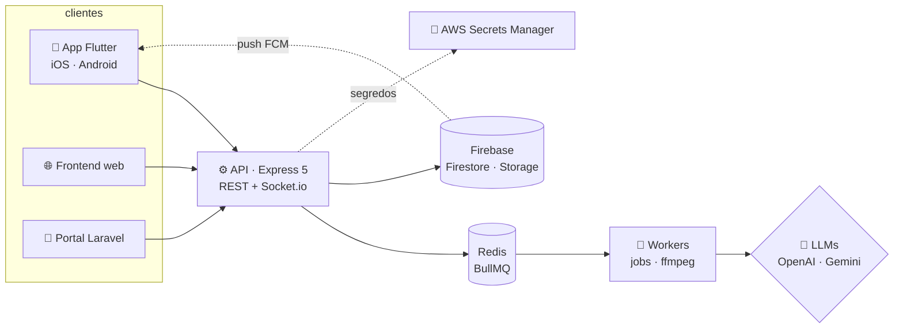

<!--
  Este README é 100% gerado por código: SVGs animados (CSS + SMIL, zero JS) feitos em scripts/.
  Rode `node scripts/build.mjs` pra regenerar. O Actions atualiza a atividade todo dia.
  Curtiu? Fork à vontade — troque os dados em scripts/sections/*.mjs.
-->

<a href="https://github.com/anderecc"><picture><source media="(prefers-color-scheme: dark)" srcset="https://raw.githubusercontent.com/anderecc/anderecc/main/assets/hero-dark.svg"></picture></a>

<a href="https://www.linkedin.com/in/andersondb06/"><picture><source media="(prefers-color-scheme: dark)" srcset="https://raw.githubusercontent.com/anderecc/anderecc/main/assets/btn-linkedin-dark.svg"></picture></a>
<a href="mailto:andersondbl06@gmail.com"><picture><source media="(prefers-color-scheme: dark)" srcset="https://raw.githubusercontent.com/anderecc/anderecc/main/assets/btn-email-dark.svg"></picture></a>
<a href="https://instagram.com/anderecs"><picture><source media="(prefers-color-scheme: dark)" srcset="https://raw.githubusercontent.com/anderecc/anderecc/main/assets/btn-instagram-dark.svg"></picture></a>
<a href="https://github.com/anderecc?tab=followers"><picture><source media="(prefers-color-scheme: dark)" srcset="https://raw.githubusercontent.com/anderecc/anderecc/main/assets/btn-github-dark.svg"></picture></a>

 

<picture><source media="(prefers-color-scheme: dark)" srcset="https://raw.githubusercontent.com/anderecc/anderecc/main/assets/whoami-dark.svg"></picture>

### `▸ o que eu construo`

<picture><source media="(prefers-color-scheme: dark)" srcset="https://raw.githubusercontent.com/anderecc/anderecc/main/assets/builds-dark.svg"></picture>

### `▸ stack`

<picture><source media="(prefers-color-scheme: dark)" srcset="https://raw.githubusercontent.com/anderecc/anderecc/main/assets/stack-dark.svg"></picture>

### `▸ sec lab`

<picture><source media="(prefers-color-scheme: dark)" srcset="https://raw.githubusercontent.com/anderecc/anderecc/main/assets/sec-dark.svg"></picture>

### `▸ como eu trabalho`

<picture><source media="(prefers-color-scheme: dark)" srcset="https://raw.githubusercontent.com/anderecc/anderecc/main/assets/flow-dark.svg"></picture>

Spec antes de código, IA como par de programação, teste no pipeline e deploy automatizado no **GitHub Actions** pra **VPS** que eu mesmo configuro (Docker + Nginx + TLS). Segurança desde o começo.

### `▸ projetos reais`

<a href="https://ldxcapital.vercel.app"><picture><source media="(prefers-color-scheme: dark)" srcset="https://raw.githubusercontent.com/anderecc/anderecc/main/assets/card-ldx-dark.svg"></picture></a>
<a href="https://gatuzii.vercel.app"><picture><source media="(prefers-color-scheme: dark)" srcset="https://raw.githubusercontent.com/anderecc/anderecc/main/assets/card-gatuzii-dark.svg"></picture></a>
<picture><source media="(prefers-color-scheme: dark)" srcset="https://raw.githubusercontent.com/anderecc/anderecc/main/assets/card-insta-dark.svg"></picture>
<picture><source media="(prefers-color-scheme: dark)" srcset="https://raw.githubusercontent.com/anderecc/anderecc/main/assets/card-bots-dark.svg"></picture>

<b>🗺️ arquitetura do ecossistema LDX</b> (diagrama interativo: arraste e dê zoom)

 

visão simplificada · repositórios privados

### `▸ formação & certificados`

<picture><source media="(prefers-color-scheme: dark)" srcset="https://raw.githubusercontent.com/anderecc/anderecc/main/assets/edu-dark.svg"></picture>

<b>📜 ver certificados</b> (+1.000h somando cursos e projetos sem certificado)

 

<!-- certs:start -->
| curso | instrutor | horas | |
|:--|:--|--:|:-:|
| React e Redux | Leonardo Moura Leitão | 54,5h | [ver ↗](https://www.udemy.com/certificate/UC-0075e93e-db81-4423-8403-2ec34b56bcd6/) |
| HTML5, CSS3 e JS | Daniel Tapias Morales | 54,5h | [ver ↗](https://www.udemy.com/certificate/UC-a442931f-f2e9-4102-98c9-7edff9b5db8f/) |
| Node.js | Guia do Programador | 50h | [ver ↗](https://www.udemy.com/certificate/UC-06134f8b-38ce-435d-b387-f94540a1674f/) |
| JavaScript | Hcode Treinamentos | 38,5h | [ver ↗](https://www.udemy.com/certificate/UC-c201d74b-6ff0-4445-b433-ac9b4618883e/) |
| Next.js e React | Leonardo Moura Leitão | 28,5h | [ver ↗](https://www.udemy.com/certificate/UC-c6c563d8-d3af-469b-9191-24bba705e675/) |
| Algoritmo e Lógica | Leonardo Moura Leitão | 18h | [ver ↗](https://www.udemy.com/certificate/UC-b2f3524f-1d3e-4c0e-b81e-3983f30aea3f/) |
| JS Funcional e Reativo | Leonardo Moura Leitão | 17h | [ver ↗](https://www.udemy.com/certificate/UC-07b943da-4392-4fb1-8bbf-f7606a69a5c1/) |
| SASS e SCSS | Matheus Battisti | 12,5h | [ver ↗](https://www.udemy.com/certificate/UC-04a99e14-f7a5-4424-8e71-1116af7e36d1/) |
| Git e GitHub | Matheus Battisti | 8,5h | [ver ↗](https://www.udemy.com/certificate/UC-d28bae80-353d-4a2d-9dea-63460d5d87f4/) |
| MySQL 8 | Hcode Treinamentos | 8,5h | [ver ↗](https://www.udemy.com/certificate/UC-77b591d7-5314-4e52-a240-7373ed80c9ae/) |
| LGPD | Cláudio Dodt | 4h | [ver ↗](https://www.udemy.com/certificate/UC-3175fa50-b084-4a40-a38f-f8768e410412/) |
<!-- certs:end -->

### `▸ atividade`

<picture><source media="(prefers-color-scheme: dark)" srcset="https://raw.githubusercontent.com/anderecc/anderecc/main/assets/activity-dark.svg"></picture>

tudo aqui é SVG gerado por código em <a href="https://github.com/anderecc/anderecc/tree/main/scripts"><code>scripts/</code></a> · zero JS · atualizado todo dia pelo GitHub Actions · curtiu? fork à vontade ✦

